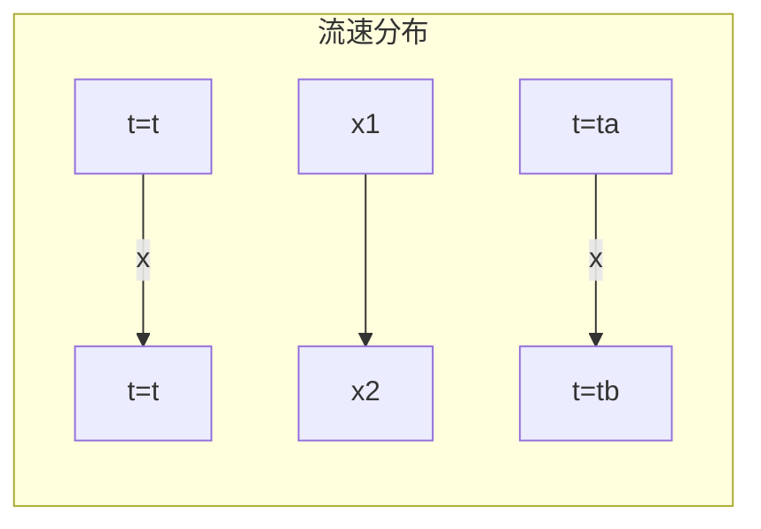
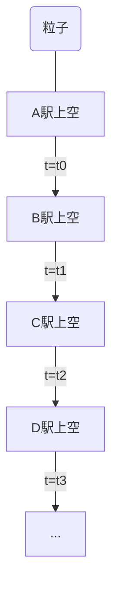
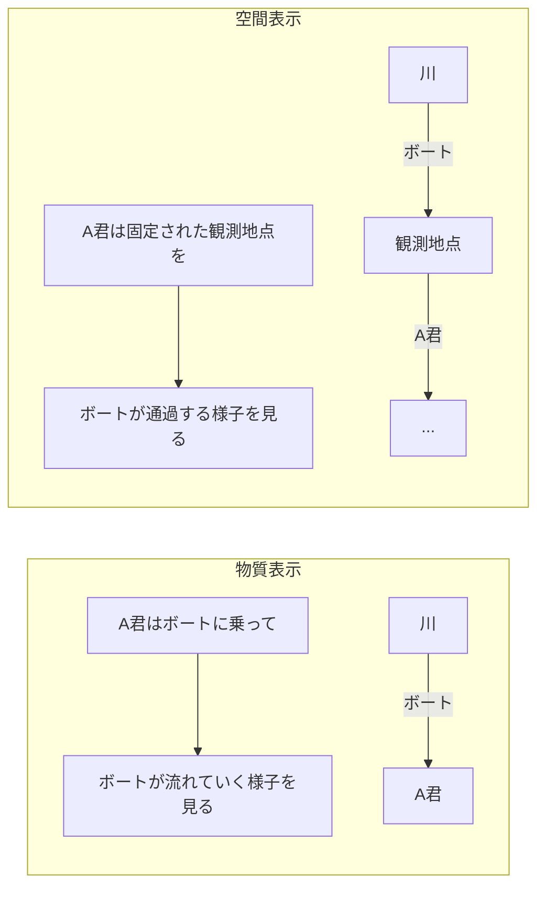

# R08 海洋流体力学及び演習ver45 第１章～第８章＜授業用・Ⅰ＞

<!-- 1〜15ページ -->
# 令和8年度
## 流体力学及び演習 <I>

近藤典夫

# 目次

<I>
* 第1章 ガイダンス(常微分、偏微分、微分演算子)
* 第2章 ラグランジュ記述とオイラー記述
* 第3章 質量保存則
* 第4章 非粘性流体の運動方程式
* 第5章 渦の運動
* 第6章 粘性流体の運動方程式
* 第7章 構造物に作用する流体力
* 第8章 浅水長波方程式

<II>
* 第9章 数値計算法
* 第10章 ナビエ・ストークス方程式の解法(1) 有限差分法
* 第11章 ナビエ・ストークス方程式の解法(2) 有限要素法
* 第12章 ナビエ・ストークス方程式の解法(3) 人工粘性と安定化手法
* 第13章 ナビエ・ストークス方程式の解法 (4) 有限要素法の3次精度数値粘性
* 第14章 浅水長波方程式の数値計算
* 第15章 数値時間積分
* 第16章 圧力のポアソン方程式
* 第17章 数値シミュレーションのアルゴリズム

* 付録A 常微分、偏微分、微分演算子
* 付録B ライプニッツの公式
* 付録C 圧縮性と非圧縮性の境界
* 付録D 総和規約
* 付録E 反変速度
* 付録F マクローリン展開

# 第1章 ガイダンス
## 常微分、偏微分、微分演算子

## 1.1 微分
### 1.1.1 微分係数

ある関数$f(x)$が与えられたとき,どのような性質(曲線の曲がり具合など)があるのかを見定める一つの指標に、各点ごとの微分係数すなわち曲線の傾きがある。

図 1-1 微分係数:
点$a$と$\Delta x$だけ離れた点$a + \Delta x$における関数値$f(a)$と$f(a + \Delta x)$の差を$\Delta f(a)$と書くと、商$\Delta f(a) / \Delta x$

$$
\frac{\Delta f(a)}{\Delta x} = \frac{f(a + \Delta x) - f(a)}{\Delta x} \quad (1-1)
$$

を区間$[a, a + \Delta x]$における平均変化率という。この平均変化率の極限つまり$\Delta x \to 0$を考えたときを$df(a)/dx$と書いて微分係数といい,これを式で書くと

$$
\frac{df(a)}{dx} = \lim_{\Delta x \to 0} \frac{\Delta f(a)}{\Delta x} = \lim_{\Delta x \to 0} \frac{f(a + \Delta x) - f(a)}{\Delta x} \quad (1-2)
$$

となる。

### 1.1.2 導関数

微分係数$f'(a)$を式(4-2)で与えたが,点$a$が連続的に変化することを考えたとき,点$a$の代わり変数$x$を用い,さらに$f(x + \Delta x)$と$f(x)$の差を$\Delta f(x) = f(x + \Delta x) - f(x)$と書いて

$$
\frac{df(x)}{dx} = \lim_{\Delta x \to 0} \frac{\Delta f(x)}{\Delta x} = \lim_{\Delta x \to 0} \frac{f(x + \Delta x) - f(x)}{\Delta x} \quad (1-3)
$$

を導関数といい,導関数を求めることを「関数$f(x)$を$x$について微分する」という。導関数$df(x)/dx$の書き方は他にもあり,関数$f(x)$が$y$と結び付けられているなら、つまり$y=f(x)$なら

のような書き方もする。
$f'$, $y'$, $\frac{df}{dx}$, $\frac{dy}{dx}$

幾つかの微分の定理を以下に示す。$c$を定数とする。

[1] $c' = 0 \quad (1-4)$
証明: $c' = \lim_{\Delta x \to 0} \frac{c - c}{\Delta x} = 0$

[2] $(cf(x))' = cf'(x) \quad (1-5)$
証明: $(cf(x))' = \lim_{\Delta x \to 0} \frac{cf(x + \Delta x) - cf(x)}{\Delta x} = \lim_{\Delta x \to 0} c \lim_{\Delta x \to 0} \frac{f(x + \Delta x) - f(x)}{\Delta x} = cf'(x)$

[3] $(f(x) \pm g(x))' = f'(x) \pm g'(x) \quad (1-6)$
証明: $(f(x) \pm g(x))' = \lim_{\Delta x \to 0} \frac{(f(x + \Delta x) \pm g(x + \Delta x)) - (f(x) \pm g(x))}{\Delta x}$
$= \lim_{\Delta x \to 0} \frac{(f(x + \Delta x) - f(x)) \pm (g(x + \Delta x) - g(x))}{\Delta x}$
$= \lim_{\Delta x \to 0} \left( \frac{f(x + \Delta x) - f(x)}{\Delta x} \pm \frac{g(x + \Delta x) - g(x)}{\Delta x} \right) = f'(x) \pm g'(x)$

[4] $(f(x)g(x))' = f'(x)g(x) + f(x)g'(x) \quad (1-7)$
証明: $\Delta f(x) = f(x + \Delta x) - f(x)$, $\Delta g(x) = g(x + \Delta x) - g(x)$と書けるので
$(f(x)g(x))' = \lim_{\Delta x \to 0} \frac{f(x + \Delta x)g(x + \Delta x) - f(x)g(x)}{\Delta x}$
$= \lim_{\Delta x \to 0} \frac{(f(x) + \Delta f(x))(g(x) + \Delta g(x)) - f(x)g(x)}{\Delta x}$
$= \lim_{\Delta x \to 0} \frac{f(x)g(x) + \Delta f(x)g(x) + f(x)\Delta g(x) + \Delta f(x)\Delta g(x) - f(x)g(x)}{\Delta x}$
$= \lim_{\Delta x \to 0} \left( \frac{\Delta f(x)g(x)}{\Delta x} + \frac{f(x)\Delta g(x)}{\Delta x} + \frac{\Delta f(x)\Delta g(x)}{\Delta x} \right)$
$= \lim_{\Delta x \to 0} \frac{\Delta f(x)}{\Delta x} \lim_{\Delta x \to 0} g(x) + \lim_{\Delta x \to 0} f(x) \lim_{\Delta x \to 0} \frac{\Delta g(x)}{\Delta x} + \lim_{\Delta x \to 0} \Delta f(x) \lim_{\Delta x \to 0} \frac{\Delta g(x)}{\Delta x}$
$= f'(x)g(x) + f(x)g'(x) + 0 \cdot g'(x)$
$= f'(x)g(x) + f(x)g'(x)$

[5] $\left( \frac{f(x)}{g(x)} \right)' = \frac{f'(x)g(x) - f(x)g'(x)}{g^2(x)} \quad (1-8)$
証明: 上記[4]の結果を使う. $y = f(x)/g(x)$と置くと, $y g(x) = f(x)$と書けるので, 両辺を微分すると
$y'g(x) + yg'(x) = f'(x)$
$\therefore y' = \frac{f'(x) - yg'(x)}{g(x)} = \frac{f'(x) - f(x)/g(x) g'(x)}{g(x)} = \frac{f'(x)g(x) - f(x)g'(x)}{g^2(x)}$
を得るので、$y=f(x)/g(x)$より
$\left( \frac{f(x)}{g(x)} \right)' = \frac{f'(x)g(x) - f(x)g'(x)}{g^2(x)}$

[6] 合成関数 $f(g(x))$の微分: $\frac{df(g(x))}{dx} = \frac{df(g)}{dg} \frac{dg(x)}{dx} \quad (1-9)$
証明: $\frac{df(g(x))}{dx} = \lim_{\Delta x \to 0} \frac{f(g(x + \Delta x)) - f(g(x))}{\Delta x}$
$= \lim_{\Delta x \to 0} \frac{f(g(x + \Delta x)) - f(g(x))}{g(x + \Delta x) - g(x)} \frac{g(x + \Delta x) - g(x)}{\Delta x}$
$= \lim_{\Delta x \to 0} \frac{f(g + \Delta g) - f(g)}{\Delta g} \frac{g(x + \Delta x) - g(x)}{\Delta x}$
$\Delta x \to 0$のとき$\Delta g \to 0$になるので
$= \lim_{\Delta g \to 0} \frac{f(g + \Delta g) - f(g)}{\Delta g} \lim_{\Delta x \to 0} \frac{g(x + \Delta x) - g(x)}{\Delta x}$
$= \frac{df(g)}{dg} \frac{dg(x)}{dx}$

次に、幾つかの関数の微分の計算例を示す。

[1] $f(x)=5x^2, \quad f'(x) = 10x \quad (1-10)$
証明: $f'(x) = \lim_{\Delta x \to 0} \frac{5(x + \Delta x)^2 - 5x^2}{\Delta x} = \lim_{\Delta x \to 0} \frac{5(x^2 + 2x\Delta x - \Delta x^2) - 5x^2}{\Delta x}$
$= \lim_{\Delta x \to 0} 5(2x - \Delta x) = 10x$

[2] $f(x)=\sin(x), \quad f'(x) = \cos(x) \quad (1-11)$
証明: $f'(x) = \lim_{\Delta x \to 0} \frac{\sin(x + \Delta x) - \sin(x)}{\Delta x} = \lim_{\Delta x \to 0} \frac{\sin(x)\cos(\Delta x) + \cos(x)\sin(\Delta x) - \sin x}{\Delta x}$
ここで,$\Delta x \to 0$のとき, $\cos(\Delta x) \to 1$, $\sin(\Delta x) \to \Delta x$ より
$= \lim_{\Delta x \to 0} \frac{\sin(x) + \cos(x)\Delta x - \sin x}{\Delta x} = \cos(x)$

[3] $f(x)=\log_a x$ ($a$ は定数), $\quad f'(x) = \frac{1}{x} \log_a e \quad (1-12)$
証明 : $f'(x) = \lim_{\Delta x \to 0} \frac{\log_a (x + \Delta x) - \log_a (x)}{\Delta x} = \lim_{\Delta x \to 0} \frac{1}{\Delta x} \log_a \frac{x + \Delta x}{x} = \lim_{\Delta x \to 0} \frac{1}{\Delta x} \log_a \left( 1 + \frac{\Delta x}{x} \right)$
ここで,$t = \Delta x/x$という変換を行うと,$\Delta x = tx$より
$= \lim_{t \to 0} \frac{1}{tx} \log_a (1 + t) = \lim_{t \to 0} \frac{1}{x} \frac{1}{t} \log_a (1 + t) = \lim_{t \to 0} \frac{1}{x} \log_a (1 + t)^{1/t} = \frac{1}{x} \log_a \lim_{t \to 0} (1 + t)^{1/t}$

ここで、$\lim_{t \to 0}(1+t)^{1/t}$の値はどのようになるのかを見てみる。$t$に数値を代入して調べてみる。
$t = 1 \to (1+1)^{1/1} = 2$
$t = 1/2 \to (1+1/2)^2 = 2.25$
$t = 1/10 \to (1+1/10)^{10} = 2.5937424601$
$t = 1/100 \to (1+1/100)^{100} = 2.7048138294$
$t = 1/10000 \to (1+1/10000)^{10000} = 2.7181459268$
$t = 1/1000000 \to (1+1/1000000)^{1000000} = 2.7182804690$
$t = 1/10000000000 \to (1+1/10000000000)^{10000000000} = 2.7182820532$
$t = 1/100000000000 \to (1+1/100000000000)^{100000000000} = 2.7182820533$
これより, $\lim_{t \to 0}(1+t)^{1/t} = 2.71828205\cdots$となり, $\pi = 3.1415926\cdots$のように無理数になる。したがって,$e$という英字を使って

$e = \lim_{t \to 0}(1+t)^{1/t} = 2.71828205\cdots$
と定義し,$e= 2.71828205\cdots$をネイピア数という。
$f'(x) = \frac{1}{x}\log_a e$

[4] $f(x)=\log_e x, \quad f'(x) = \frac{1}{x} \quad (1-13)$
証明: 上記[3]より,$a=e$の場合にあたるので,$\log_e e=1$より
$f'(x) = \frac{1}{x}$

[5] $f(x)=a^x$ ($a$は定数), $\quad f'(x) = a^x \log_e a \quad (1-14)$
証明-1:
$f'(x) = \lim_{\Delta x \to 0} \frac{a^{x+\Delta x} - a^x}{\Delta x} = \lim_{\Delta x \to 0} \frac{a^x (a^{\Delta x}-1)}{\Delta x} = \lim_{\Delta x \to 0} a^x \lim_{\Delta x \to 0} \frac{a^{\Delta x}-1}{\Delta x} = a^x \lim_{\Delta x \to 0} \frac{a^{\Delta x}-1}{\Delta x}$
ここで,$a^{\Delta x} - 1 = t$と置くと, $a^{\Delta x} = 1+t$ ($\Delta x \to 0$なら$t \to 0$)となるので, 両辺に対数$\log_a$を作用させると$\log_a a^{\Delta x} = \log_a (1+t) \quad \therefore \Delta x = \log_a (1+t)$これを上式に代入して
$= a^x \lim_{t \to 0} \frac{t}{\log_a (1 + t)} = a^x \lim_{t \to 0} \frac{1}{\frac{1}{t} \log_a (1 + t)} = a^x \frac{1}{\log_a \lim_{t \to 0} (1 + t)^{1/t}} = a^x \frac{1}{\log_a e}$
分母で, ネイピア数$e = \lim_{t \to 0}(1+t)^{1/t}$があるので,$ = a^x \frac{1}{\log_a e} = a^x \frac{\log_e a}{\log_e e} = a^x \log_e a$
証明-2:
両辺に対数 $\log_e$を作用させると,$f(x) = \log_e a^x = x \log_e a$を得るので, 両辺を$x$で微分する。
$\frac{d}{dx} (\log_e f(x)) = \frac{d}{dx} (x \log_e a)$
左辺$= \frac{d}{df} (\log_e f(x)) \frac{df}{dx} = \frac{1}{f} \frac{df}{dx}$
右辺$= \frac{d}{dx} (x \log_e a) = \log_e a$
よって,
$\frac{1}{f} \frac{df}{dx} = \log_e a, \quad \therefore \frac{df}{dx} = f(x) \log_e a$
ここで, $f(x)=a^x$を代入すると, 導関数は次式になる
$f'(x) = a^x \log_e a$

[6] $f(x)=e^x, \quad f'(x) = e^x \quad (1-14)$
証明:上記[5]より,$a=e$の場合にあたるので,$\log_e e=1$より
$f'(x) = e^x$

[7] $f(x)=x^n, \quad f'(x) = nx^{n-1} \quad (1-15)$
証明:両辺に対数$\log_e$を作用させると, $\log_e f(x) = n \log_e x$を得るので, これの両辺を$x$で微分する。
左辺$= \frac{d}{dx} \log_e f(x) = \frac{d}{df} \log_e f \frac{df}{dx} = \frac{1}{f} \frac{df}{dx}$
右辺$= \frac{d}{dx} n \log_e x = n \frac{1}{x}$
これより $\frac{1}{f} \frac{df}{dx} = n \frac{1}{x}, \quad \therefore \frac{df}{dx} = n f(x) \frac{1}{x} = n x^n \frac{1}{x} = n x^{n-1}$

## 1.2 偏微分
1変数$x$を持つ関数$f(x)$についての微分を「1.1 微分」で示したが,工学の世界では,変数は複数個ある。たとえば、2次元空間を扱うなら変数は$x,y$の2個,3次元空間であれば変数は$x,y,z$の3個になる。さらに、時間$t$も変数として扱うなら時空間という扱いになり$x,y,t$の3個あるいは$x,y,z,t$の4個になる。このように複数個の変数があるときの微分を1変数の微分(常微分)と区別するために「偏微分」と呼ぶ。
今、3変数の関数$f(x,y,z)$を考える。このような場合,$x$による偏微分,$y$による偏微分,$z$による偏微分によるそれぞれの微分係数と導関数を「偏微分係数」と「偏導関数」といい、偏導関数を次のように表す。

$\frac{\partial f(x, y, z)}{\partial x} = \lim_{\Delta x \to 0} \frac{f(x + \Delta x, y, z) - f(x, y, z)}{\Delta x} \quad (1-16)$

$\frac{\partial f(x, y, z)}{\partial y} = \lim_{\Delta y \to 0} \frac{f(x, y + \Delta y, z) - f(x, y, z)}{\Delta y} \quad (1-17)$

$\frac{\partial f(x, y, z)}{\partial z} = \lim_{\Delta z \to 0} \frac{f(x, y, z + \Delta z) - f(x, y, z)}{\Delta z} \quad (1-18)$

これから分かるように,偏微分法は偏微分する1つの成分を変数と見做し、それ以外を固定して定数としての扱いをする。偏微分の記号は$\partial / \partial x$のように書き,$\partial$をラウンド、ラウンドデルタ、パーシャルあるいはディーなどと読む。また偏微分の記号に$f_{,x}, f_{,y}, f_{,z}$という書き方をして

$\frac{\partial f(x, y, z)}{\partial x} = f_{,x}(x, y, z), \quad \frac{\partial f(x, y, z)}{\partial y} = f_{,y}(x, y, z), \quad \frac{\partial f(x, y, z)}{\partial y} = f_{,z}(x, y, z) \quad (1-19)$

と表してもよい。

[例題-1]
[1-1] $f=x^2y^3z^4$を偏微分せよ。
解答: $\frac{\partial f}{\partial x} = 2xy^3z^4, \quad \frac{\partial f}{\partial y} = 3x^2y^2z^4, \quad \frac{\partial f}{\partial z} = 4x^2y^3z^3$

[1-2] $f=x^2+y^3+z^4$を偏微分せよ。
解答: $\frac{\partial f}{\partial x} = 2x, \quad \frac{\partial f}{\partial y} = 3y^2, \quad \frac{\partial f}{\partial z} = 4z^3$

[1-3] $f=e^{xyz}$を偏微分せよ。
解答: $\frac{\partial f}{\partial x} = yze^{xyz}, \quad \frac{\partial f}{\partial y} = xze^{xyz}, \quad \frac{\partial f}{\partial z} = xye^{xyz}$

[1-4] $f=e^{(ax+by+cz)}$を偏微分せよ。ただし,$a, b, c$は定数とする。
解答: $\frac{\partial f}{\partial x} = ae^{(ax+by+cz)}, \quad \frac{\partial f}{\partial y} = be^{(ax+by+cz)}, \quad \frac{\partial f}{\partial z} = ce^{(ax+by+cz)}$

## 1.3 高階の偏微分
1変数$x$の関数$f(x)$の高階微分$d^2f(x)/dx^2$, $d^3f(x)/dx^3$などが計算できるように,偏微分でも高階の偏微分の計算ができる。しかし、多変数関数の場合は$x,y,z$の偏微分が多様に渡って計算できる。
高階導関数の計算は、

$$
\begin{aligned}
\frac{\partial}{\partial x} \left( \frac{\partial f(x, y, z)}{\partial x} \right) &= \frac{\partial^2 f(x, y, z)}{\partial x^2} \\
\frac{\partial}{\partial y} \left( \frac{\partial f(x, y, z)}{\partial y} \right) &= \frac{\partial^2 f(x, y, z)}{\partial y^2} \\
\frac{\partial}{\partial z} \left( \frac{\partial f(x, y, z)}{\partial z} \right) &= \frac{\partial^2 f(x, y, z)}{\partial z^2}
\end{aligned} \quad (1-20)
$$

$$
\begin{aligned}
\frac{\partial}{\partial y} \left( \frac{\partial f(x, y, z)}{\partial x} \right) &= \frac{\partial^2 f(x, y, z)}{\partial y \partial x} = \frac{\partial^2 f(x, y, z)}{\partial x \partial y} \\
\frac{\partial}{\partial z} \left( \frac{\partial f(x, y, z)}{\partial y} \right) &= \frac{\partial^2 f(x, y, z)}{\partial z \partial y} = \frac{\partial^2 f(x, y, z)}{\partial y \partial z}
\end{aligned}
$$

$$
\frac{\partial}{\partial x} \left( \frac{\partial^2 f(x, y, z)}{\partial x^2} \right) = \frac{\partial^3 f(x, y, z)}{\partial x^3}
$$

のように計算し、さらに

$$
\frac{\partial^2 f(x, y, z)}{\partial y \partial x} = \frac{\partial^2 f(x, y, z)}{\partial x \partial y} \quad (1-21)
$$

と示す如く、変数の偏微分の順序に依存しない。一般に「$n$階偏微分可能で,$n$階偏導関数が連続であるなら,偏微分の順序は交換可能」である。
$f(x,y,z)$の偏微分は,$(x,y,z)$の部分を省略して以下のように書いてもよい。

$$
\begin{aligned}
& \frac{\partial f}{\partial x}, \frac{\partial f}{\partial y}, \frac{\partial f}{\partial z} \\
& \frac{\partial^2 f}{\partial x^2}, \frac{\partial^2 f}{\partial y^2}, \frac{\partial^2 f}{\partial z^2} \\
& \frac{\partial^2 f}{\partial x \partial y}, \frac{\partial^2 f}{\partial x \partial z}, \frac{\partial^2 f}{\partial y \partial x}, \frac{\partial^2 f}{\partial y \partial z}, \frac{\partial^2 f}{\partial z \partial x}, \frac{\partial^2 f}{\partial z \partial y} \\
& \frac{\partial^3 f}{\partial x^3}, \frac{\partial^3 f}{\partial y^3}, \frac{\partial^3 f}{\partial z^3} \\
& \frac{\partial^3 f}{\partial x^2 \partial y}, \frac{\partial^3 f}{\partial x \partial y^2}, \frac{\partial^3 f}{\partial x^2 \partial z}, \frac{\partial^3 f}{\partial x \partial z^2}, \frac{\partial^3 f}{\partial y^2 \partial z}, \frac{\partial^3 f}{\partial y \partial z^2}, \frac{\partial^3 f}{\partial x \partial y \partial z}
\end{aligned} \quad (1-22)
$$

さらに、偏微分の記号を使わずに、
$f_{,x}, f_{,y}, f_{,z}$
$f_{,xx}, f_{,xy}, f_{,xz}$
のように表記することも多く行われている。

[例題-2]
[2-1] $f=x^2y^3z^4$ の2階の偏導関数を求めよ。
解答: 1階の偏導関数は[例題-1]で計算してあるので、それを使って2階の偏導関数を計算する。
$\frac{\partial^2 f}{\partial x^2} = \frac{\partial}{\partial x} \left( \frac{\partial f}{\partial x} \right) = \frac{\partial}{\partial x} (2xy^3z^4) = 2y^3z^4$
$\frac{\partial^2 f}{\partial y^2} = 6x^2yz^4$
$\frac{\partial^2 f}{\partial z^2} = 12x^2y^3z^2$
$\frac{\partial^2 f}{\partial x \partial y} = \frac{\partial}{\partial x} \left( \frac{\partial f}{\partial y} \right) = \frac{\partial}{\partial x} (3x^2y^2z^4) = 6xy^2z^4$
$\frac{\partial^2 f}{\partial y \partial x} = 6xy^2z^4$
$\frac{\partial^2 f}{\partial x \partial z} = 8xy^3z^3$
$\frac{\partial^2 f}{\partial z \partial x} = 8xy^3z^3$
$\frac{\partial^2 f}{\partial y \partial z} = 12x^2y^2z^3$
$\frac{\partial^2 f}{\partial z \partial y} = 12x^2y^2z^3$

[2-2] $f=x^2y^3z^4$ について以下の3階の偏導関数を求めよ。
$\frac{\partial^3 f}{\partial x^3}, \quad \frac{\partial^3 f}{\partial x^2 \partial y}, \quad \frac{\partial^3 f}{\partial x \partial y \partial z}$
解答: $\frac{\partial^3 f}{\partial x^3} = \frac{\partial}{\partial x} \left( \frac{\partial^2 f}{\partial x^2} \right) = \frac{\partial}{\partial x} (2y^3z^4) = 0$
$\frac{\partial^3 f}{\partial x^2 \partial y} = \frac{\partial}{\partial x} \left( \frac{\partial^2 f}{\partial x \partial y} \right) = \frac{\partial}{\partial x} (6xy^2z^4) = 6y^2z^4$
$\frac{\partial^3 f}{\partial x \partial y \partial z} = 24xy^2z^3$

[2-3] $f=e^{xyz}$ をついて以下の2階の偏導関数を求めよ。
$\frac{\partial^2 f}{\partial x^2}, \quad \frac{\partial^2 f}{\partial x \partial y}$
解答: [例題-1]の[3]の結果を使う。
$\frac{\partial^2 f}{\partial x^2} = y^2z^2e^{xyz}$
$\frac{\partial^2 f}{\partial x \partial y} = \frac{\partial}{\partial x} \left( \frac{\partial f}{\partial y} \right) = \frac{\partial}{\partial x} (xze^{xyz}) = ze^{xyz} + xyz \cdot ze^{xyz} = (z + xyz^2)e^{xyz}$

## 1.4 全微分
3変数関数$f(x, y, z)$が,位置$(x, y, z)$から3方向に僅かに移動した量をそれぞれ$\Delta x, \Delta y, \Delta z$と移動後の位置は$(x+ \Delta x, y+ \Delta y, z+ \Delta z)$となり,その関数は$f(x+ \Delta x, y+ \Delta y, z+ \Delta z)$で表される。このとき$f(x+ \Delta x, y+ \Delta y, z+ \Delta z)$と$f(x, y, z)$の差を$\Delta f$と書いて
$$
\Delta f (x, y, z) = f (x + \Delta x, y + \Delta y, z + \Delta z) - f (x, y, z) \quad (1-23)
$$
と表される。式(1-23)を変形して,
$$
\begin{aligned}
\Delta f (x, y, z) &= \frac{f (x + \Delta x, y + \Delta y, z + \Delta z) - f (x, y + \Delta y, z + \Delta z)}{\Delta x} \Delta x \\
&+ \frac{f(x, y + \Delta y, z + \Delta z) - f(x, y, z + \Delta z)}{\Delta y} \Delta y \\
&+ \frac{f(x, y, z + \Delta z) - f(x, y, z)}{\Delta z} \Delta z
\end{aligned} \quad (1-24)
$$
を得るので、これの極限$\Delta x \to 0, \Delta y \to 0, \Delta z \to 0$をとり,それを$df$と書くと
$$
\begin{aligned}
df &= \lim_{\Delta x \to 0, \Delta y \to 0, \Delta z \to 0} \Delta f (x, y, z) \\
&= \lim_{\Delta x \to 0, \Delta y \to 0, \Delta z \to 0} \left( \frac{f (x + \Delta x, y + \Delta y, z + \Delta z) - f (x, y + \Delta y, z + \Delta z)}{\Delta x} \Delta x \right. \\
&\quad \left. + \frac{f (x, y + \Delta y, z + \Delta z) - f (x, y, z + \Delta z)}{\Delta y} \Delta y \right. \\
&\quad \left. + \frac{f (x, y, z + \Delta z) - f (x, y, z)}{\Delta z} \Delta z \right) \\
&= \lim_{\Delta x \to 0} \frac{f (x + \Delta x, y, z) - f(x, y, z)}{\Delta x} dx \\
&\quad + \lim_{\Delta y \to 0} \frac{f(x, y + \Delta y, z) - f(x, y, z)}{\Delta y} dy \\
&\quad + \lim_{\Delta z \to 0} \frac{f(x, y, z + \Delta z) - f(x, y, z)}{\Delta z} dz \\
&= \frac{\partial f(x, y, z)}{\partial x} dx + \frac{\partial f(x, y, z)}{\partial y} dy + \frac{\partial f(x, y, z)}{\partial z} dz
\end{aligned} \quad (1-25)
$$
が成立するとき,式(1-25)つまり
$$
df = \frac{\partial f(x, y, z)}{\partial x} dx + \frac{\partial f(x, y, z)}{\partial y} dy + \frac{\partial f(x, y, z)}{\partial z} dz \quad (1-26)
$$
を全微分という。

さらに、式(1-26)のような書き方をすると表示が長くなるので、総和規約を使って表示すると短かい表現になる。ここで,$x \to X_1, y \to X_2, z \to X_3$のように変数に番号付けで表示すると、式(1-26)は

$$
df = \frac{\partial f}{\partial x_1} dx_1 + \frac{\partial f}{\partial x_2} dx_2 + \frac{\partial f}{\partial x_3} dx_3 = \sum_{i=1}^{3} \frac{\partial f}{\partial x_i} dx_i
$$

総和規約より和の記号$\sum$を省略して

$$
df = \frac{\partial f}{\partial x_i} dx_i \quad (1-27)
$$

のように書くことができる。

## 1.5 合成関数の偏微分
スカラー関数$f(x, y, z)$において,$x, y, z$が変数$u$の関数であるなら、つまり,$x=x(u), y=y(u), z=z(u)$のとき,$f(x(u), y(u), z(u))$という合成関数になるので,式(1-26)は
$$
df = \frac{\partial f(x(u),y(u), z(u))}{\partial x} dx(u) + \frac{\partial f(x(u), y(u), z(u))}{\partial y} dy(u) + \frac{\partial f(x(u),y(u), z(u))}{\partial z} dz(u) \quad (1-28)
$$
を表すことになる。これを$u$で微分すると,合成関数の微分
$$
\frac{df}{du} = \frac{\partial f(x(u), y(u), z(u))}{\partial x} \frac{dx(u)}{du} + \frac{\partial f(x(u), y(u), z(u))}{\partial y} \frac{dy(u)}{du} + \frac{\partial f(x(u),y(u), z(u))}{\partial z} \frac{dz(u)}{du}
$$
$$
= \frac{\partial f}{\partial x} \frac{dx}{du} + \frac{\partial f}{\partial y} \frac{dy}{du} + \frac{\partial f}{\partial z} \frac{dz}{du}
$$
が得られる。これをチェイン・ルールともいう。
さらに,$x, y, z$が2変数$u, v$の関数であるとき、つまり,$x=x(u,v), y=y(u,v), z=z(u,v)$のとき,$f(x(u,v), y(u,v), z(u,v))$という合成関数になるので、式(1-26)は

$$
df = \frac{\partial f(x(u, v), y(u, v), z(u,v))}{\partial x} dx(u,v) + \frac{\partial f(x(u, v), y(u, v), z(u,v))}{\partial y} dy(u,v) \\
+ \frac{\partial f(x(u,v),y(u,v), z(u,v))}{\partial z} dz(u,v)
$$
となる。これを$u$で微分すると,
$$
\frac{\partial f}{\partial u} = \frac{\partial f(x(u,v), y(u,v), z(u,v))}{\partial x} \frac{\partial x(u,v)}{\partial u} + \frac{\partial f(x(u,v), y(u,v), z(u,v))}{\partial y} \frac{\partial y(u,v)}{\partial u} \\
+ \frac{\partial f(x(u, v), y(u, v), z(u,v))}{\partial z} \frac{\partial z(u,v)}{\partial u}
$$
$$
= \frac{\partial f}{\partial x} \frac{\partial x}{\partial u} + \frac{\partial f}{\partial y} \frac{\partial y}{\partial u} + \frac{\partial f}{\partial z} \frac{\partial z}{\partial u} \quad (1-29)
$$
また、$v$で微分すると次式になる。
$$
\frac{\partial f}{\partial v} = \frac{\partial f(x(u, v), y(u, v), z(u,v))}{\partial x} \frac{\partial x(u,v)}{\partial v} + \frac{\partial f(x(u, v), y(u, v), z(u,v))}{\partial y} \frac{\partial y(u,v)}{\partial v} \\
+ \frac{\partial f(x(u, v), y(u, v), z(u,v))}{\partial z} \frac{\partial z(u,v)}{\partial v}
$$
$$
= \frac{\partial f}{\partial x} \frac{\partial x}{\partial v} + \frac{\partial f}{\partial y} \frac{\partial y}{\partial v} + \frac{\partial f}{\partial z} \frac{\partial z}{\partial v} \quad (1-30)
$$

[例題-3]
[3-1] $f=x^2y^3z^4$ の全微分$df$を求めよ。
解答: $\frac{\partial f}{\partial x} = 2xy^3z^4, \frac{\partial f}{\partial y} = 3x^2y^2z^4, \frac{\partial f}{\partial z} = 4x^2y^3z^3$と計算されているので
$df = \frac{\partial f}{\partial x} dx + \frac{\partial f}{\partial y} dy + \frac{\partial f}{\partial z} dz = 2xy^3z^4 dx + 3x^2y^2z^4 dy + 4x^2y^3z^3 dz$

## 1.6 テーラー展開
ある位置$x=a$で関数$f(a)$のあらゆる状態(例えば, $f(a), df(a)/dx, d^2f(a)/dx^2, \cdots$)が既知であるとする。この時,$a$から$h$だけ離れた位置$x=a+h$での$f(x)=f(a+h)$の状態を求めたいときには、関数$f(a)$の状態を使って計算することができる。今,$f(x)$を

図1.2 関数f:
- y軸に$f(a)$と$f'(a)$ (既知), $f(x)$ (未知)
- x軸に$a$と$x$
- $a$と$x$の間の距離$h$

$$
f(x) = a_0(x - a)^0 + a_1(x - a)^1 + a_2(x - a)^2 + a_3(x - a)^3 + a_4(x - a)^4 + a_5(x - a)^5 + \cdots \\
= \sum_{n=0}^{\infty} a_n (x - a)^n \quad (1-31)
$$
のように、位置$a$のまわりで級数展開できるものとする。これから未定係数$a_n$の決定は以下の手順による。
1) 式(1-31)に$x=a$を代入すると,$f(a)=a_0$が求まる。
2) 式(1-31)の微分は
$$
\frac{df(x)}{dx} = a_1 + 2a_2(x - a)^1 + 3a_3(x - a)^2 + 4a_4(x - a)^3 + 5a_5(x - a)^4 + \cdots
$$
となるので,$x=a$を代入すると
$$
\frac{df(a)}{dx} = a_1 = 1a_1 = 1!a_1
$$
が得られ、$a_1$は次のようになる。
$$
a_1 = \frac{1}{1!} \frac{df(a)}{dx}
$$
3) 式(1-31)を2回微分する。
$$
\frac{d^2f(x)}{dx^2} = 2a_2 + 3 \cdot 2a_3(x - a)^1 + 4 \cdot 3a_4(x - a)^2 + 5 \cdot 4a_5(x - a)^3 + \cdots
$$
これに$x=a$を代入すると
$$
\frac{d^2f(a)}{dx^2} = 2a_2 = 2 \cdot 1 \cdot a_2 = 2!a_2
$$
が得られるので、$a_2$は次のようになる。
$$
a_2 = \frac{1}{2!} \frac{d^2f(a)}{dx^2}
$$
4) 式(1-31)を3回微分する。
$$
\frac{d^3f(x)}{dx^3} = 3 \cdot 2 \cdot 1a_3 + 4 \cdot 3 \cdot 2a_4(x - a)^1 + 5 \cdot 4 \cdot 3a_5(x - a)^2 + \cdots
$$
これに$x=a$を代入すると
$$
\frac{d^3f(a)}{dx^3} = 3 \cdot 2 \cdot 1a_3 = 3!a_3
$$
が得られるので、$a_3$は次のようになる。
$$
a_3 = \frac{1}{3!} \frac{d^3f(a)}{dx^3}
$$
4) 以上の操作を繰り返すことにより,$n$回微分後,$a_n$は次のようになる。
$$
a_n = \frac{1}{n!} \frac{d^nf(a)}{dx^n}
$$
よって,式(1-31)は
$$
f(x) = a_0(x - a)^0 + a_1(x - a)^1 + a_2(x - a)^2 + a_3(x - a)^3 + a_4(x - a)^4 + a_5(x - a)^5 + \cdots \\
= \sum_{n=0}^{\infty} a_n (x - a)^n
$$
$$
= f(a)(x - a)^0 + \frac{1}{1!} \frac{df(a)}{dx} (x - a)^1 + \frac{1}{2!} \frac{d^2f(a)}{dx^2} (x - a)^2 + \frac{1}{3!} \frac{d^3f(a)}{dx^3} (x - a)^3 + \cdots \\
+ \frac{1}{n!} \frac{d^{(n)}f(a)}{dx^{(n)}} (x - a)^n + \cdots \quad (1-32)
$$
となり、これをテーラー級数といい、テーラー級数を求める事をテーラー展開という。
工学では, $x = a + h$ より $x-a=h$ であるから,式(1-32)は
$$
f(a+h) = f(a) + \frac{1}{1!} \frac{df(a)}{dx} h + \frac{1}{2!} \frac{d^2f(a)}{dx^2} h^2 + \frac{1}{3!} \frac{d^3f(a)}{dx^3} h^3 + \cdots + \frac{1}{n!} \frac{d^{(n)}f(a)}{dx^{(n)}} h^n + \cdots
$$
さらに$a$を$x$に書き換えて,任意の点$x$でテーラー級数を考えた
$$
f(x+h) = f(x) + \frac{1}{1!} \frac{df(x)}{dx} h + \frac{1}{2!} \frac{d^2f(x)}{dx^2} h^2 + \frac{1}{3!} \frac{d^3f(x)}{dx^3} h^3 + \cdots + \frac{1}{n!} \frac{d^{(n)}f(x)}{dx^{(n)}} h^n + \cdots \quad (1-33)
$$
の形を使うことが多い。上記の表現は無限級数和であり,本来なら収束性の議論も必要になる。
また、有限級数和の形で
$$
f(x+h) = f(x) + \frac{1}{1!} \frac{df(x)}{dx} h + \frac{1}{2!} \frac{d^2f(x)}{dx^2} h^2 + \frac{1}{3!} \frac{d^3f(x)}{dx^3} h^3 + \cdots \\
+ \frac{1}{(n-1)!} \frac{d^{(n-1)}f(x)}{dx^{(n-1)}} h^{(n-1)} + R_n \quad (1-34)
$$
と表される。ここで,$R_n$は余剰項といわれ
$$
R_n = \frac{1}{n!} \frac{d^{(n)}f(c)}{dx^{(n)}} h^n \quad (1-35)
$$
である。$c$は$x$と$x+h$の間にある定数である。
式(1-34)は$x$軸方向についてのみ考えたテーラー級数展開であるが,これを$x$軸と$y$軸の2方向を考慮したテーラー級数展開は次式になる。
$f(x + h, y + k)$
$$
\begin{aligned}
&= f(x, y + k) + \frac{1}{1!} \frac{\partial f(x, y + k)}{\partial x} h + \frac{1}{2!} \frac{\partial^2 f(x, y + k)}{\partial x^2} h^2 + \cdots \\
&= \left( f(x, y) + \frac{1}{1!} \frac{\partial f(x,y)}{\partial y} k + \frac{1}{2!} \frac{\partial^2 f(x,y)}{\partial y^2} k^2 + \cdots \right) \\
&\quad + \frac{1}{1!} \left( \frac{\partial f(x, y)}{\partial x} + \frac{1}{1!} \frac{\partial}{\partial y} \left( \frac{\partial f(x, y)}{\partial x} \right) k + \cdots \right) h + \cdots \\
&= f(x,y) + \left( \frac{\partial f(x, y)}{\partial x} h + \frac{\partial f(x, y)}{\partial y} k \right) + \frac{1}{2!} \left( \frac{\partial^2 f(x,y)}{\partial x^2} h^2 + 2 \frac{\partial^2 f(x,y)}{\partial x \partial y} hk + \frac{\partial^2 f(x,y)}{\partial y^2} k^2 \right) + \cdots \quad (1-36)
\end{aligned}
$$

---

<!-- 16〜30ページ -->
同様に、x軸とy軸およびz軸の3方向を考慮したテーラー級数展開は次式になる。
$f(x + h, y + k, z + l)$
$= f(x, y, z) + \frac{1}{1!} \left( \frac{\partial f(x, y, z)}{\partial x} h + \frac{\partial f(x, y, z)}{\partial y} k + \frac{\partial f(x, y, z)}{\partial z} l \right) + \cdots$
(1-37)

## 1.7 マクローリン展開

マクローリン級数はテーラー級数の原点$x = 0$で展開したときをいい、次のようになる。
$f(h) = f (0 + h) = f (0) + \frac{1}{1!} \frac{df (0)}{dx} h + \frac{1}{2!} \frac{d^2 f(0)}{dx^2} h^2 + \frac{1}{3!} \frac{d^3 f(0)}{dx^3} h^3 + \cdots + \frac{1}{n!} \frac{d^n f(0)}{dx^n} h^n + \cdots$
(1-38)

一般には、任意の点$x$で考えるという事で、$h$を$x$に置きかえて
$f(x) = f (0 + x) = f (0) + \frac{1}{1!} \frac{df (0)}{dx} x + \frac{1}{2!} \frac{d^2 f(0)}{dx^2} x^2 + \frac{1}{3!} \frac{d^3 f(0)}{dx^3} x^3 + \cdots + \frac{1}{n!} \frac{d^n f(0)}{dx^n} x^n + \cdots$
(1-39)
(1-40)

と表わす。マクローリン展開の具体的な計算例は、付録Eをみよ。

## 1.8 微分演算子

上記まで偏微分を講義し、変数$x, y, z$による様々な偏微分を学習した。それらの偏微分を一つひとつ書くと煩わしいので、グループ分けした偏微分を記号に置き換え,偏微分の表示を簡単にする書き方がある。そのような書き方に微分演算子がある。

スカラー関数$f(x,y,z)$の全微分は
$df = \frac{\partial f}{\partial x} dx + \frac{\partial f}{\partial y} dy + \frac{\partial f}{\partial z} dz$
(1-41)

で表される。このとき、位置$(x,y,z)$を位置ベクトル$\mathbf{r} = [x,y,z]^{\mathrm{t}}$で表し、その増分ベクトル$\mathbf{dr} = [dx,dy, dz]^{\mathrm{t}}$を考えると式(1-41)はベクトル表示で
$df = \begin{bmatrix} \frac{\partial f}{\partial x} & \frac{\partial f}{\partial y} & \frac{\partial f}{\partial z} \end{bmatrix} \begin{bmatrix} dx \\ dy \\ dz \end{bmatrix}$
(1-42)

と書くことができる。次に、$\begin{bmatrix} \frac{\partial f}{\partial x} & \frac{\partial f}{\partial y} & \frac{\partial f}{\partial z} \end{bmatrix}^{\mathrm{t}}$の項を

$\begin{bmatrix} \frac{\partial f}{\partial x} \\ \frac{\partial f}{\partial y} \\ \frac{\partial f}{\partial z} \end{bmatrix} = \begin{bmatrix} \frac{\partial}{\partial x} \\ \frac{\partial}{\partial y} \\ \frac{\partial}{\partial z} \end{bmatrix} f = \nabla f$
(1-43)

という書き方に変更する。つまり、$x,y,z$軸方向の単位ベクトルをそれぞれ$\mathbf{e}_x, \mathbf{e}_y, \mathbf{e}_z$とすると
$\nabla = \begin{bmatrix} \frac{\partial}{\partial x} \\ \frac{\partial}{\partial y} \\ \frac{\partial}{\partial z} \end{bmatrix} = \frac{\partial}{\partial x}\mathbf{e}_x + \frac{\partial}{\partial y}\mathbf{e}_y + \frac{\partial}{\partial z}\mathbf{e}_z$
(1-44)

という記号$\nabla$を新しく導入する。これをハミルトン演算子と言い、$\nabla$をナブラと読む。$\nabla$は変数$x,y,z$による偏微分のベクトルを表している。したがって、式(1-42)は
$df = \nabla f \cdot \mathbf{dr}$
(1-45)

のように表示される。スカラー関数$f$に$\nabla$を作用させた結果の$\nabla f$をこう配という。

また、$\nabla$をベクトル演算に使うことができる。ナブラ$\nabla$とベクトル$\mathbf{A} = [A_x, A_y, A_z]^{\mathrm{t}}$の内積は
$\nabla \cdot \mathbf{A} = \begin{bmatrix} \frac{\partial}{\partial x} \\ \frac{\partial}{\partial y} \\ \frac{\partial}{\partial z} \end{bmatrix}^{\mathrm{t}} \begin{bmatrix} A_x \\ A_y \\ A_z \end{bmatrix} = \frac{\partial A_x}{\partial x} + \frac{\partial A_y}{\partial y} + \frac{\partial A_z}{\partial z}$
(1-46)

で与えられ、これをベクトル$\mathbf{A}$の発散という。さらに、それらの外積は、$x,y,z$軸方向の単位ベクトルをそれぞれ$\mathbf{e}_x, \mathbf{e}_y, \mathbf{e}_z$とすると、
$\nabla \times \mathbf{A} = \begin{vmatrix} \mathbf{e}_x & \mathbf{e}_y & \mathbf{e}_z \\ \frac{\partial}{\partial x} & \frac{\partial}{\partial y} & \frac{\partial}{\partial z} \\ A_x & A_y & A_z \end{vmatrix} = \left( \frac{\partial A_z}{\partial y} - \frac{\partial A_y}{\partial z} \right) \mathbf{e}_x + \left( \frac{\partial A_x}{\partial z} - \frac{\partial A_z}{\partial x} \right) \mathbf{e}_y + \left( \frac{\partial A_y}{\partial x} - \frac{\partial A_x}{\partial y} \right) \mathbf{e}_z$
(1-47)

と表す。

$\begin{bmatrix} \frac{\partial}{\partial x} & \frac{\partial}{\partial y} & \frac{\partial}{\partial z} \end{bmatrix}^{\mathrm{t}}$は、ナブラ$\nabla$以外に grad, div, rot, curl という記号でも表示される。つまり、
$\nabla = \text{grad} = \text{div} = \text{rot} = \text{curl} = \begin{bmatrix} \frac{\partial}{\partial x} \\ \frac{\partial}{\partial y} \\ \frac{\partial}{\partial z} \end{bmatrix}$
(1-48)

であり、次のように使い方が規定されている。

### [1] $\nabla$
$\nabla$が作用する関数はスカラー関数$f$とベクトル関数$\mathbf{A}$で、こう配、内積、外積の計算に使われる。
$\nabla f, \nabla \cdot \mathbf{A}, \nabla \times \mathbf{A}$

### [2] grad (gradient)
grad が作用する関数はスカラー関数$f$で、こう配の計算に使われ、$\nabla f$と同じになる。
$\text{grad } f = \nabla f$

### [3] div (divergence)
div が作用する関数はベクトル関数$\mathbf{A}$で内積の計算に使われ、$\nabla \cdot \mathbf{A}$と同じになる。
$\text{div } \mathbf{A} = \nabla \cdot \mathbf{A}$

### [4] rot (rotation), curl
rotとcurl が作用する関数はベクトル関数$\mathbf{A}$で外積の計算に使われ、$\nabla \times \mathbf{A}$と同じになる。
$\text{rot } \mathbf{A} = \text{curl } \mathbf{A} = \nabla \times \mathbf{A}$

ナブラ$\nabla$は偏微分のベクトルを表わすので、$\nabla$と$\nabla$の内積を$\nabla \cdot \nabla = \nabla^2 = \Delta = \text{div} \cdot \text{grad}$と書いて
$\nabla \cdot \nabla = \nabla^2 = \Delta = \text{div} \cdot \text{grad} = \begin{bmatrix} \frac{\partial}{\partial x} \\ \frac{\partial}{\partial y} \\ \frac{\partial}{\partial z} \end{bmatrix}^{\mathrm{t}} \begin{bmatrix} \frac{\partial}{\partial x} \\ \frac{\partial}{\partial y} \\ \frac{\partial}{\partial z} \end{bmatrix} = \frac{\partial^2}{\partial x^2} + \frac{\partial^2}{\partial y^2} + \frac{\partial^2}{\partial z^2}$
(1-49)

となる。これをラプラシアン(ラプラス演算子)という。

したがって、スカラー関数$f$にラプラシアンが作用すると
$\nabla \cdot \nabla f = \nabla^2 f = \Delta f = \text{div} \cdot \text{grad } f = \frac{\partial^2 f}{\partial x^2} + \frac{\partial^2 f}{\partial y^2} + \frac{\partial^2 f}{\partial z^2}$
(1-50)

ベクトル関数$\mathbf{A} = [A_x, A_y, A_z]^{\mathrm{t}}$の場合は
$\nabla \cdot \nabla \mathbf{A} = \nabla^2 \mathbf{A} = \Delta \mathbf{A} = (\text{div} \cdot \text{grad}) \mathbf{A} = \begin{bmatrix} \left( \frac{\partial^2}{\partial x^2} + \frac{\partial^2}{\partial y^2} + \frac{\partial^2}{\partial z^2} \right) A_x \\ \left( \frac{\partial^2}{\partial x^2} + \frac{\partial^2}{\partial y^2} + \frac{\partial^2}{\partial z^2} \right) A_y \\ \left( \frac{\partial^2}{\partial x^2} + \frac{\partial^2}{\partial y^2} + \frac{\partial^2}{\partial z^2} \right) A_z \end{bmatrix}$
(1-51)

である。

### [例題-4]
$f=x^2y^3z^4$のとき、$\nabla f, \nabla^2 f$を求めよ。

**解答:**
$\frac{\partial f}{\partial x} = 2xy^3z^4, \quad \frac{\partial f}{\partial y} = 3x^2y^2z^4, \quad \frac{\partial f}{\partial z} = 4x^2y^3z^3$より
$\frac{\partial^2 f}{\partial x^2} = 2y^3z^4, \quad \frac{\partial^2 f}{\partial y^2} = 6x^2yz^4, \quad \frac{\partial^2 f}{\partial z^2} = 12x^2y^3z^2$
以上より、
$\nabla f = \text{grad } f = \begin{bmatrix} \frac{\partial f}{\partial x} \\ \frac{\partial f}{\partial y} \\ \frac{\partial f}{\partial z} \end{bmatrix} = \begin{bmatrix} 2xy^3z^4 \\ 3x^2y^2z^4 \\ 4x^2y^3z^3 \end{bmatrix}$

$\nabla^2 f = \text{div} \cdot \text{grad } f = \frac{\partial^2 f}{\partial x^2} + \frac{\partial^2 f}{\partial y^2} + \frac{\partial^2 f}{\partial z^2} = 2y^3z^4 + 6x^2yz^4 + 12x^2y^3z^2$

### [応用例-1]

流体力学分野で、図 1.3 に示した波動問題のように、流体流れが非粘性を仮定できるとき流速$u, v, w$は、速度ポテンシャル$\phi$から
x軸方向の流速: $u = \frac{\partial \phi}{\partial x}$
(a1)
y軸方向の流速: $v = \frac{\partial \phi}{\partial y}$
(a2)
z軸方向の流速: $w = \frac{\partial \phi}{\partial z}$
(a3)


図1.3 水の運動

のように表される。さらに、流体の性質で「非圧縮性」を仮定できるなら,流体密度$\rho =$一定になる。このような流体を非圧縮非粘性流体といい,密度$\rho$の運動方程式(これを連続方程式という)は次式になる。
$\frac{\partial u}{\partial x} + \frac{\partial v}{\partial y} + \frac{\partial w}{\partial z} = 0$
(b)

これに式(a)を代入すると次式になり、ラプラス方程式と呼ばれている。
$\frac{\partial^2 \phi}{\partial x^2} + \frac{\partial^2 \phi}{\partial y^2} + \frac{\partial^2 \phi}{\partial z^2} = 0$
(c)

以上のような式の表現の他に、ナブラ$\nabla$や grad などを使って表現される。つまり、式(a)は流速ベクトルを$\mathbf{u}$として、次のように表わされ
$\mathbf{u} = \nabla \phi \quad \text{または} \quad \mathbf{u} = \text{grad } \phi$
(d)

連続方程式(b)は
$\nabla \cdot \mathbf{u} = 0 \quad \text{または} \quad \text{div} \cdot \mathbf{u} = 0$
(e)

ラプラス方程式(c)は
$\nabla^2 \phi = 0 \quad \text{または} \quad \text{div} \cdot \text{grad } \phi = 0$
(f)

となる。式(c)または(f)は水の運動を表しており,これの解から波の速度や圧力を知ることができる。

### [応用例-2]
構造分野で2次元弾性論の学問体系がある。1次元弾性論として梁、柱,トラスの力学を学んでいるが,2次元弾性論の一つに平板の力学がある。図 1.4(a)に示すように、2辺の

長さが$a, b$, 平板の厚さが$h$の平板で,等分布荷重$p$を受けたときの平板の撓みを$w$で表すと,$w$は$x$と$y$の関数$w(x, y)$になる。このような平板の釣合い式は式(g)で表される。


図1.4(a) 板の力学


図1.4(b) 変位の状態

$D \left( \frac{\partial^4 w}{\partial x^4} + 2 \frac{\partial^4 w}{\partial x^2 \partial y^2} + \frac{\partial^4 w}{\partial y^4} \right) = p$
(g)

ここで、$D = \frac{Eh^3}{12(1-\nu^2)}$は剛性、$E$はヤング係数,$\nu$はポアソン比である。

式(g)をナブラ$\nabla$の記号を使って簡潔に表示すると式(h)になる。
$D \nabla^4 w = p$
(h)

ここで、$\nabla^4 w$は以下のことを表し,重調和関数と呼ばれる。
$\nabla^4 w = \nabla^2 \cdot \nabla^2 w = \left( \frac{\partial^2}{\partial x^2} + \frac{\partial^2}{\partial y^2} \right) \left( \frac{\partial^2 w}{\partial x^2} + \frac{\partial^2 w}{\partial y^2} \right) = \frac{\partial^4 w}{\partial x^4} + 2 \frac{\partial^4 w}{\partial x^2 \partial y^2} + \frac{\partial^4 w}{\partial y^4}$

したがって,荷重$p$が作用した平板では,式(g)または(h)の形で書かれた式を解くことにより,平板の境界条件に応じて,図 1.4(b)のような撓み$w$が求まる。

## 1.9 総和規約

関数や変数を$u(x,y,z), v(x,y,z), w(x,y,z)$や$x, y, z$のように表現することをやめて,添え字$1,2,3$の表記で表すことを考える。これによって、例えば
$\frac{\partial u}{\partial x} + \frac{\partial v}{\partial y} + \frac{\partial w}{\partial z} = 0$
(i)

は以下のように書き換えられる。
$\frac{\partial u_1}{\partial x_1} + \frac{\partial u_2}{\partial x_2} + \frac{\partial u_3}{\partial x_3} = 0$
(j-1)

和の記号を使って
$\sum_{i=1}^{3} \frac{\partial u_i}{\partial x_i} = 0$
(j-2)

(j-2)では、指標$i$が2個あるので,その時には$\sum$記号を省略する。これを総和規約という約束ごとの一つである。よって,
$\frac{\partial u_i}{\partial x_i} = 0$
(k)

のように表記する。
(c)は以下になる。
$\frac{\partial^2 \phi}{\partial x_i \partial x_i} = 0$

# 第2章 ラグランジュ記述とオイラー記述

## 2.1 流体

物質は,固体(solid),液体(liquid), 気体(gas)に分類される。固体は堅く自由に形を変えることができないが、液体と気体は、形が固定されておらず自由に変形することができるという特徴がある。このような性質を「流動」といい、液体と気体は共に流動する性質を持ち合わせているので、総称して流体と呼んでいる。固体や流体は微視的に見れば、分子・原子で構成されていることが分かる。しかし,微視的に見る事はせず,巨視的に捉えて空間に連続的に広がっている物質として捉え,微分可能な状態を想定する。このような物体のことを連続体という。

流体は、自由に動き回る塊の連続体として扱うことができるので,弾性力学や構造力学と同じように、流体力学という学問体系が構築されている。弾性力学や構造力学で釣合い式を考えるときに、微小体積や微小要素という小さな領域を考えるが,流体力学でも同様で、その小さな領域を流体粒子や流体要素などという。

弾性体ではヤング係数(弾性係数)と呼ばれる材料定数が定義されているが,流体でもそれと似たものに粘性係数または粘度がある。運動している流体は,速度の差が生じるので流体にはその速度差に応じた応力が作用する。この性質を内部摩擦あるいは粘性という。粘性の大きさを表すパラメーターが粘性係数あるいは粘度と呼ばれている。粘性係数はかなり小さな数値であり,圧力や温度によって変化することが知られている。例えば、鉄のヤング係数$E$は $E = 2.05 \times 10^5 \text{ N/mm}^2 (\approx 2.05 \times 10^{11} \text{ Pa})$であるが,空気の粘性係数$\mu$は,大気圧下で温度0度のとき $\mu = 0.0171 \times 10^{-3} \text{ Pa}\cdot\text{s}$である。純水はもう少し大きくて大気圧下で温度0度のとき, $\mu = 1.792 \times 10^{-3} \text{ Pa}\cdot\text{s}$である。

## 2.2 流体の分類

流体は、その性質によって多くの種類に分類されている。その一例を図2.1 に示す。流体は大きく圧縮性流体と非圧縮性流体に分けられ、圧縮性流れとは、流体密度が流れとともに変化する流体のことをいい,非圧縮流体とは密度変化が極力小さく,密度変化を無視できる流体をいう。風や海流などは非圧縮性流体に属する。

空気の流れをみたとき、空気の密度変化が大きく表れるのはマッハ数$M$が0.3 前後以降と言われている。時速300km で走る新幹線ではマッハ数$M$が 0.25 になるので,圧縮流体の域に差し掛かり,新幹線の空力特性を知るには圧縮流体での計算が必要になる。一方、空気の流れがマッハ数 $M=0.3$ になるためには、風速$v$が約100m/s のときである。台風が日本を通過するときでも,最大風速は 40~50m/s 程度であり、都市部や沿岸域の風解析では非圧縮性流体を仮定することができる。

図2.1 の分類にもあるように、流体はさらに粘性と非粘性に分けられる。しかし,すべての流体は粘性を有しており,その意味ではすべてが粘性流体である。非粘性とは,粘性が十分に小さくその影響が無視できると仮定できる場合の流体のことをいう。

```mermaid
graph TD
    A[流体] --> B{圧縮性流体}
    A --> C{非圧縮性流体}

    B --> D[圧縮粘性流体]
    B --> E[圧縮非粘性流体]

    C --> F[非圧縮粘性流体]
    C --> G[非圧縮非粘性流体 (完全流体, 理想流体)]

    E --> H[ニュートン流体]
    F --> I[非ニュートン流体]
```
図2.1 流体の分類の一例

ニュートン流体は,いわゆる空気・水・海水などの流体のことになる(ニュートン流体の詳細な定義は後の章で説明する)。また,非ニュートン流体とは,油やプラスチック, チョコレートなどのドロドロした流体のことを言う(プラスチックやチョコレートは常温では固いが、熱を加えるとドロドロした流体になる)。

## 2.3 定常流れと非定常流れ

流体がある領域内の固定した位置$\mathbf{x}$を通過するとき,その流れ(流体の物理量)が時間的に変化しない場合を定常流れという。例えば図 2.2 に示すように、定常流れでは2つの位置$x_1$と$x_2$で流速分布の大きさが異なっても、それぞれの速度は時間的には変化することはない状態のことである。したがって定常流れでは時間微分は零になる。これとは逆に、図 2.3 のように、位置$\mathbf{x}$で流れが時間的に変化するときを非定常流れという。


図2.2 時間で変化しない流速分布
図2.3 時間で変化する流速分布

## 2.4 物質表示と空間表示

物体に力が加わると,その力の大きさに依存して物体は移動する。この移動することを運動と呼び、運動を記述するために座標を導入する。この座標の選び方に2つの方法があり,それが物質表示と空間表示で,それぞれ異なった運動の記述になる。

物質表示は,物体に着目し,物体の移動していく過程を追いかけていくあるいは見つづけていくという記述で、どれだけ移動したのかを問題にする。

空間表示は,空間のある位置に注目し,物体がその位置をどのように通過するのかをみる記述になる。よって,移動距離は問題視しない。

これら2つは数学的にどのように記述されるのかを次節以降で説明する。


図2.4a 粒子の流れ


図1.4b 物質表示(ラグランジュ記述)と空間表示(オイラー記述)

### 2.3.1 物質表示

物質表示は,物体の粒子がある基準配置(時間$t=t_0$: $t_0$は$t_0=0$など任意に選んでよい)における粒子の位置ベクトル$\mathbf{X}=[X_1, X_2, X_3]$と時間$t$を独立変数に選び、物体が運動しているときの位置ベクトル$\mathbf{x}$を
$\mathbf{x}=\mathbf{x}(\mathbf{X}, t)$
(2-1)

で表す。これをラグランジュ表示ともいう。位置ベクトル$\mathbf{X}$は一つの粒子を識別する表示版とみなすことができ,粒子が異なれば位置ベクトル$\mathbf{X}$もまた異なったものになる。この事から位置ベクトル$\mathbf{X}$の成分$[X_1, X_2, X_3]$を物質座標あるいはラグランジュ変数ともいう。

```mermaid
graph TD
    subgraph 移動前の物体
        X0(粒子1)
        X1(粒子2)
    end
    subgraph 移動後の物体
        X2(x=x(X,t))
    end
    subgraph 移動前の物体
        X3(粒子1)
    end
    subgraph 移動後の物体
        X4(x=x(X,t))
    end
    X0 -- t=t0 --> X2
    X1 -- t=t0 --> X2
    X3 -- t=t --> X4
    X3 --> d(d) --> X4
    X0 -- O --> X3
    X0 -- X --> X3
```
図2.5 粒子に固定した物質座標 X
図2.6 粒子の移動量d

```mermaid
graph LR
    A[粒子X] --> B(時間 t=t0, 位置 X=x0=x0(X, t0) : 粒子Xがスタート)
    B --> C(時間 t=t1, 位置 x1=x1(X, t1))
    C --> D(時間 t=t2, 位置 x2=x2(X, t2))
    D --> E(時間 t=t, 位置 x=x(X,t))
    F[粒子X が時間経過とともに移動していく様子を観察する。]
    B -- :位置とは位置ベクトル のこと --> F
```
図2.7 物質表示(ラグランジュ表示)

物質表示は物体の粒子に着目してその粒子の運動をみるので,粒子を識別する初期の位置ベクトル$\mathbf{X}$をその粒子に固定することになる。したがって,$\mathbf{X}$は時間に無関係になり、移動後の位置ベクトル$\mathbf{x}$における流速ベクトル$\mathbf{u}$および加速度ベクトル$\mathbf{a}$は
$\mathbf{x}=\mathbf{x}(\mathbf{X}, t)=\mathbf{x}(t)$
$\mathbf{u}=\mathbf{u}(\mathbf{X}, t)=\mathbf{u}(t)$
$\mathbf{a}=\mathbf{a}(\mathbf{X}, t)=\mathbf{a}(t)$
となるので、位置ベクトル$\mathbf{x}$での速度ベクトル$\mathbf{u}$と加速度ベクトル$\mathbf{a}$は微分表示すると

$\mathbf{u} = \frac{d\mathbf{x}}{dt}$
(2-2)
$\mathbf{a} = \frac{d\mathbf{u}}{dt} = \frac{d^2\mathbf{x}}{dt^2}$
(2-3)

で表される。

また、粒子の移動ベクトル$\mathbf{d}$(変位ベクトルという)に対して、図2.5 からもわかるように次の関係がある。
$\mathbf{x}=\mathbf{X}+\mathbf{d}$
(2-4)

物体の位置ベクトル$\mathbf{x}$は変位ベクトル$\mathbf{d}$から決定づけることができる。通常,質点の力学,弾性力学,構造力学などは物質表示(ラグランジュ表示)を使ってその運動を記述している。

### 2.3.2 空間表示

空間表示は、任意の時間$t$における現時配置で空間を占める位置ベクトル$\mathbf{x}$と時間$t$を独立変数に選び、物体の運動を
$\mathbf{X}=\mathbf{X}(\mathbf{x}, t)$
(2-5)

と表す。これをオイラー表示ともいう。位置ベクトル$\mathbf{x}$は,ある空間点に固定して考えるので、空間の位置ベクトル$\mathbf{x}=[x_1, x_2, x_3]$を空間座標あるいはオイラー変数ともいう。位置ベクトル$\mathbf{X}$は、粒子を識別する表示版の意味もあるので,粒子$\mathbf{X}$が時間$t$でおいて固定された位置$\mathbf{x}$をどのような速度を持って通過するのかを見る事になる。このとき,位置$\mathbf{x}$を固定して粒子の運動を見るので,固定された位置$\mathbf{x}$での速度の変化とは、次から次に位置$\mathbf{x}$を通過する粒子群の速度が変化していることを意味している。

流体力学では、一般にこの空間表示(オイラー表示)を使って流体粒子の運動を記述している。

```mermaid
graph TD
    subgraph 空間表示 (オイラー表示)
        A[固定された位置x (空間内の位置)]
        B[時間 t=t1]
        C[粒子X1が通過: X1(x,t1)]
        D[時間 t=t2=t1+Δt]
        E[粒子X2が通過: X2(x,t2)]
        F[時間 t=t3=t2+Δt]
        G[粒子X3が通過: X3(x,t3)]
        H[時間 t=t]
        I[粒子Xが通過: X(x,t)]
        J[粒子群Xが固定された位置xを次から次へ通過する様子を観察する。]
        A --> B
        B --> C
        D --> E
        F --> G
        H --> I
        C --- x1 --- D
        E --- x2 --- F
        G --- x3 --- H
        I --- x --- J
    end
```
図2.8 空間に固定した空間座標x
図2.9 空間表示(オイラー表示)

## 2.5 物質時間微分

固定した位置ベクトル$\mathbf{x}$における速度ベクトル$\mathbf{u}$は,オイラー変数としての$\mathbf{x}$により
$\mathbf{u}=\mathbf{u}(\mathbf{x},t)$
(2-6)

で表される。速度$\mathbf{u}$は位置$\mathbf{x}$を通過するときの粒子の速度であり,粒子を特定するラグランジュ変数$\mathbf{X}$でオイラー変数$\mathbf{x}$を表示すると,式(2-1)よりラグランジュ変数$\mathbf{X}$は粒子に固定されているので、つまり時間変数に依存しないので
$\mathbf{x}=\mathbf{x}(\mathbf{X}, t)=\mathbf{x}(t)$
(2-7)

と表示される。ここで,位置$\mathbf{x}$,速度$\mathbf{u}$,加速度$\mathbf{a}$の各ベクトルの成分を以下のようにする。(ここで,$\mathbf{x}(t)$はベクトルを表し, $\mathbf{x}(t) = (x_1(t),x_2(t),x_3(t))$であることに注意。)
$\mathbf{x} = \begin{bmatrix} x_1(t) \\ x_2(t) \\ x_3(t) \end{bmatrix}, \quad \mathbf{u} = \begin{bmatrix} u_1(\mathbf{x}(t),t) \\ u_2(\mathbf{x}(t),t) \\ u_3(\mathbf{x}(t),t) \end{bmatrix} = \begin{bmatrix} u_1(x_1(t),x_2(t),x_3(t),t) \\ u_2(x_1(t),x_2(t),x_3(t),t) \\ u_3(x_1(t),x_2(t),x_3(t),t) \end{bmatrix}$
$\mathbf{a} = \begin{bmatrix} a_1(\mathbf{x}(t),t) \\ a_2(\mathbf{x}(t),t) \\ a_3(\mathbf{x}(t),t) \end{bmatrix} = \begin{bmatrix} a_1(x_1(t),x_2(t),x_3(t),t) \\ a_2(x_1(t),x_2(t),x_3(t),t) \\ a_3(x_1(t),x_2(t),x_3(t),t) \end{bmatrix}$
(2-8)

したがって,式(2-6)は次式の表示になる。
$\mathbf{u}=\mathbf{u}(\mathbf{x}(t),t)=\mathbf{u}(x_1(t), x_2(t), x_3(t), t)$
(2-9)

式(2-9)の流速ベクトル$\mathbf{u}$の時間変化が加速度ベクトル$\mathbf{a}$になるので,加速度ベクトル$\mathbf{a}$は次式になる。
$\mathbf{a} = \frac{d\mathbf{u}}{dt} = \frac{\partial \mathbf{u}}{\partial t} + \frac{\partial \mathbf{u}}{\partial x_1} \frac{dx_1}{dt} + \frac{\partial \mathbf{u}}{\partial x_2} \frac{dx_2}{dt} + \frac{\partial \mathbf{u}}{\partial x_3} \frac{dx_3}{dt}$
$= \frac{\partial \mathbf{u}}{\partial t} + u_1 \frac{\partial \mathbf{u}}{\partial x_1} + u_2 \frac{\partial \mathbf{u}}{\partial x_2} + u_3 \frac{\partial \mathbf{u}}{\partial x_3}$
$= \frac{\partial \mathbf{u}}{\partial t} + \sum_{i=1}^{3} u_i \frac{\partial \mathbf{u}}{\partial x_i}$

総和規約から
$\mathbf{a} = \frac{\partial \mathbf{u}}{\partial t} + u_i \frac{\partial \mathbf{u}}{\partial x_i}$
(2-10)

式(2-10)に対して式(2-8)を使って$X_1, X_2, X_3$方向に成分表示すると以下のようになる。
$a_1 = \frac{\partial u_1}{\partial t} + u_1 \frac{\partial u_1}{\partial x_1} + u_2 \frac{\partial u_1}{\partial x_2} + u_3 \frac{\partial u_1}{\partial x_3} = \frac{\partial u_1}{\partial t} + \sum_{i=1}^{3} u_i \frac{\partial u_1}{\partial x_i}$
(2-11)
$a_2 = \frac{\partial u_2}{\partial t} + u_1 \frac{\partial u_2}{\partial x_1} + u_2 \frac{\partial u_2}{\partial x_2} + u_3 \frac{\partial u_2}{\partial x_3} = \frac{\partial u_2}{\partial t} + \sum_{i=1}^{3} u_i \frac{\partial u_2}{\partial x_i}$
(2-12)
$a_3 = \frac{\partial u_3}{\partial t} + u_1 \frac{\partial u_3}{\partial x_1} + u_2 \frac{\partial u_3}{\partial x_2} + u_3 \frac{\partial u_3}{\partial x_3} = \frac{\partial u_3}{\partial t} + \sum_{i=1}^{3} u_i \frac{\partial u_3}{\partial x_i}$
(2-13)

式(2-10)は,加速度ベクトル$\mathbf{a}$を$du/dt$で表示してあるが,$Du/Dt$の記号を使うことが多い。つまり
$\mathbf{a} = \frac{D\mathbf{u}}{Dt} = \frac{\partial \mathbf{u}}{\partial t} + u_1 \frac{\partial \mathbf{u}}{\partial x_1} + u_2 \frac{\partial \mathbf{u}}{\partial x_2} + u_3 \frac{\partial \mathbf{u}}{\partial x_3}$
$= \frac{\partial \mathbf{u}}{\partial t} + \sum_{i=1}^{3} u_i \frac{\partial \mathbf{u}}{\partial x_i}$
$= \frac{\partial \mathbf{u}}{\partial t} + u_i \frac{\partial \mathbf{u}}{\partial x_i}$
(2-14)

となる。加速度ベクトル$\mathbf{a}$の成分$a_i$と速度ベクトル$\mathbf{u}$の成分$u_i$で表示すると次式になる。
$a_i = \frac{D u_i}{Dt} = \frac{\partial u_i}{\partial t} + u_1 \frac{\partial u_i}{\partial x_1} + u_2 \frac{\partial u_i}{\partial x_2} + u_3 \frac{\partial u_i}{\partial x_3}$
$= \frac{\partial u_i}{\partial t} + \sum_{j=1}^{3} u_j \frac{\partial u_i}{\partial x_j}$
$= \frac{\partial u_i}{\partial t} + u_j \frac{\partial u_i}{\partial x_j}$
(2-15)

式(2-9)~(2-15)の形がオイラー表示による加速度を表し,物質時間微分あるいはラグランジュの時間微分という。また,式(2-14)は,gradや$\nabla$の記号を使って

$\mathbf{a} = \frac{D\mathbf{u}}{Dt} = \frac{\partial \mathbf{u}}{\partial t} + (\mathbf{u} \cdot \text{grad})\mathbf{u}$
$= \frac{\partial \mathbf{u}}{\partial t} + (\mathbf{u} \cdot \nabla)\mathbf{u}$
(2-16)

のようにも表される。これより物質時間微分の演算子$D/Dt$は
$\frac{D}{Dt} = \frac{\partial}{\partial t} + u_1 \frac{\partial}{\partial x_1} + u_2 \frac{\partial}{\partial x_2} + u_3 \frac{\partial}{\partial x_3}$
$= \frac{\partial}{\partial t} + \sum_{i=1}^{3} u_i \frac{\partial}{\partial x_i}$
$= \frac{\partial}{\partial t} + (\mathbf{u} \cdot \text{grad})$
$= \frac{\partial}{\partial t} + (\mathbf{u} \cdot \nabla)$
(2-17)

を表す。物質時間微分あるいはラグランジュの時間微分の中で
$\frac{\partial u_i}{\partial t}$
の項を局所時間微分,
$u_j \frac{\partial u_i}{\partial x_j} = (\mathbf{u} \cdot \nabla)u = (\mathbf{u} \cdot \text{grad})u$
の項を対流項と呼ぶ。

---

<!-- 31〜45ページ -->
# まとめ
## (1) ラグランジュ記述 (物質表示)
移動後の位置ベクトル$\mathbf{x}(t)$での速度ベクトルを$\mathbf{u}$と書くと,$\mathbf{u}$を移動前の固定してある位置ベクトル $\mathbf{X}$ で見るので,$\mathbf{u}$は時間 $t$のみの関数で表され以下のようになる。

$$ \mathbf{u} = \mathbf{u}(\mathbf{X},t) = \mathbf{u}(t) \quad \text{---(a)} $$

加速度ベクトル$\mathbf{a}$は、速度ベクトル$\mathbf{u}$を時間$t$で微分して次式で与えられる。

$$ \mathbf{a} = \frac{d\mathbf{u}(t)}{dt} \quad \text{---(b)} $$

## (2) オイラー記述 (空間表示)
空間上の特定の位置ベクトル $\mathbf{x}(t) = [x_1(t), x_2(t),x_3(t)]^T$ での速度ベクトルを$\mathbf{u}$と書くと,$\mathbf{u}$を位置 $\mathbf{x}(t)$ でみるので$\mathbf{u}$は位置ベクトル$\mathbf{x}(t)$と時間 $t$の関数で表され以下のようになる。

$$ \mathbf{u} = \mathbf{u}(\mathbf{x}(t),t) = \mathbf{u}(x_1(t),x_2(t),x_3(t),t) \quad \text{---(c)} $$

加速度ベクトル$\mathbf{a}$は、速度ベクトル$\mathbf{u}$を時間$t$で微分して次式で与えられる。

$$ \mathbf{a} = \frac{\partial \mathbf{u}}{\partial t} + u_i \frac{\partial \mathbf{u}}{\partial x_i} \quad (i = 1, 2, 3) \quad \text{---(d)} $$

通常、上の表記 $d/dt$ を $D/Dt$ で表し,次式のように書く。

$$ \mathbf{a} = \frac{D\mathbf{u}}{Dt} = \frac{\partial \mathbf{u}}{\partial t} + u_i \frac{\partial \mathbf{u}}{\partial x_i} \quad (i = 1, 2, 3) \quad \text{---(e)} $$

## (3) 非定常流れ (オイラー記述 (空間表示))

$$ \mathbf{a} = \frac{D\mathbf{u}}{Dt} = \frac{\partial \mathbf{u}}{\partial t} + u_i \frac{\partial \mathbf{u}}{\partial x_i} \quad (i = 1, 2, 3) \quad \text{---(e)} $$

## (4) 定常流れ (オイラー記述 (空間表示))
定常流れでは、時間変化が零($\partial \mathbf{u} / \partial t = 0$)であるため以下のようになる。

$$ \mathbf{a} = \frac{D\mathbf{u}}{Dt} = u_i \frac{\partial \mathbf{u}}{\partial x_i} \quad (i = 1, 2, 3) \quad \text{---------(f)} $$

となる。

# 第3章 質量保存則

## 3.1 圧縮性を考慮した質量保存則
ある境界で定められた空間に存在する物質は,その空間が体積変化を伴いながら移動しても、さらにどんなに時間が経過してもその空間内の質量は変わらないことを「質量保存則」という。これを流体に適用して得られた式を「連続方程式」という。
流体流れに対して,質量保存則がどのように成り立つのかを見てみる。図3.1と図 3.2 のように、流れの中に2次元空間の場合は2辺の長さが $dx_1, dx_2$ の長方形(厚さを1と考える)を、3次元空間の場合は3辺が $dx_1, dx_2, dx_3$ の直方体を考え,その領域で流体質量が出入りする状態を想定し,2次元問題と3次元問題に分けてそれぞれでのオイラーの連続方程式を誘導する。

<!-- Image: 図3.1 微小長方形への流体の流出入(2次元問題) -->
<!-- Image: 図3.2 微小立方体への流体の流出入(3次元問題) -->

### 3.1.1 2次元空間のオイラーの連続方程式
微小な長方形の面からの流体質量の流出入を図3.3のように示す。このとき,流体の密度を$\rho$で表し,$x_1, x_2$方向への流速成分をそれぞれ $u_1, u_2$ で表わす。密度$\rho$と流速ベクトル$\mathbf{u}$は、位置ベクトル $\mathbf{x}=[x_1, x_2]^T$ と時間$t$の関数で与えられ、以下のようになる。

$$ \rho = \rho(x_1,x_2,t) $$
$$ \mathbf{u} = \mathbf{u}(\mathbf{x},t) = \begin{bmatrix} u_1(x_1,x_2,t) \\ u_2(x_1,x_2,t) \end{bmatrix} \quad (3\text{-}1) $$

$x_1$ 方向への流出入は,AC 面から単位面積当たりの流入量を $\rho u_1 |_{x_1,x_2}$で表わし, BD 面から単位面積当たりの流出量を $\rho u_1 |_{x_1+dx_1,x_2}$とする。同様に $x_2$ 向への流出入は、それぞれ$\rho u_2 |_{x_1,x_2}$
と $\rho u_2 |_{x_1,x_2+dx_2}$となる。ここで、流出面での$\rho u_1 |_{x_1+dx_1,x_2}$と$\rho u_2 |_{x_1,x_2+dx_2}$はテーラー級数展開を使って以下のように書き換えられる。

$$ \rho u_1 |_{x_1+dx_1,x_2} = \rho u_1 |_{x_1,x_2} + \frac{1}{1!} \frac{\partial (\rho u_1)}{\partial x_1} |_{x_1,x_2} dx_1 + \frac{1}{2!} \frac{\partial^2 (\rho u_1)}{\partial x_1^2} |_{x_1,x_2} dx_1^2 + \dots $$
$$ \equiv \rho u_1 |_{x_1,x_2} + \frac{\partial (\rho u_1)}{\partial x_1} |_{x_1,x_2} dx_1 $$
記号 $|_{x_1,x_2}$を省略して
$$ = \rho u_1 + \frac{\partial (\rho u_1)}{\partial x_1} dx_1 \quad (3\text{-}2) $$

$$ \rho u_2 |_{x_1,x_2+dx_2} = \rho u_2 |_{x_1,x_2} + \frac{1}{1!} \frac{\partial (\rho u_2)}{\partial x_2} |_{x_1,x_2} dx_2 + \frac{1}{2!} \frac{\partial^2 (\rho u_2)}{\partial x_2^2} |_{x_1,x_2} dx_2^2 + \dots $$
$$ \equiv \rho u_2 |_{x_1,x_2} + \frac{\partial (\rho u_2)}{\partial x_2} |_{x_1,x_2} dx_2 $$
記号 $|_{x_1,x_2}$を省略して
$$ = \rho u_2 + \frac{\partial (\rho u_2)}{\partial x_2} dx_2 \quad (3\text{-}3) $$

<!-- Image: 図3.3 微小長方形の面からの流体の流出入量(2次元空間) -->

以上より,長方形領域の流体質量の総流出入量を考える。流出をプラス,流入をマイナスで表すと、単位長さあたりの流出入量に長方形の各面の微小長さを掛けて,時間$t$ から $t+dt$ の間に各面を通しての質量の総流出入量は,$dt$ 時間内の長方形領域の密度の変動分(長方形領域内の質量の減少がプラスになるので、増加はマイナスの符号になる)と一致することを考慮して,

$$ \left( \rho u_1 + \frac{\partial (\rho u_1)}{\partial x_1} dx_1 \right) dx_2 \cdot dt + \left( \rho u_2 + \frac{\partial (\rho u_2)}{\partial x_2} dx_2 \right) dx_1 \cdot dt - \rho u_1 dx_2 dt - \rho u_2 dx_1 dt $$
$$ = - \frac{\partial \rho}{\partial t} dt dx_1 dx_2 \quad (3\text{-}4) $$

が得られる。これを整理して,次式になる。

$$ \frac{\partial \rho}{\partial t} + \frac{\partial (\rho u_1)}{\partial x_1} + \frac{\partial (\rho u_2)}{\partial x_2} = 0 \quad (3\text{-}5a) $$

総和規約より

$$ \therefore \frac{\partial \rho}{\partial t} + \frac{\partial (\rho u_i)}{\partial x_i} = 0 \quad (i = 1, 2) \quad (3\text{-}5b) $$

式(3-5)を2次元空間のオイラーの連続方程式という。
さらに、微分項を変更して式(3-5a)は

$$ \frac{\partial \rho}{\partial t} + u_1 \frac{\partial \rho}{\partial x_1} + \rho \frac{\partial u_1}{\partial x_1} + u_2 \frac{\partial \rho}{\partial x_2} + \rho \frac{\partial u_2}{\partial x_2} = 0 \quad (3\text{-}6a) $$

式(3-5b)は

$$ \frac{\partial \rho}{\partial t} + u_i \frac{\partial \rho}{\partial x_i} + \rho \frac{\partial u_i}{\partial x_i} = 0 \quad (i = 1, 2) \quad (3\text{-}6b) $$

ここで、物質微分 $\frac{D \rho}{D t} = \frac{\partial \rho}{\partial t} + u_i \frac{\partial \rho}{\partial x_i}$ に置き換えて

$$ \therefore \frac{D \rho}{D t} + \rho \frac{\partial u_i}{\partial x_i} = 0 \quad (i = 1, 2) \quad (3\text{-}6c) $$

のようにも表示できる。また、ベクトル表示と流速ベクトル $\mathbf{u}=[\mathbf{u_1}, \mathbf{u_2}]^T$ を使って,式(3-5)と(3-6)はそれぞれ

$$ \frac{\partial \rho}{\partial t} + \nabla \cdot (\rho \mathbf{u}) = 0 \quad (3\text{-}7a) $$
$$ \frac{\partial \rho}{\partial t} + (\mathbf{u} \cdot \nabla) \rho + \rho \nabla \cdot \mathbf{u} = 0 \quad (3\text{-}7b) $$
$$ \frac{\partial \rho}{\partial t} + (\mathbf{u} \cdot \text{grad}) \rho + \rho \text{div} \cdot \mathbf{u} = 0 \quad (3\text{-}7c) $$
$$ \frac{D \rho}{D t} + \rho \nabla \cdot \mathbf{u} = 0 \quad (3\text{-}7d) $$
$$ \frac{D \rho}{D t} + \rho \text{div} \cdot \mathbf{u} = 0 \quad (3\text{-}7e) $$

2次元流れを考えているので$\nabla$, gradおよびdivは次を意味している。

$$ \nabla = \text{grad} = \text{div} = \begin{bmatrix} \frac{\partial}{\partial x_1} \\ \frac{\partial}{\partial x_2} \end{bmatrix} $$

と書くことができる。ここで,物質微分 $D\rho / Dt$ は

$$ \frac{D \rho}{D t} = \frac{\partial \rho}{\partial t} + u_i \frac{\partial \rho}{\partial x_i} = \frac{\partial \rho}{\partial t} + (\mathbf{u} \cdot \nabla) \rho = \frac{\partial \rho}{\partial t} + (\mathbf{u} \cdot \text{grad}) \rho \quad (3\text{-}8) $$

を意味している。

### 3.1.2 3次元空間のオイラーの連続方程式
次に、図3.2 に示した3次元空間での連続の方程式を誘導する。前節と同じく,密度$\rho$と流速ベクトル$\mathbf{u}$は、位置ベクトル $\mathbf{x}=[x_1, x_2, x_3]^T$ と時間$t$の関数

$$ \rho = \rho(x_1,x_2,x_3,t) $$
$$ \mathbf{u} = \mathbf{u}(\mathbf{x},t) = \begin{bmatrix} u_1(x_1,x_2,x_3,t) \\ u_2(x_1,x_2,x_3,t) \\ u_3(x_1,x_2,x_3,t) \end{bmatrix} \quad (3\text{-}9) $$

で与えられ、連続の方程式の誘導の考え方は前項と同じである。図3.4に示すように直方体要素の各面での質量の流れを考えると,式(3.4)と同様に,位置を示す記号 $|_{x_1,x_2,x_3}$ を省略して

$$ \left( \rho u_1 + \frac{\partial (\rho u_1)}{\partial x_1} dx_1 \right) dx_2 dx_3 \cdot dt + \left( \rho u_2 + \frac{\partial (\rho u_2)}{\partial x_2} dx_2 \right) dx_1 dx_3 \cdot dt $$
$$ + \left( \rho u_3 + \frac{\partial (\rho u_3)}{\partial x_3} dx_3 \right) dx_1 dx_2 \cdot dt $$
$$ - \rho u_1 dx_2 dx_3 \cdot dt - \rho u_2 dx_1 dx_3 \cdot dt - \rho u_3 dx_1 dx_2 \cdot dt $$
$$ = - \frac{\partial \rho}{\partial t} dt dx_1 dx_2 dx_3 \quad (3\text{-}10) $$

<!-- Image: 図3.4 微小立方体への流体の流出入(3次元問題) -->

を得ることができるので、以下のようになる。

$$ \frac{\partial \rho}{\partial t} + \frac{\partial (\rho u_1)}{\partial x_1} + \frac{\partial (\rho u_2)}{\partial x_2} + \frac{\partial (\rho u_3)}{\partial x_3} = 0 \quad (3\text{-}11a) $$

総和規約より

$$ \therefore \frac{\partial \rho}{\partial t} + \frac{\partial (\rho u_i)}{\partial x_i} = 0 \quad (i = 1, 2, 3) \quad (3\text{-}11b) $$
$$ \therefore \frac{\partial \rho}{\partial t} + u_i \frac{\partial \rho}{\partial x_i} + \rho \frac{\partial u_i}{\partial x_i} = 0 \quad (i = 1, 2, 3) \quad (3\text{-}11c) $$

上式を3次元空間のオイラーの連続方程式という。さらに、物質微分 $D/Dt$と流速ベクトル $\mathbf{u}=[u_1, u_2, u_3]^T$を使うと、以下のように書き表される。

$$ \frac{\partial \rho}{\partial t} + \nabla \cdot (\rho \mathbf{u}) = 0 \quad (3\text{-}12a) $$
$$ \frac{\partial \rho}{\partial t} + (\mathbf{u} \cdot \nabla) \rho + \rho \nabla \cdot \mathbf{u} = 0 \quad (3\text{-}12b) $$
$$ \frac{\partial \rho}{\partial t} + (\mathbf{u} \cdot \text{grad}) \rho + \rho \text{div} \cdot \mathbf{u} = 0 \quad (3\text{-}12c) $$
$$ \frac{D \rho}{D t} + \rho \nabla \cdot \mathbf{u} = 0 \quad (3\text{-}12d) $$
$$ \frac{D \rho}{D t} + \rho \text{div} \cdot \mathbf{u} = 0 \quad (3\text{-}12e) $$

3次元流れを考えているので$\nabla$, gradおよびdivは次を意味している。

$$ \nabla = \text{grad} = \text{div} = \begin{bmatrix} \frac{\partial}{\partial x_1} \\ \frac{\partial}{\partial x_2} \\ \frac{\partial}{\partial x_3} \end{bmatrix} $$

以上の連続方程式では,密度$\rho$は、空間の位置ベクトル $\mathbf{x}=[x_1, x_2, x_3]^T$ と時間 $t$ の関数になっており一定ではない。したがって,位置と時間の変化によって密度が変化することを表しており、圧縮流体に対しての連続方程式になる。

## 3.2 非圧縮性を考慮した質量保存則 (付録Bを参照)
前節では密度$\rho$は空間と時間で変化することを考慮してきたが,水の運動や低速な空気の流れでは、密度変化は無視できるほど小さく、「密度は一定」であることを仮定することができ,非圧縮流体として扱いになる。密度変化を無視することは、

$$ \frac{\partial \rho}{\partial t} = 0 $$
$$ \frac{\partial \rho}{\partial x_i} = 0 \quad (3\text{-}13) $$

が成立するため,3次元領域で表した連続方程式(3.11),(3-12)は次のように書ける。

$$ \frac{\partial u_1}{\partial x_1} + \frac{\partial u_2}{\partial x_2} + \frac{\partial u_3}{\partial x_3} = 0 $$

総和規約より

$$ \therefore \frac{\partial u_i}{\partial x_i} = 0 \quad (i = 1, 2, 3) \quad (3\text{-}14a) $$

あるいは、ベクトル表示で以下のようになる。

$$ \nabla \cdot \mathbf{u} = 0 $$
$$ \text{div} \cdot \mathbf{u} = 0 \quad (3\text{-}14b) $$

このように、非圧縮性を考慮すると連続方程式は非常に簡単な式で表されることになる。

# まとめ
密度$\rho$と流速ベクトル $\mathbf{u} = [u_1(t),u_2(t),u_3(t)]^T$ に対して, 連続方程式は以下のような表記になる。

## (1) 圧縮流体の連続方程式
$$ \frac{\partial \rho}{\partial t} + u_i \frac{\partial \rho}{\partial x_i} + \rho \frac{\partial u_i}{\partial x_i} = 0 \quad (i = 1, 2, 3) $$
$$ \frac{\partial \rho}{\partial t} + \nabla \cdot (\rho \mathbf{u}) = 0 $$
$$ \frac{D \rho}{D t} + \rho \frac{\partial u_i}{\partial x_i} = 0 $$
$$ \frac{D \rho}{D t} + \rho \nabla \cdot \mathbf{u} = 0 $$
$$ \frac{D \rho}{D t} + \rho \text{div} \cdot \mathbf{u} = 0 $$

## (2) 非圧縮流体の連続方程式
$$ \frac{\partial u_i}{\partial x_i} = 0 \quad (i = 1, 2, 3) $$
$$ \nabla \cdot \mathbf{u} = 0 $$
$$ \text{div} \cdot \mathbf{u} = 0 $$

# 第4章 非粘性流体の運動方程式

## 4.1 オイラーの運動方程式
流体の性質として粘性があるが,第4回では粘性が無視できる流体運動を取り上げる。粘性を無視した流体を非粘性流体という。粘性を無視するので、流体に作用する力として圧力と物体力のみを考慮する。圧力は流体粒子や物体の表面に垂直に作用する単位面積当たりの力として定義され、押す力として作用するときをプラス、引張る力の場合をマイナスの符号で区別する。圧力の単位は N/mm², N/m², Paなどで表される。

<!-- Image: 図4.1 流体粒子に働く圧力 -->

初めに、流体の2次元流れを論じる。粒子が流速ベクトル $\mathbf{u} = [u_1, u_2]^T$ で流れているときに,粒子(微小な2次元流体領域)の表面に圧力 $p$ が作用し,中心に単位体積当たりの物

$$ p(x_1,x_2 + dx_2) = p(x_1, x_2) + \frac{\partial p(x_1,x_2)}{\partial x_2} dx_2 $$

<!-- Image: Diagram for pressure on faces of a fluid element in 2D -->

体力 $\mathbf{X} = [X_1, X_2]^T$ が働く状態を考え、微小流体粒子の面に作用する圧力と物体力を図 4.2 に示すように表記する。
ニュートンの第2法則から、図 4-2 に示した $x_1$ 軸方向の釣り合い式が次式のように導かれる。

$$ p dx_2 - \left( p + \frac{\partial p}{\partial x_1} dx_1 \right) dx_2 + X_1 dx_1 dx_2 = \rho \frac{D u_1}{D t} dx_1 dx_2 $$
$$ \therefore \rho \frac{D u_1}{D t} = - \frac{\partial p}{\partial x_1} + X_1 \quad (4\text{-}1) $$

同様に,$x_2$軸方向の釣り合い式は以下のようになる。

$$ p dx_1 - \left( p + \frac{\partial p}{\partial x_2} dx_2 \right) dx_1 + X_2 dx_1 dx_2 = \rho \frac{D u_2}{D t} dx_1 dx_2 $$
$$ \therefore \rho \frac{D u_2}{D t} = - \frac{\partial p}{\partial x_2} + X_2 \quad (4\text{-}2) $$

したがって,式(4-1), (4-2)を整理すると,総和規約やベクトル表示を使って以下のように表記することができ,これを2次元空間のオイラーの運動方程式という。

$$ \rho \frac{D u_i}{D t} = - \frac{\partial p}{\partial x_i} + X_i \quad (i = 1, 2) \quad (4\text{-}3a) $$
$$ \rho \left( \frac{\partial u_i}{\partial t} + u_j \frac{\partial u_i}{\partial x_j} \right) = - \frac{\partial p}{\partial x_i} + X_i \quad (i = 1, 2) \quad (4\text{-}3b) $$
$$ \rho \left( \frac{\partial \mathbf{u}}{\partial t} + (\mathbf{u} \cdot \nabla) \mathbf{u} \right) = - \nabla p + \mathbf{X} \quad (4\text{-}3c) $$
$$ \rho \left( \frac{\partial \mathbf{u}}{\partial t} + (\mathbf{u} \cdot \text{grad}) \mathbf{u} \right) = - \text{grad} p + \mathbf{X} \quad (4\text{-}3d) $$

2次元流れを考えているので、$\nabla$とgradは次のとおりである。

$$ \nabla = \text{grad} = \begin{bmatrix} \frac{\partial}{\partial x_1} \\ \frac{\partial}{\partial x_2} \end{bmatrix} $$

次に、流体粒子の3次元流れを考える。3次元空間内の粒子の流速ベクトル$\mathbf{u}$の成分を$\mathbf{u} = [u_1, u_2, u_3]^T$,単位体積当たりの物体力$\mathbf{X}$の成分を$\mathbf{X} = [X_1, X_2, X_3]^T$とすると,図4-3に示すような流体粒子の運動方程式は式(4-1)~(4-3)と同様に導かれ,$x$軸方向のつり合い式は以下のように誘導される。

<!-- Image: 図4.3 粒子の流れ,微小直方体に作用する圧力と物体力 -->

$$ p dx_2 dx_3 - \left( p + \frac{\partial p}{\partial x_1} dx_1 \right) dx_2 dx_3 + X_1 dx_1 dx_2 dx_3 = \rho \frac{D u_1}{D t} dx_1 dx_2 dx_3 $$
$$ \therefore \rho \frac{D u_1}{D t} = - \frac{\partial p}{\partial x_1} + X_1 \quad (4\text{-}4a) $$

同様に,$x_2$ 軸と $x_3$ 軸方向についても以下のつり合い式が導かれる。

$$ \rho \frac{D u_2}{D t} = - \frac{\partial p}{\partial x_2} + X_2 \quad (4\text{-}4b) $$
$$ \rho \frac{D u_3}{D t} = - \frac{\partial p}{\partial x_3} + X_3 \quad (4\text{-}4c) $$

式(4-4)を総和規約またはベクトル表示で記述すると,式(4-5)のようになる。

$$ \rho \frac{D u_i}{D t} = - \frac{\partial p}{\partial x_i} + X_i \quad (i = 1, 3) \quad (4\text{-}5a) $$
$$ \rho \left( \frac{\partial u_i}{\partial t} + u_j \frac{\partial u_i}{\partial x_j} \right) = - \frac{\partial p}{\partial x_i} + X_i \quad (i = 1, 3) \quad (4\text{-}5b) $$
$$ \rho \left( \frac{\partial \mathbf{u}}{\partial t} + (\mathbf{u} \cdot \nabla) \mathbf{u} \right) = - \nabla p + \mathbf{X} \quad (4\text{-}5c) $$
$$ \rho \left( \frac{\partial \mathbf{u}}{\partial t} + (\mathbf{u} \cdot \text{grad}) \mathbf{u} \right) = - \text{grad} p + \mathbf{X} \quad (4\text{-}5d) $$

3次元空間を考えているので、$\nabla$とgradは次のとおりである

$$ \nabla = \text{grad} = \begin{bmatrix} \frac{\partial}{\partial x_1} \\ \frac{\partial}{\partial x_2} \\ \frac{\partial}{\partial x_3} \end{bmatrix} $$

上記の式を3次元空間のオイラーの運動方程式という。

## 4.3 水の運動 一非粘性流体一
非粘性流体の運動を考えるとき,速度ポテンシャル $\phi$ という物理概念を導入して式(4-5)を書き換えることができる。速度ポテンシャル$\phi$を使う流体運動問題の一つに図 4.4 に示すような水の運動があり,それに関連する方程式を示す。

<!-- Image: 図4.4 水の運動 -->

初めに、物体力ベクトル $\mathbf{X}$ を重力効果($g$は重力)

$$ \mathbf{X} = \begin{bmatrix} X_1 \\ X_2 \\ X_3 \end{bmatrix} = \begin{bmatrix} 0 \\ 0 \\ -\rho g \end{bmatrix} \quad (4\text{-}6) $$

で評価すれば次(4-5)は,次式に書き換えられる。

$$ \rho \frac{D u_1}{D t} = - \frac{\partial p}{\partial x_1} \quad (4\text{-}7a) $$
$$ \rho \frac{D u_2}{D t} = - \frac{\partial p}{\partial x_2} \quad (4\text{-}7b) $$
$$ \rho \frac{D u_3}{D t} = - \frac{\partial p}{\partial x_3} - \rho g \quad (4\text{-}7c) $$

式(4-7c)で,鉛直加速度 $D u_3 / D t$ と重力 $g$ と比較して,$D u_3 / D t$ が十分小さい($D u_3 / D t \ll g$)と仮定して $D u_3 / D t$ の項を無視し,式(4-7c)を積分すると

$$ p = - \rho g x_3 + f(x_1, x_2, t) \quad (4\text{-}8) $$

が得られる。水面$x_3 = \eta$では圧力 $p$ は大気圧 $p_0$ に等しいので、$f(x_1, x_2, t)$ は

$$ f(x_1, x_2, t) = p_0 + \rho g \eta \quad (4\text{-}9) $$

と求まり,式(4-9)を式(4-8)に代入すれば,圧力 $p$ は次式になる。

$$ p = p_0 + \rho g (\eta - x_3) \quad (4\text{-}10) $$

したがって,物体に作用する静水圧 $p$ は,例えば岸壁の圧力分布は図 4.5 のようになる。

<!-- Image: 図4.5 岸壁に働く静水圧 -->

非粘性流体の運動で速度ポテンシャル $\phi$ を導入する。速度ポテンシャル$\phi$の性質として$\phi$の1階導関数は流速に等しいと定義するなら、流体運動の速度は

$$ u_1 = \frac{\partial \phi}{\partial x_1} $$
$$ u_2 = \frac{\partial \phi}{\partial x_2} $$
$$ u_3 = \frac{\partial \phi}{\partial x_3} \quad (4\text{-}11a) $$

で与えられる。これらはまとめて成分表示とベクトル表示で

$$ u_i = \frac{\partial \phi}{\partial x_i} $$
$$ \mathbf{u} = \nabla \phi = \text{grad} \phi \quad (4\text{-}11b) $$

と表記される。
$\mathbf{A}$と$\mathbf{B}$をベクトルとすると、ベクトル代数から

$$ \nabla (\mathbf{A} \cdot \mathbf{B}) = (\mathbf{A} \cdot \nabla) \mathbf{B} + (\mathbf{B} \cdot \nabla) \mathbf{A} + \mathbf{A} \times \text{rot } \mathbf{B} + \mathbf{B} \times \text{rot } \mathbf{A} $$

という関係式を使って, $\mathbf{A}=\mathbf{B}=\mathbf{u}$および$q^2 = \mathbf{u} \cdot \mathbf{u} = u_i u_i$とおくと,

$$ (\mathbf{u} \cdot \nabla) \mathbf{u} = \nabla \left( \frac{1}{2} q^2 \right) - \mathbf{u} \times \text{rot } \mathbf{u} $$

非粘性流体では rot $\mathbf{u} = 0$より(詳細は第5回の5.3で説明)

$$ = \nabla \left( \frac{1}{2} q^2 \right) \quad (4\text{-}12) $$

が得られるので,式(4-5)は式(4-6)を使って次式に書き換えられる。

$$ \rho \left( \frac{\partial \phi}{\partial t} + \nabla \left( \frac{1}{2} q^2 \right) \right) = - \nabla (p + \rho g x_3) \quad (4\text{-}13) $$

## 4.4 水の運動 -非圧縮非粘性流体のラプラス方程式
密度$\rho$を一定と仮定したとき,式(4-13)を積分すると非圧縮非粘性流体に関する次式のベルヌーイの式が得られる。

$$ \rho \frac{\partial \phi}{\partial t} + \frac{1}{2} \rho q^2 + p + \rho g x_3 = f(t) \quad (4\text{-}14) $$

右辺の $f(t)$は時間$t$を変数に持つ任意の関数である。
また、式(3-14)に式(4-11)を代入すると非圧縮非粘性流体の運動を記述する次式のラプラス方程式が成分表示やベクトル表示で得られる。

$$ \frac{\partial^2 \phi}{\partial x_i^2} = 0 \quad (4\text{-}15a) $$
$$ \nabla^2 \phi = 0 \quad (4\text{-}15b) $$
$$ \text{div} \cdot \text{grad } \phi = 0 \quad (4\text{-}15c) $$

## 4.5 水の運動 一圧縮非粘性流体の波動方程式一
圧縮非粘性流体についての波動方程式を誘導する。式(4-5)へ式(4-6)と式(4-11)を代入すると式(4-13)になることは 4.3 節で述べたとおりであるが,この節では,密度$\rho$の変化を考慮した圧縮粘性流体の波動方程式を誘導する。はじめに

$$ P = p + \rho g x_3 \quad (4\text{-}16) $$

とおいて式(4-13)の右辺の微分を変更すると

$$ \rho \left( \frac{\partial \phi}{\partial t} + \nabla \left( \frac{1}{2} q^2 \right) \right) = - \frac{1}{\rho} \frac{\partial P}{\partial \rho} \nabla \rho \quad (4\text{-}17) $$

が導かれる。
次に,式(4-16)を適用して,式(4-13)を空間上で積分すると次式を得る。

$$ \rho \frac{\partial \phi}{\partial t} + \frac{1}{2} \rho q^2 + \int \frac{d P}{\rho} = f(t) \quad (4\text{-}18) $$

さらに、式(4-18)で $f(t) = \text{const.}$ とおき,時間$t$で微分すると次式になる

$$ \rho \frac{\partial^2 \phi}{\partial t^2} + \rho \frac{\partial}{\partial t} \left( \frac{1}{2} q^2 \right) + \frac{1}{\rho} \frac{\partial P}{\partial \rho} \frac{\partial \rho}{\partial t} = 0 \quad (4\text{-}19) $$

上式の左辺第2項と第3項を以下のような変形

$$ \frac{\partial}{\partial t} \left( \frac{1}{2} \mathbf{u} \cdot \mathbf{u} \right) = \mathbf{u} \cdot \frac{\partial \mathbf{u}}{\partial t} = \nabla \phi \cdot \frac{\partial}{\partial t} (\nabla \phi) \quad (4\text{-}20) $$
$$ \frac{1}{\rho} \frac{\partial P}{\partial \rho} \frac{\partial \rho}{\partial t} \quad (4\text{-}21) $$

を考慮して,式(4-19)を書き換えると

$$ \rho \frac{\partial^2 \phi}{\partial t^2} + \rho \nabla \left( \frac{1}{2} q^2 \right) \cdot \nabla \phi + \frac{1}{\rho} \frac{\partial P}{\partial \rho} \frac{\partial \rho}{\partial t} = 0 \quad (4\text{-}22) $$

となる。
以上より,式(4-17)を次のように変形する。

$$ \nabla \rho = - \frac{\rho}{c^2} \left[ \frac{\partial^2 \phi}{\partial t^2} + \frac{\partial}{\partial t} \left( \frac{1}{2} q^2 \right) \right] \quad (4\text{-}23) $$

式(4-22)は

$$ \frac{\partial \rho}{\partial t} = - \rho \left[ \frac{\partial^2 \phi}{\partial t^2} + \nabla \left( \frac{1}{2} q^2 \right) \cdot \nabla \phi \right] / \left( \frac{\partial P}{\partial \rho} \right) \quad (4\text{-}24) $$

のように変形できるので、オイラーの連続方程式(3-12b)(第3回 質量保存則)、つまり

$$ \frac{\partial \rho}{\partial t} + \mathbf{u} \cdot \nabla \rho + \rho \nabla \cdot \mathbf{u} = 0 \quad (3\text{-}12b) $$

に式(4-23)と式(4-24)を代入すると, $\mathbf{u}=\nabla \phi$ を考慮して,

$$ \rho \left[ \frac{\partial^2 \phi}{\partial t^2} + \nabla \left( \frac{1}{2} q^2 \right) \cdot \nabla \phi \right] + \rho \nabla \phi \cdot \frac{\partial}{\partial t} \left( - \frac{\rho}{c^2} \left[ \frac{\partial^2 \phi}{\partial t^2} + \frac{\partial}{\partial t} \left( \frac{1}{2} q^2 \right) \right] \right) + \rho \nabla^2 \phi = 0 \quad (4\text{-}25a) $$
$$ \therefore \frac{\partial}{\partial \rho} \left[ \frac{\partial^2 \phi}{\partial t^2} + \nabla \left( \frac{1}{2} q^2 \right) \right] \cdot \nabla \rho + \nabla \phi \cdot \frac{\partial}{\partial t} \left( - \frac{\rho}{c^2} \left[ \frac{\partial^2 \phi}{\partial t^2} + \frac{\partial}{\partial t} \left( \frac{1}{2} q^2 \right) \right] \right) + \rho \nabla^2 \phi = 0 \quad (4\text{-}25b) $$

---

<!-- 46〜60ページ -->
$$
\frac{\partial P}{\partial \rho} = c^2 : \text{音速より}
$$

$$
\frac{\partial P}{\partial \rho} = c^2 + gx_3 = c^2
$$

$$
\left(\frac{\partial P}{\partial \rho} = c^2 \gg gx_3 \text{より}\right)
$$

を考慮し,式(4-25c)を書き換えてベクトル表記で以下の非線形波動方程式が得られる。

$$
c^2 \nabla^2 \phi - \frac{\partial^2 \phi}{\partial t^2} - 2\nabla \left(\frac{\partial \phi}{\partial t}\right) \cdot \nabla \phi - \frac{1}{2}\nabla \phi \cdot \nabla (\nabla \phi \cdot \nabla \phi) = 0 \quad \text{(4-27a)}
$$

または、総和規約表記で次式になる。

$$
c^2 \frac{\partial^2 \phi}{\partial x_i \partial x_i} - \frac{\partial^2 \phi}{\partial t^2} - 2 \frac{\partial}{\partial x_i} \left(\frac{\partial \phi}{\partial t}\right) \frac{\partial \phi}{\partial x_i} - \frac{1}{2} \frac{\partial \phi}{\partial x_i} \frac{\partial}{\partial x_i} \left(\frac{\partial \phi}{\partial x_j} \frac{\partial \phi}{\partial x_j}\right) = 0 \quad \text{(4-27b)}
$$

式(4-27)は非線形式であるから,線形項のみで表示すると次式になる。

$$
c^2 \nabla^2 \phi - \frac{\partial^2 \phi}{\partial t^2} = 0 \quad \text{(4-28a)}
$$

$$
c^2 \frac{\partial^2 \phi}{\partial x_i \partial x_i} - \frac{\partial^2 \phi}{\partial t^2} = 0 \quad \text{(4-28b)}
$$

以上のように、オイラーの運動方程式から波動問題に関する式を導くことができる。

### まとめ

**オイラーの運動方程式**
$$
\rho \left(\frac{\partial \mathbf{u}}{\partial t} + (\mathbf{u} \cdot \nabla)\mathbf{u}\right) = -\nabla p + \mathbf{X}
$$

**ベルヌーイの式**
$$
\rho \frac{\partial \phi}{\partial t} + \frac{1}{2}\rho \mathbf{q}^2 + p + \rho gx_3 = f(t)
$$

**ラプラス方程式**
$$
\nabla^2 \phi = 0
$$

**非線形波動方程式**
$$
c^2 \nabla^2 \phi - \frac{\partial^2 \phi}{\partial t^2} - 2\nabla \left(\frac{\partial \phi}{\partial t}\right) \cdot \nabla \phi - \frac{1}{2}\nabla \phi \cdot \nabla (\nabla \phi \cdot \nabla \phi) = 0
$$

**線形波動方程式**
$$
c^2 \nabla^2 \phi - \frac{\partial^2 \phi}{\partial t^2} = 0
$$

**c: 音速**
$$
c^2 = \frac{\partial p}{\partial \rho}
$$

---

## 第5章 渦の運動

### 5.1 流体の運動 (2次元領域)

流体運動の特徴は変形が自由にできることであり、次の4つの流体運動に分けられる。

1.  **並進運動**:
    *   2次元領域 $u_1, u_2$
    *   3次元領域 $u_1, u_2, u_3$
2.  **伸縮変形**:
    *   2次元領域 $\varepsilon_{11}, \varepsilon_{22}$
    *   3次元領域 $\varepsilon_{11}, \varepsilon_{22}, \varepsilon_{33}$
3.  **せん断変形**:
    *   $\varepsilon_{12} = \varepsilon_{21}$
    *   2次元領域 $\varepsilon_{12} = \varepsilon_{21}$
    *   3次元領域 $\varepsilon_{13} = \varepsilon_{31}$
    *   $\varepsilon_{23} = \varepsilon_{32}$
4.  **回転運動**:
    *   2次元領域 $\omega_3$
    *   3次元領域 $\omega_1, \omega_2, \omega_3$

これらを2次元領域で示すと図 5.1 のようになる。

図5.1a 流体運動の変形
（粒子の流れ、変形前、並進運動、伸縮変形の図がここに配置される。）

図5.1b 流体運動の変形
（せん断変形、回転運動の図がここに配置される。）

ここで,流体粒子が$x_1$軸と$x_2$軸に関する角度変化を表わす$\gamma_1, \gamma_2$及び$\omega_1, \omega_2$は次式
$$
\gamma_1 = -\frac{\partial u_1}{\partial x_2}, \quad \gamma_2 = -\frac{\partial u_2}{\partial x_1}, \quad \omega_1 = -\frac{\partial u_1}{\partial x_2}, \quad \omega_2 = \frac{\partial u_2}{\partial x_1} \quad \text{(5-1)}
$$
(ここで、$u_1 = u_1(x_1,x_2,t), u_2 = u_2(x_1,x_2,t)$であることに注意)
で与えられることから,並進運動の速度ベクトル$\mathbf{u}_0$,垂直ひずみ速度$\varepsilon_{11}, \varepsilon_{22}$,せん断ひずみ速度$\gamma_{12}$及び回転変形速度$\omega_3$はそれぞれ以下のように与えられる。

$$
\mathbf{u} = \begin{bmatrix} u_1 \\ u_2 \end{bmatrix} \quad \text{(5-2a)}
$$

$$
\varepsilon_{11} = \frac{\partial u_1}{\partial x_1} \quad \text{(5-2b)}
$$

$$
\varepsilon_{22} = \frac{\partial u_2}{\partial x_2} \quad \text{(5-2c)}
$$

$$
\gamma_{12} = \gamma_{21} = \gamma_1 + \gamma_2 = -\frac{\partial u_1}{\partial x_2} + \frac{\partial u_2}{\partial x_1} \quad \text{(5-2d)}
$$

$$
\omega_3 = \zeta_1 + \zeta_2 = -\frac{\partial u_1}{\partial x_2} - \frac{\partial u_2}{\partial x_1} \quad \text{(5-2e)}
$$

図5.2 垂直ひずみ速度$\varepsilon_{11}$
図5.3 垂直ひずみ速度$\varepsilon_{22}$

ここで,式(5-2b)~(5-2e)の誘導過程を示す。初めに式(5-2b)を誘導する。
図5.2のように、微小要素の流体粒子ABCDが点Aで$x_1$軸方向に流速$u_1(x_1, x_2, t)$で流れ,点Bでは$x_1$軸方向に流速$u_1(x_1 + dx_1, x_2, t) = u_1 + (\partial u_1 / \partial x_1) \cdot dx_1$で流れて移動しているとき,$x_1$軸方向のひずみ速度$\varepsilon_{11}$は次式のように計算される。

$$
\begin{aligned}
\varepsilon_{11} &= \frac{1}{dt} \frac{u_1(x_1+dx_1,x_2,t)dt - u_1(x_1,x_2,t)dt}{dx_1} \\
&= \frac{u_1 + \frac{\partial u_1}{\partial x_1} dx_1 - u_1}{dx_1} \\
&= \frac{\partial u_1}{\partial x_1} \\
&= \frac{1}{2} \left(\frac{\partial u_1}{\partial x_1} + \frac{\partial u_1}{\partial x_1}\right)
\end{aligned} \quad \text{(5-2b)}
$$

同様に,$x_2$軸方向のひずみ速度$\varepsilon_{22}$は次式のようになる。

$$
\begin{aligned}
\varepsilon_{22} &= \frac{1}{dt} \frac{u_2(x_1, x_2+dx_2,t)dt - u_2(x_1,x_2,t)dt}{dx_2} \\
&= \frac{u_2 + \frac{\partial u_2}{\partial x_2} dx_2 - u_2}{dx_2} \\
&= \frac{\partial u_2}{\partial x_2} \\
&= \frac{1}{2} \left(\frac{\partial u_2}{\partial x_2} + \frac{\partial u_2}{\partial x_2}\right)
\end{aligned} \quad \text{(5-2c)}
$$

次に、式(5-2d)のせん断ひずみ速度$\gamma_{12} = \gamma_{21}$を誘導する。図 5.4 に示すように流体粒子が移動していく過程で”ずれ”が生じ、角度変化$\gamma_1$と$\gamma_2$が発生する。これをせん断変形といい,せん断ひずみ速度$\gamma_{12} = \gamma_{21}$は以下のように求められる。

図5.4 せん断ひずみ速度$\gamma_{12} = \gamma_{21}$

図5.5 回転運動$\omega_3$

$$
\begin{aligned}
\tan(\gamma_1) &= \frac{1}{dt} \frac{u_1(x_1, x_2+dx_2,t)dt - u_1(x_1,x_2,t)dt}{dx_2} \\
&= \frac{u_1 + \frac{\partial u_1}{\partial x_2} dx_2 - u_1}{dx_2} \\
&= \frac{\partial u_1}{\partial x_2}
\end{aligned}
$$

$$
\begin{aligned}
\tan(\gamma_2) &= \frac{1}{dt} \frac{u_2(x_1+dx_1,x_2,t)dt - u_2(x_1,x_2,t)dt}{dx_1} \\
&= \frac{u_2 + \frac{\partial u_2}{\partial x_1} dx_1 - u_2}{dx_1} \\
&= \frac{\partial u_2}{\partial x_1}
\end{aligned}
$$
$\gamma_1$と$\gamma_2$が十分小さいとき, $\tan(\gamma_1) = \gamma_1, \tan(\gamma_2) = \gamma_2$より
$$
\gamma_1 = \frac{\partial u_1}{\partial x_2}
$$

$$
\gamma_2 = \frac{\partial u_2}{\partial x_1}
$$

$$
\therefore \gamma_{12} = \gamma_{21} = \gamma_1 + \gamma_2 = \frac{\partial u_1}{\partial x_2} + \frac{\partial u_2}{\partial x_1} \quad \text{(5-2d)}
$$
また、せん断ひずみ速度$\gamma_{12}$と$\gamma_{21}$の1/2 倍

$$
\varepsilon_{12} = \varepsilon_{21} = \frac{1}{2}\gamma_{12} = \frac{1}{2}\gamma_{21} \quad \text{(5-2e)}
$$
をせん断ひずみ速度テンソル$\varepsilon_{12}, \varepsilon_{21}$という。

$$
[\varepsilon] = \begin{bmatrix} \varepsilon_{11} & \varepsilon_{12} \\ \varepsilon_{21} & \varepsilon_{22} \end{bmatrix} = \frac{1}{2} \begin{bmatrix} 2\frac{\partial u_1}{\partial x_1} & \frac{\partial u_1}{\partial x_2} + \frac{\partial u_2}{\partial x_1} \\ \frac{\partial u_1}{\partial x_2} + \frac{\partial u_2}{\partial x_1} & 2\frac{\partial u_2}{\partial x_2} \end{bmatrix} \quad \text{(5-2f)}
$$
さらに、回転運動$\omega_3$は次式のように計算される。

$$
\begin{aligned}
\tan(\zeta_1) &= \frac{1}{dt} \frac{u_1(x_1, x_2+dx_2,t)dt - u_1(x_1,x_2,t)dt}{dx_2} \\
&= \frac{u_1 + \frac{\partial u_1}{\partial x_2} dx_2 - u_1}{dx_2} \\
&= \frac{\partial u_1}{\partial x_2}
\end{aligned}
$$

$$
\begin{aligned}
\tan(\zeta_2) &= \frac{1}{dt} \frac{u_2(x_1+dx_1,x_2,t)dt - u_2(x_1,x_2,t)dt}{dx_1} \\
&= \frac{u_2 + \frac{\partial u_2}{\partial x_1} dx_1 - u_2}{dx_1} \\
&= \frac{\partial u_2}{\partial x_1}
\end{aligned}
$$
$\zeta_1$と$\zeta_2$が十分に小さいとき$\tan(\zeta_1) = \zeta_1, \tan(\zeta_2) = \zeta_2$より
$$
\zeta_1 = \frac{\partial u_1}{\partial x_2}
$$

$$
\zeta_2 = \frac{\partial u_2}{\partial x_1}
$$

$$
\therefore \omega_3 = \zeta_1 + \zeta_2 = -\frac{\partial u_1}{\partial x_2} + \frac{\partial u_2}{\partial x_1} \quad \text{(5-3)}
$$
図 5.1 にある点 Cでの流速$\mathbf{u}|_C= [u_1, u_2 ]^T$は,次式のように表わされる。
*   **ベクトル表示**

$$
\mathbf{u}|_{x_i+dx_i} = \mathbf{u} + \frac{\partial \mathbf{u}}{\partial x_1} dx_1 + \frac{\partial \mathbf{u}}{\partial x_2} dx_2 = \begin{bmatrix} u_1 \\ u_2 \end{bmatrix} + \begin{bmatrix} \varepsilon_{11} & \varepsilon_{12} - \Omega_3 \\ \varepsilon_{21} + \Omega_3 & \varepsilon_{22} \end{bmatrix} \begin{bmatrix} dx_1 \\ dx_2 \end{bmatrix} \quad \text{(5-4a)}
$$
*   **成分表示**

$$
\begin{aligned}
u_1|_C &= u_1(x_1+dx_1,x_2+dx_2,t) = u_1 + \frac{\partial u_1}{\partial x_1} dx_1 + \frac{\partial u_1}{\partial x_2} dx_2 = u_1 + \varepsilon_{11} dx_1 + (\varepsilon_{12}-\frac{1}{2}\omega_3)dx_2 \\
u_2|_C &= u_2(x_1+dx_1,x_2+dx_2,t) = u_2 + \frac{\partial u_2}{\partial x_1} dx_1 + \frac{\partial u_2}{\partial x_2} dx_2 = u_2 + (\varepsilon_{21}+\frac{1}{2}\omega_3)dx_1 + \varepsilon_{22} dx_2
\end{aligned} \quad \text{(5-4b)}
$$
(ここで、式(5-4)の右辺の$u_1$ と $u_2$ は図 5.1 の点 A での流速を表わしており,$u_1 = u_1(x_1,x_2,t), u_2 = u_2(x_1,x_2,t)$を意味していることに注意。)

以上から,流体粒子の運動は,4つの並進運動($u_1, u_2$),伸縮変形($\varepsilon_{11}, \varepsilon_{22}$),せん断変形($\varepsilon_{12} = \varepsilon_{21}$),回転運動($\omega$)に分解できることが分かる。

また,2次元領域で伸縮変形($\varepsilon_{11}, \varepsilon_{22}$)とせん断変形($\varepsilon_{12} = \varepsilon_{21}$)を総和規約を使ってまとめて表現ができ,それは

$$
\varepsilon_{ij} = \frac{1}{2} \left(\frac{\partial u_i}{\partial x_j} + \frac{\partial u_j}{\partial x_i}\right) \quad (i, j = 1,2) \quad \text{(5-5)}
$$
となる。

### 5.2 流体の運動 (3次元領域)

前節では2次元領域で表示したものであるが,3次元領域で示すと次のようになる。

図5-6 3次元領域 : x1, x2, x3 の軸方向の伸びひずみ速度

$x_1$軸方向のひずみ速度$\varepsilon_{11}$は

$$
\begin{aligned}
\varepsilon_{11} &= \frac{1}{dt} \frac{u_1(x_1+dx_1,x_2,x_3,t)dt - u_1(x_1,x_2,x_3,t)dt}{dx_1} \\
&= \frac{u_1 + \frac{\partial u_1}{\partial x_1} dx_1 - u_1}{dx_1} \\
&= \frac{\partial u_1}{\partial x_1} \\
&= \frac{1}{2} \left(\frac{\partial u_1}{\partial x_1} + \frac{\partial u_1}{\partial x_1}\right)
\end{aligned} \quad \text{(5-6a)}
$$
同様に,$x_2$軸と$x_3$軸方向のひずみ速度$\varepsilon_{22}$と$\varepsilon_{22}$は

$$
\varepsilon_{22} = \frac{\partial u_2}{\partial x_2} = \frac{1}{2} \left(\frac{\partial u_2}{\partial x_2} + \frac{\partial u_2}{\partial x_2}\right) \quad \text{(5-6b)}
$$

$$
\varepsilon_{33} = \frac{\partial u_3}{\partial x_3} = \frac{1}{2} \left(\frac{\partial u_3}{\partial x_3} + \frac{\partial u_3}{\partial x_3}\right) \quad \text{(5-6c)}
$$
である。せん断ひずみ速度$\gamma_{ij}$は、2次元の場合と同様に、以下のとおりである。

図5.6 3次元領域:せん断ひずみ速度
図5.6 3次元領域:せん断ひずみ速度(続き)

$$
\begin{aligned}
\gamma_1 &= \frac{1}{dt} \frac{u_1(x_1, x_2+dx_2,x_3,t)dt - u_1(x_1,x_2,x_3,t)dt}{dx_2} \\
&= \frac{u_1 + \frac{\partial u_1}{\partial x_2} dx_2 - u_1}{dx_2} \\
&= \frac{\partial u_1}{\partial x_2}
\end{aligned}
$$

$$
\begin{aligned}
\gamma_2 &= \frac{1}{dt} \frac{u_2(x_1+dx_1,x_2,x_3,t)dt - u_2(x_1,x_2,x_3,t)dt}{dx_1} \\
&= \frac{u_2 + \frac{\partial u_2}{\partial x_1} dx_1 - u_2}{dx_1} \\
&= \frac{\partial u_2}{\partial x_1}
\end{aligned}
$$

$$
\begin{aligned}
\bar{\gamma}_1 &= \frac{1}{dt} \frac{u_1(x_1, x_2,x_3+dx_3,t)dt - u_1(x_1,x_2,x_3,t)dt}{dx_3} \\
&= \frac{u_1 + \frac{\partial u_1}{\partial x_3} dx_3 - u_1}{dx_3} \\
&= \frac{\partial u_1}{\partial x_3}
\end{aligned}
$$

$$
\begin{aligned}
\bar{\gamma}_3 &= \frac{1}{dt} \frac{u_3(x_1+dx_1,x_2,x_3,t)dt - u_3(x_1,x_2,x_3,t)dt}{dx_1} \\
&= \frac{u_3 + \frac{\partial u_3}{\partial x_1} dx_1 - u_3}{dx_1} \\
&= \frac{\partial u_3}{\partial x_1}
\end{aligned}
$$

$$
\begin{aligned}
\bar{\bar{\gamma}}_2 &= \frac{1}{dt} \frac{u_2(x_1, x_2,x_3+dx_3,t)dt - u_2(x_1,x_2,x_3,t)dt}{dx_3} \\
&= \frac{u_2 + \frac{\partial u_2}{\partial x_3} dx_3 - u_2}{dx_3} \\
&= \frac{\partial u_2}{\partial x_3}
\end{aligned}
$$

$$
\begin{aligned}
\bar{\bar{\gamma}}_3 &= \frac{1}{dt} \frac{u_3(x_1, x_2+dx_2,x_3,t)dt - u_3(x_1,x_2,x_3,t)dt}{dx_2} \\
&= \frac{u_3 + \frac{\partial u_3}{\partial x_2} dx_2 - u_3}{dx_2} \\
&= \frac{\partial u_3}{\partial x_2}
\end{aligned}
$$

$$
\therefore \gamma_{12} = \gamma_{21} = \gamma_1 + \gamma_2 = \frac{\partial u_1}{\partial x_2} + \frac{\partial u_2}{\partial x_1} \quad \text{(5-7a)}
$$

$$
\gamma_{13} = \gamma_{31} = \bar{\gamma}_1 + \bar{\gamma}_3 = \frac{\partial u_1}{\partial x_3} + \frac{\partial u_3}{\partial x_1} \quad \text{(5-7b)}
$$

$$
\gamma_{23} = \gamma_{32} = \bar{\bar{\gamma}}_2 + \bar{\bar{\gamma}}_3 = \frac{\partial u_2}{\partial x_3} + \frac{\partial u_3}{\partial x_2} \quad \text{(5-7c)}
$$
以上をまとめて、せん断ひずみ速度ベクトル$\gamma$は,$x_1$軸に垂直な面($x_2, x_3$)のせん断ひずみ速度$\gamma_{23} = \gamma_{32}$, $x_2$軸に垂直な面($x_3, x_1$)のせん断ひずみ速度$\gamma_{31} = \gamma_{13}$, $x_3$軸に垂直な面($x_1, x_2$)のせん断ひずみ速度$\gamma_{12} = \gamma_{21}$となるので以下になる。

$$
\gamma = \begin{bmatrix} \gamma_{23} \\ \gamma_{31} \\ \gamma_{12} \end{bmatrix} = \begin{bmatrix} \frac{\partial u_2}{\partial x_3} + \frac{\partial u_3}{\partial x_2} \\ \frac{\partial u_3}{\partial x_1} + \frac{\partial u_1}{\partial x_3} \\ \frac{\partial u_1}{\partial x_2} + \frac{\partial u_2}{\partial x_1} \end{bmatrix} \quad \text{(5-8)}
$$
せん断ひずみ速度テンソルはせん断ひずみ速度の 1/2 倍

$$
\begin{aligned}
\varepsilon_{12} = \varepsilon_{21} &= \frac{1}{2}\gamma_{12} = \frac{1}{2}\gamma_{21} \\
\varepsilon_{13} = \varepsilon_{31} &= \frac{1}{2}\gamma_{13} = \frac{1}{2}\gamma_{31} \\
\varepsilon_{23} = \varepsilon_{32} &= \frac{1}{2}\gamma_{23} = \frac{1}{2}\gamma_{32}
\end{aligned} \quad \text{(5-9)}
$$
で定義される。
よって,伸縮ひずみ速度テンソルとせん断ひずみ速度テンソルをまとめてひずみ速度テンソル$\varepsilon_{ij}$は以下のとおりに書ける。

$$
[\varepsilon_{ij}] = \begin{bmatrix}
\varepsilon_{11} & \varepsilon_{12} & \varepsilon_{13} \\
\varepsilon_{21} & \varepsilon_{22} & \varepsilon_{23} \\
\varepsilon_{31} & \varepsilon_{32} & \varepsilon_{33}
\end{bmatrix} = \frac{1}{2} \begin{bmatrix}
2\frac{\partial u_1}{\partial x_1} & \frac{\partial u_1}{\partial x_2} + \frac{\partial u_2}{\partial x_1} & \frac{\partial u_1}{\partial x_3} + \frac{\partial u_3}{\partial x_1} \\
\frac{\partial u_2}{\partial x_1} + \frac{\partial u_1}{\partial x_2} & 2\frac{\partial u_2}{\partial x_2} & \frac{\partial u_2}{\partial x_3} + \frac{\partial u_3}{\partial x_2} \\
\frac{\partial u_3}{\partial x_1} + \frac{\partial u_1}{\partial x_3} & \frac{\partial u_3}{\partial x_2} + \frac{\partial u_2}{\partial x_3} & 2\frac{\partial u_3}{\partial x_3}
\end{bmatrix} \quad \text{(5-10)}
$$
これを総和規約で表記すれば次式になる。

$$
\varepsilon_{ij} = \frac{1}{2} \left(\frac{\partial u_i}{\partial x_j} + \frac{\partial u_j}{\partial x_i}\right) \quad (i, j = 1,2,3) \quad \text{(5-11)}
$$
さらに、回転運動では$x_1, x_2, x_3$軸まわりの成分 (軸の正の方向から断面を見て、左回り(反時計)まわりに回転させる)を$\omega_1, \omega_2, \omega_3$とすれば、回転ベクトル$\mathbf{\omega}$は

$$
\mathbf{\omega} = \begin{bmatrix} \omega_1 \\ \omega_2 \\ \omega_3 \end{bmatrix} = \begin{bmatrix} \frac{\partial u_3}{\partial x_2} - \frac{\partial u_2}{\partial x_3} \\ \frac{\partial u_1}{\partial x_3} - \frac{\partial u_3}{\partial x_1} \\ \frac{\partial u_2}{\partial x_1} - \frac{\partial u_1}{\partial x_2} \end{bmatrix} \quad \text{(5-12)}
$$
として求まり,$\mathbf{\omega}$を渦度ベクトルという。また,これの 1/2 倍

$$
\mathbf{\Omega} = \begin{bmatrix} \Omega_1 \\ \Omega_2 \\ \Omega_3 \end{bmatrix} = \frac{1}{2} \mathbf{\omega} = \frac{1}{2} \begin{bmatrix} \omega_1 \\ \omega_2 \\ \omega_3 \end{bmatrix} = \frac{1}{2} \begin{bmatrix} \frac{\partial u_3}{\partial x_2} - \frac{\partial u_2}{\partial x_3} \\ \frac{\partial u_1}{\partial x_3} - \frac{\partial u_3}{\partial x_1} \\ \frac{\partial u_2}{\partial x_1} - \frac{\partial u_1}{\partial x_2} \end{bmatrix} \quad \text{(5-13)}
$$
を回転ベクトルという。

図5-7 3次元領域:回転運動
図5-7 3次元領域:回転運動(続き)

以上から、流体粒子の運動は次式になる。

$$
\mathbf{u}|_{x_i+dx_i} = \begin{bmatrix} u_1 \\ u_2 \\ u_3 \end{bmatrix}_{x_i+dx_i} = \mathbf{u} + \frac{\partial \mathbf{u}}{\partial x_1} dx_1 + \frac{\partial \mathbf{u}}{\partial x_2} dx_2 + \frac{\partial \mathbf{u}}{\partial x_3} dx_3 = \begin{bmatrix} u_1 \\ u_2 \\ u_3 \end{bmatrix} + \begin{bmatrix}
\varepsilon_{11} & \varepsilon_{12}-\Omega_3 & \varepsilon_{13}+\Omega_2 \\
\varepsilon_{21}+\Omega_3 & \varepsilon_{22} & \varepsilon_{23}-\Omega_1 \\
\varepsilon_{31}-\Omega_2 & \varepsilon_{32}+\Omega_1 & \varepsilon_{33}
\end{bmatrix} \begin{bmatrix} dx_1 \\ dx_2 \\ dx_3 \end{bmatrix} \quad \text{(5-14)}
$$
図5-8 3次元領域:粒子の変形

### 5.3 渦無しの流体運動

ここで、流体運動の渦度(5-12)について見てみる。速度ベクトル$\mathbf{u}$が速度ポテンシャル$\phi$の勾配$\mathbf{u} = \nabla\phi$で与えられるなら,式(5-12)は

$$
\mathbf{\omega} = \begin{bmatrix} \omega_1 \\ \omega_2 \\ \omega_3 \end{bmatrix} = \begin{bmatrix} \frac{\partial u_3}{\partial x_2} - \frac{\partial u_2}{\partial x_3} \\ \frac{\partial u_1}{\partial x_3} - \frac{\partial u_3}{\partial x_1} \\ \frac{\partial u_2}{\partial x_1} - \frac{\partial u_1}{\partial x_2} \end{bmatrix} = \begin{bmatrix} \frac{\partial}{\partial x_2} \left(\frac{\partial \phi}{\partial x_3}\right) - \frac{\partial}{\partial x_3} \left(\frac{\partial \phi}{\partial x_2}\right) \\ \frac{\partial}{\partial x_3} \left(\frac{\partial \phi}{\partial x_1}\right) - \frac{\partial}{\partial x_1} \left(\frac{\partial \phi}{\partial x_3}\right) \\ \frac{\partial}{\partial x_1} \left(\frac{\partial \phi}{\partial x_2}\right) - \frac{\partial}{\partial x_2} \left(\frac{\partial \phi}{\partial x_1}\right) \end{bmatrix} = \begin{bmatrix} 0 \\ 0 \\ 0 \end{bmatrix} \quad \text{(5-15)}
$$
となり,渦度ベクトル$\mathbf{\omega}$は零になる。したがって,速度ポテンシャル$\phi$が存在すれば渦度$\mathbf{\omega}$が零になることが分かり,このような流体運動を非回転運動と呼ぶ。

一方,渦度ベクトル$\mathbf{\omega}$は
$$
\mathbf{\omega} = \nabla \times \mathbf{u} = \text{rot } \mathbf{u}
$$
で計算できるので,渦無し運動では$\mathbf{\omega} = \nabla \times \mathbf{u} = \text{rot } \mathbf{u} = \nabla \times \nabla\phi = \text{rot grad } \phi = \mathbf{0}$ (零ベクトル)という関係になる。したがって,速度ポテンシャル$\phi$が存在すれば、流れは渦無しになり、逆に、渦無し流れであれば速度ポテンシャルが存在することになる。
非粘性の仮定にあるオイラーの運動方程式(4-5)へ速度ポテンシャル$\phi$を適用すれば,渦度$\mathbf{\omega}=\mathbf{0}$となる。


---

<!-- 61〜75ページ -->
# 第6章 粘性流体の運動方程式

## 6.1 粘性流体の運動方程式(2次元領域)

流体の性質として粘性がある。これによって流体運動に伴う流体の変形によって応力が生じ,構造物まわりの流れが複雑になっていく。流体に作用する応力(垂直応力 $\sigma_{11}, \sigma_{22}$ とせん断応力 $\sigma_{12} = \sigma_{21}$)を図 5.1 のように定義する。各応力は位置の関数で表され、さらに点BとDでテーラー展開を実施して、テーラー展開の第2項で応力の増分項を表わす。また、流体要素の重心Gに単位体積当たりの物体力 $X_1, X_2$ を作用させる。流体粒子は,$x_1$方向に $u_1, x_2$方向に $u_2$ の速度で流れているとする。

図6.1 流体粒子に作用する応力(2次元領域)

$x_1$ 方向の運動方程式は,加速度 $Du_1 / Dt$ を使って以下のように誘導される。

$$
\sigma_{11} + \frac{\partial \sigma_{11}}{\partial x_1} dx_1 dx_2 - \sigma_{11}dx_2 + \left(\sigma_{12} + \frac{\partial \sigma_{12}}{\partial x_2} dx_2\right) dx_1 - \sigma_{12}dx_1 + X_1dx_1dx_2 = \rho \frac{Du_1}{Dt} dx_1dx_2
$$

$$\therefore \rho \frac{Du_1}{Dt} = \frac{\partial \sigma_{11}}{\partial x_1} + \frac{\partial \sigma_{12}}{\partial x_2} + X_1 \quad (6\text{-}1)$$

同様の計算より,$x_2$ 方向の運動方程式は以下のように誘導される。

$$\rho \frac{Du_2}{Dt} = \frac{\partial \sigma_{21}}{\partial x_1} + \frac{\partial \sigma_{22}}{\partial x_2} + X_2 \quad (6\text{-}2)$$

式(6-1)と(6-2)をまとめて、総和規約から式(6-3)として書ける。

$$\rho \frac{Du_i}{Dt} = \frac{\partial \sigma_{ij}}{\partial x_j} + X_i \quad (i, j = 1, 2) \quad (6\text{-}3)$$

さらに、物質微分

$$\frac{Du_i}{Dt} = \frac{\partial u_i}{\partial t} + u_j \frac{\partial u_i}{\partial x_j} \quad (6\text{-}4)$$

を使えば、式(6-3)は次式に書き換えられる。

$$\rho \left(\frac{\partial u_i}{\partial t} + u_j \frac{\partial u_i}{\partial x_j}\right) = \frac{\partial \sigma_{ij}}{\partial x_j} + X_i \quad (6\text{-}5)$$

以上から,式(6-5)が2次元領域で導かれた粘性流体の運動方程式になる。

## 6.2 粘性流体の運動方程式(3次元領域)

次に、3次元領域を考える。3次元領域でも考え方は同じであるが,流体粒子の表面に作用する応力を図に示すと図 6-2 のようになり、相当に複雑になる。図6-2 の上側は各応力を位置の関数で表したものであるが、それにテーラー展開を施したものが下側の図になる。この時、例えば$\sigma_{11}$について位置を表示すると $\sigma_{11}(x_1,x_2,x_3,t)$ であるが、下側の図では位置 $(x_1,x_2,x_3,t)$を省略して表記してある。他の$\sigma_{12}, \sigma_{13}, \dots, \sigma_{33}$についても同様である。

3次元領域での運動方程式を誘導する。初めに、図6.2 と図 6.3 から $x_1$ 軸方向では以下の ように誘導できる。

$$
\sigma_{11} + \frac{\partial \sigma_{11}}{\partial x_1} dx_1 dx_2dx_3 - \sigma_{11}dx_2dx_3 + \left(\sigma_{12} + \frac{\partial \sigma_{12}}{\partial x_2} dx_2\right) dx_1dx_3 - \sigma_{12}dx_1dx_3 + \left(\sigma_{13} + \frac{\partial \sigma_{13}}{\partial x_3} dx_3\right) dx_1dx_2 - \sigma_{13}dx_1dx_2 + X_1dx_1dx_2dx_3 = \rho \frac{Du_1}{Dt} dx_1dx_2dx_3 \quad (6\text{-}6)
$$

図6.2 流体粒子に作用する応力(3次元領域)

図6.3 流体粒子に作用する単位体積当たりの物体力

したがって,これを整理すると式(6-7)になる。

$$\therefore \rho \frac{Du_1}{Dt} = \frac{\partial \sigma_{11}}{\partial x_1} + \frac{\partial \sigma_{12}}{\partial x_2} + \frac{\partial \sigma_{13}}{\partial x_3} + X_1 \quad (6\text{-}7)$$

同様に、$x_2$ と $x_3$ 軸方向では

$$\rho \frac{Du_2}{Dt} = \frac{\partial \sigma_{21}}{\partial x_1} + \frac{\partial \sigma_{22}}{\partial x_2} + \frac{\partial \sigma_{23}}{\partial x_3} + X_2 \quad (6\text{-}8)$$

$$\rho \frac{Du_3}{Dt} = \frac{\partial \sigma_{31}}{\partial x_1} + \frac{\partial \sigma_{32}}{\partial x_2} + \frac{\partial \sigma_{33}}{\partial x_3} + X_3 \quad (6\text{-}9)$$

を得ることができるので,式(6-7)~(6-8)を総和規約で表記すれば式(6-10)または式(6-11)になる。

$$\rho \frac{Du_i}{Dt} = \frac{\partial \sigma_{ij}}{\partial x_j} + X_i \quad (i, j = 1, 2, 3) \quad (6\text{-}10)$$

$$\rho \left(\frac{\partial u_i}{\partial t} + u_j \frac{\partial u_i}{\partial x_j}\right) = \frac{\partial \sigma_{ij}}{\partial x_j} + X_i \quad (6\text{-}11)$$

以上,粘性流体の運動方程式を応力$\sigma_{ij}$の表記で誘導してきたが,応力を圧力 $p$ と流速 $u_i$で表すことになるが,応力の定義の仕方によって,さまざまな性質を有する流体を表現することができる。

## 6.3 応力テンソル

流体の微小要素の伸縮変形とせん断変形に対して、それに抵抗するように流体内部に応力が生じる。図 6.4 のような四角形の流体要素 ABCD にせん断応力 $\sigma_{12}$が作用して、せん断ひずみ速度$\gamma_1$が生じたとき,$\gamma_1$は

図6.4 せん断応力$\tau$とせん断ひずみ速度$\gamma_1$

$$
\tan(\gamma_1) = \frac{\frac{\partial u_1}{\partial x_2} dx_2 dt}{dx_2} = \frac{\partial u_1}{\partial x_2} dt
$$

$\gamma_1$が十分に小さいとき, $\tan(\gamma_1) = \gamma_1$

$$\therefore \dot{\gamma_1} = \frac{\partial u_1}{\partial x_2} \quad (6\text{-}12)$$

のように求められ,せん断応力 $\sigma_{12}$がせん断ひずみ速度 $\dot{\gamma_1}$に比例し,式(6-13)で与えられることを「ニュートンの粘性法則」

$$\sigma_{12} = \mu \dot{\gamma_1} = \mu \frac{\partial u_1}{\partial x_2} \quad (6\text{-}13)$$

と呼び,$\mu$を粘性係数という。
式(6-13)を一般化して3次元の応力テンソルで表したものが,式(6-14)になる。

$$\sigma_{ij} = -p\delta_{ij} + 2\mu\epsilon_{ij} + \lambda\delta_{ij}\theta = -p\delta_{ij} + \tau_{ij} \quad (i, j = 1, 2, 3) \quad (6\text{-}14)$$

圧力 $ : p $
粘性応力: $\tau_{ij} = 2\mu\epsilon_{ij} + \lambda\delta_{ij}\theta$

ここで,$\lambda$を第2粘性係数といい,$\epsilon_{ij}$と$\theta$は以下のとおりである。

ひずみ速度テンソル,第5回式(5-10), (5-11) 参照

$$\epsilon_{ij} = \frac{1}{2} \left(\frac{\partial u_i}{\partial x_j} + \frac{\partial u_j}{\partial x_i}\right) \quad (6\text{-}15)$$

体積膨張率: $\theta = \frac{1}{V} \frac{dV}{dt} = \frac{\partial u_k}{\partial x_k} \quad (6\text{-}16)$$

体積膨張率$\theta$は2次元領域の場合,以下のように計算される。

$$
\theta = \frac{1}{dx_1dx_2} \frac{\left(u_1 + \frac{\partial u_1}{\partial x_1} dx_1\right) dx_2dt - u_1dx_2dt + \left(u_2 + \frac{\partial u_2}{\partial x_2} dx_2\right) dx_1dt - u_2dx_1dt}{dt} \\
= \frac{\partial u_1}{\partial x_1} + \frac{\partial u_2}{\partial x_2}
$$

(総和規約より, $i = 1, 2$)

$$= \frac{\partial u_i}{\partial x_i} = \nabla \cdot \mathbf{u}$$
(流速ベクトル$\mathbf{u} = [u_1 \ u_2]$より)
(6-17)

図6.5 2次元領域の体積膨張

同様に、式(6-17)の誘導過程に従って,3次元領域では以下のようになる。

$$
\theta = \frac{\partial u_1}{\partial x_1} + \frac{\partial u_2}{\partial x_2} + \frac{\partial u_3}{\partial x_3}
$$

(総和規約より, $i = 1, 2, 3$)

$$
= \frac{\partial u_i}{\partial x_i} = \nabla \cdot \mathbf{u}
$$
(流速ベクトル$\mathbf{u} = [u_1 \ u_2 \ u_3]$より)
(6-18)

応力テンソル(6-14)を行列で表示すると次式のように9個の成分で表わされるが,対称行列$\sigma_{ij}=\sigma_{ji}$になる。

$$
[\sigma_{ij}] = \begin{bmatrix}
\sigma_{11} & \sigma_{12} & \sigma_{13} \\
\sigma_{21} & \sigma_{22} & \sigma_{23} \\
\sigma_{31} & \sigma_{32} & \sigma_{33}
\end{bmatrix}
= \begin{bmatrix}
-p & 0 & 0 \\
0 & -p & 0 \\
0 & 0 & -p
\end{bmatrix}
+ 2\mu \begin{bmatrix}
\epsilon_{11} & \epsilon_{12} & \epsilon_{13} \\
\epsilon_{21} & \epsilon_{22} & \epsilon_{23} \\
\epsilon_{31} & \epsilon_{32} & \epsilon_{33}
\end{bmatrix}
+ \lambda \begin{bmatrix}
\theta & 0 & 0 \\
0 & \theta & 0 \\
0 & 0 & \theta
\end{bmatrix} \\
= \begin{bmatrix}
-p & 0 & 0 \\
0 & -p & 0 \\
0 & 0 & -p
\end{bmatrix}
+ \mu \begin{bmatrix}
2\frac{\partial u_1}{\partial x_1} & \frac{\partial u_1}{\partial x_2} + \frac{\partial u_2}{\partial x_1} & \frac{\partial u_1}{\partial x_3} + \frac{\partial u_3}{\partial x_1} \\
\frac{\partial u_2}{\partial x_1} + \frac{\partial u_1}{\partial x_2} & 2\frac{\partial u_2}{\partial x_2} & \frac{\partial u_2}{\partial x_3} + \frac{\partial u_3}{\partial x_2} \\
\frac{\partial u_3}{\partial x_1} + \frac{\partial u_1}{\partial x_3} & \frac{\partial u_3}{\partial x_2} + \frac{\partial u_2}{\partial x_3} & 2\frac{\partial u_3}{\partial x_3}
\end{bmatrix}
+ \lambda \begin{bmatrix}
\frac{\partial u_1}{\partial x_1} + \frac{\partial u_2}{\partial x_2} + \frac{\partial u_3}{\partial x_3} & 0 & 0 \\
0 & \frac{\partial u_1}{\partial x_1} + \frac{\partial u_2}{\partial x_2} + \frac{\partial u_3}{\partial x_3} & 0 \\
0 & 0 & \frac{\partial u_1}{\partial x_1} + \frac{\partial u_2}{\partial x_2} + \frac{\partial u_3}{\partial x_3}
\end{bmatrix} \quad (6\text{-}19)
$$

ここで,第2粘性係数$\lambda$を求めてみる。圧力$p$の定義式は次式

$$p = -\frac{1}{3} (\sigma_{11} + \sigma_{22} + \sigma_{33}) = -\frac{1}{3} \sigma_{ii} \quad (6\text{-}20)$$

で与えられ、これを使って,

$$
\sigma_{ii} = -p\delta_{ii} + \tau_{ii} \\
= -p\delta_{ii} + 2\mu\epsilon_{ii} + \lambda\delta_{ii}\theta \\
= -3p + 2\mu \frac{\partial u_i}{\partial x_i} + 3\lambda\theta = -3p + 2\mu\theta + 3\lambda\theta \quad (6\text{-}21)
$$

(ここで, $\delta_{ii} = \delta_{11} + \delta_{22} + \delta_{33} = 1+1+1=3$)
を考慮すると,式(6-20), (6-21)及び$\partial u_i / \partial x_i = \theta$より

$$
2\mu\theta + 3\lambda\theta = 0 \\
\therefore \lambda = -\frac{2}{3} \mu \quad (6\text{-}22)
$$

が得られる。
以上から,応力テンソル(6-14)は次式になる。

$$
\sigma_{ij} = -p\delta_{ij} + \tau_{ij} \\
= -p\delta_{ij} + 2\mu\epsilon_{ij} + \lambda\delta_{ij}\theta \\
= -p\delta_{ij} + 2\mu\epsilon_{ij} - \frac{2}{3}\mu\theta\delta_{ij} \\
= -p\delta_{ij} + \mu\left(\frac{\partial u_i}{\partial x_j} + \frac{\partial u_j}{\partial x_i}\right) - \frac{2}{3}\mu\delta_{ij}\frac{\partial u_k}{\partial x_k} \quad (6\text{-}23)
$$

応力テンソルが式(6-23)で表わされる流体をニュートン流体と呼び、式(6-23)で表わされない流体を非ニュートン流体という。

## 6.4 圧縮性ナビエ・ストークス方程式

ニュートン流体の応力テンソル(6-23)を運動方程式(6-11)に代入して整理すると

$$
\rho\left(\frac{\partial u_i}{\partial t} + u_j\frac{\partial u_i}{\partial x_j}\right) = -\frac{\partial p}{\partial x_i} + \frac{\partial}{\partial x_j}\left[\mu\left(\frac{\partial u_i}{\partial x_j} + \frac{\partial u_j}{\partial x_i}\right)\right] - \frac{2}{3}\frac{\partial}{\partial x_j}\left(\mu\delta_{ij}\frac{\partial u_k}{\partial x_k}\right) + X_i \quad (6\text{-}24)
$$

が得られる。この式を圧縮性ナビエ・ストークス方程式という。したがって,圧縮の性質を考慮したニュートン流体では,上式と第3回で詳細に示した圧縮流体の連続方程式(3-11)

$$
\frac{\partial \rho}{\partial t} + u_j\frac{\partial \rho}{\partial x_j} + \rho\frac{\partial u_j}{\partial x_j} = 0 \quad (3\text{-}11)
$$

および状態方程式(本テキストではこれについては論じない)の計算を行い,流速や圧力などを求めることになる。

式(3-11)は

$$
\frac{\partial \rho}{\partial t} + \frac{\partial \rho u_j}{\partial x_j} = 0 \quad (6\text{-}25)
$$

のようにも記述できるので,これに$u_i$を掛けて,式(6-24)の左辺に加えると

$$
\frac{\partial \rho u_i}{\partial t} + \frac{\partial \rho u_i u_j}{\partial x_j} = -\frac{\partial p}{\partial x_i} + \frac{\partial}{\partial x_j}\left[\mu\left(\frac{\partial u_i}{\partial x_j} + \frac{\partial u_j}{\partial x_i}\right)\right] - \frac{2}{3}\frac{\partial}{\partial x_j}\left(\mu\delta_{ij}\frac{\partial u_k}{\partial x_k}\right) + X_i \quad (6\text{-}26)
$$

が得られ、この形式を保存系の圧縮性ナビエ・ストークス方程式という。これに対して,式(6-24)の形式を非保存系の圧縮性ナビエ・ストークス方程式という。

## 6.5 非圧縮性ナビエ・ストークス方程式

水の流れやマッハ数$M \le 0.3$の空気の流れでは,密度$\rho$の変化は充分に小さいと仮定することができるので$\rho=$一定とした非圧縮粘性流体としての扱いができる。したがって,第3回の式(3-14)で示したように、連続方程式は

$$
\frac{\partial u_i}{\partial x_i} = 0 \quad (3\text{-}14)
$$

である。これを応力テンソル(6-23)に考慮すると,体積膨張率$\theta = \partial u_i / \partial x_i = 0$となるために,応力テンソルは

$$
\sigma_{ij} = -p\delta_{ij} + \tau_{ij} \\
= -p\delta_{ij} + 2\mu\epsilon_{ij} \\
= -p\delta_{ij} + \mu\left(\frac{\partial u_i}{\partial x_j} + \frac{\partial u_j}{\partial x_i}\right) \quad (6\text{-}27)
$$

圧力: $p$
粘性応力: $\tau_{ij} = 2\mu\epsilon_{ij} = \mu\left(\frac{\partial u_i}{\partial x_j} + \frac{\partial u_j}{\partial x_i}\right)$

のように簡単な表現になる。これを行列表示すれば次式になる。

$$
[\sigma_{ij}] = \begin{bmatrix}
\sigma_{11} & \sigma_{12} & \sigma_{13} \\
\sigma_{21} & \sigma_{22} & \sigma_{23} \\
\sigma_{31} & \sigma_{32} & \sigma_{33}
\end{bmatrix}
= \begin{bmatrix}
-p & 0 & 0 \\
0 & -p & 0 \\
0 & 0 & -p
\end{bmatrix}
+ \mu \begin{bmatrix}
2\frac{\partial u_1}{\partial x_1} & \frac{\partial u_1}{\partial x_2} + \frac{\partial u_2}{\partial x_1} & \frac{\partial u_1}{\partial x_3} + \frac{\partial u_3}{\partial x_1} \\
\frac{\partial u_2}{\partial x_1} + \frac{\partial u_1}{\partial x_2} & 2\frac{\partial u_2}{\partial x_2} & \frac{\partial u_2}{\partial x_3} + \frac{\partial u_3}{\partial x_2} \\
\frac{\partial u_3}{\partial x_1} + \frac{\partial u_1}{\partial x_3} & \frac{\partial u_3}{\partial x_2} + \frac{\partial u_2}{\partial x_3} & 2\frac{\partial u_3}{\partial x_3}
\end{bmatrix} \quad (6\text{-}28)
$$

密度$\rho$が一定であれば粘性係数$\mu$も一定と仮定することができるので,それを考慮し運動方程式(6-11)に応力テンソル(6-27)を代入して整理すると,非圧縮ナビエ・ストークス方程式(6-29)が得られる。

$$
\rho\left(\frac{\partial u_i}{\partial t} + u_j\frac{\partial u_i}{\partial x_j}\right) = -\frac{\partial p}{\partial x_i} + \mu\frac{\partial}{\partial x_j}\left(\frac{\partial u_i}{\partial x_j} + \frac{\partial u_j}{\partial x_i}\right) + X_i \quad (6\text{-}29\text{a})
$$

$$\therefore \rho\left(\frac{\partial u_i}{\partial t} + u_j\frac{\partial u_i}{\partial x_j}\right) = -\frac{\partial p}{\partial x_i} + \mu\frac{\partial^2 u_i}{\partial x_j\partial x_j} + X_i \quad (6\text{-}29\text{b})$$

式(6-29b)を使って,指標による書き方をしないで

$$
u_1 \to u, \quad u_2 \to v, \quad u_3 \to w \\
x_1 \to x, \quad x_2 \to y, \quad x_3 \to z \\
$$

で書き換えると以下のようになる。

$$
\rho\left(\frac{\partial u}{\partial t} + u\frac{\partial u}{\partial x} + v\frac{\partial u}{\partial y} + w\frac{\partial u}{\partial z}\right) = -\frac{\partial p}{\partial x} + \mu\left(\frac{\partial^2 u}{\partial x^2} + \frac{\partial^2 u}{\partial y^2} + \frac{\partial^2 u}{\partial z^2}\right) + X \quad (6\text{-}31\text{a})
$$

$$
\rho\left(\frac{\partial v}{\partial t} + u\frac{\partial v}{\partial x} + v\frac{\partial v}{\partial y} + w\frac{\partial v}{\partial z}\right) = -\frac{\partial p}{\partial y} + \mu\left(\frac{\partial^2 v}{\partial x^2} + \frac{\partial^2 v}{\partial y^2} + \frac{\partial^2 v}{\partial z^2}\right) + Y \quad (6\text{-}31\text{b})
$$

$$
\rho\left(\frac{\partial w}{\partial t} + u\frac{\partial w}{\partial x} + v\frac{\partial w}{\partial y} + w\frac{\partial w}{\partial z}\right) = -\frac{\partial p}{\partial z} + \mu\left(\frac{\partial^2 w}{\partial x^2} + \frac{\partial^2 w}{\partial y^2} + \frac{\partial^2 w}{\partial z^2}\right) + Z \quad (6\text{-}31\text{c})
$$

以上より,非圧縮ニュートン流体では,ナビエ・ストークス方程式(6-29)と連続方程式(3-14)を解いて,流体運動を決定することになる。

一方,連続方程式$\partial u_i / \partial x_i = 0$に$\rho u_i$を掛けて式(6-29b)の左辺に加えると

$$
\frac{\partial (\rho u_i)}{\partial t} + \frac{\partial (\rho u_i u_j)}{\partial x_j} = -\frac{\partial p}{\partial x_i} + \mu\frac{\partial^2 u_i}{\partial x_j\partial x_j} + X_i
$$

が得られ,この形を保存系の非圧縮ナビエストークス方程式という。また、式(6-29)の形を非保存系の非圧縮ナビエストークス方程式という。

## 6.6 平行平板間内の流れ ークエット・ポアズイユ流れー

前節でナビエ・ストークス方程式について学んだ。この節では、簡単な流れ問題を解いて、流れがどのようになるのかを見てみる。
平行な平板に挟まれた2次元流体を考える。図6.6に見られるように、上板は速度 $U$ で移動し,下板は静止しているときの流体速度を求める。
この計算では以下の仮定を設ける。
(1) 流速$u_2 = 0, u_3 = 0$として$u_1$を求める。
(2) 流速の変化は$x_2$方向のみを考え、$x_1, x_3$方向の変化は零とする。
(3) 定常流れとする。
(4) 流れは遅く,線形計算をする。
(5) 物体力 $X_i = 0$とする。

この仮定により,$x_1$方向の流れ$u_1$だけを考慮すればよく,$x_1 \to x, x_2 \to y, x_3 \to z, u_1 \to u$に置き換えをすると,式(6-27)は次式になる。

$$
-\frac{\partial p}{\partial x} + \mu\frac{\partial^2 u}{\partial y^2} = 0 \quad (6\text{-}32\text{a})
$$

$$
\frac{\partial p}{\partial y} = 0 \quad (6\text{-}32\text{b})
$$

$$
\frac{\partial p}{\partial z} = 0 \quad (6\text{-}32\text{c})
$$

式(6-30b, c)から, $p = p(x)$ ということが分かる。式(6-30a)の境界条件は,

$$
y = -h/2 : u = 0 \\
y = h/2 : u = U
$$
(6-33)

である。これを$u$について解くと

$$
u = \frac{1}{2\mu}\left(-\frac{\partial p}{\partial x}\right)\left(h^2 - y^2\right) + \frac{U}{h}\left(y + \frac{h}{2}\right) \quad (6\text{-}34)
$$

になる。圧力変化$\partial p/\partial x$の符号によって流速$u$の分布が異なり,それを図 6.6 に示す。つまり,$\partial p/\partial x <0$ では流速は大きな分布に,$\partial p/\partial x >0$ では流速は小さくなり,圧力変化が零$\partial p/\partial x=0$ では流速は直線分布になる。これらをクエット流れと呼ぶ。さらに上壁の速度 $U=0$ では、流速分布は2次曲線を示し、ポアズイユ流れという。
ポアズイユ流れにおいて、圧力分布を求めることができる。
流束と圧力の境界条件
[1] $y=0$で流速条件 $u = \hat{u}$
[2] 圧力 $p$の境界条件として $x=L$ で$p=0$
を使い、上記の[1]から式(6-32)は

図6.6 平行平板間内の2次元流れの分布

$$
\frac{\partial p}{\partial x} = -\frac{8\mu}{h^2}\hat{u} \\
\therefore p = -\frac{8\mu}{h^2}\hat{u}x + C \quad (6\text{-}35)
$$

のように一般解が得られ,圧力$p$の境界条件[2]を使って未定定数$C$を求めれば,最終的に圧力$p$は次式になる。

$$
p = \frac{8\mu}{h^2}\hat{u}(L-x) \quad (6\text{-}36)
$$

図6.7 ポアズイユ流れの圧力分布

クエット・ポアズイユ流れは定常流れを仮定しているので、管内の流れは一定で同じ分布を示すことになる。」

## 6.7 非圧縮性ナビエ・ストークス方程式と連続方程式の無次元化

ナビエ・ストークス方程式を計算するとき,無次元化を施した式で計算することが多い。そこで,非圧縮性ナビエ・ストークス方程式についての無次元化を示す(圧縮性ナビエ・ストークス方程式も無次元化するが,建築・海洋建築・土木・機械の一部で扱うニュートン流体は、圧縮性は考慮しないので,この節では説明を省略する)。
無次元化とは単位を無くした状態のことを指す。したがって,方程式の中にある未知量から単位を無くして,その結果,方程式が持っている単位もない状態にする。無次元化するために、代表流速$V$と代表長さ$L$を考える。この$V$と$L$は一定値で任意に選んでよい。通常,$V$は構造物に対して遠方から流れてくる流速を選ぶことが多く,$L$は構造物の一部の長さに設定する。
流速$u_i$,圧力$p$,座標系$x_i$,時間$t$の無次元化を以下のようにする。$*$の記号が付いたものが無次元量になる。

$$
u_i^* = \frac{u_i}{V}, \quad p^* = \frac{p}{\rho V^2}, \quad x_i^* = \frac{x_i}{L}, \quad t^* = \frac{t}{L/V} \quad (6\text{-}37)
$$

図6.8 VとLの設定の仕方の例

これらを式(6-29)に代入すると以下のようになる。

$$
\rho\frac{V}{L}(V\frac{\partial u_i^*}{\partial t^*}) + \rho\frac{V}{L}(V u_j^*)\frac{V}{L}\frac{\partial u_i^*}{\partial x_j^*} = -\frac{1}{L}\frac{\partial (\rho V^2 p^*)}{\partial x_i^*} + \mu\frac{V}{L^2}\frac{\partial^2 u_i^*}{\partial x_j^*\partial x_j^*} + X_i \quad (6\text{-}38)
$$

$$
\therefore \rho\frac{V^2}{L}\frac{\partial u_i^*}{\partial t^*} + \rho\frac{V^2}{L} u_j^*\frac{\partial u_i^*}{\partial x_j^*} = -\frac{\rho V^2}{L}\frac{\partial p^*}{\partial x_i^*} + \mu\frac{V}{L^2}\frac{\partial^2 u_i^*}{\partial x_j^*\partial x_j^*} + X_i \quad (6\text{-}39)
$$

$\rho V^2 / L$で割って,次式になる。

$$
\therefore \frac{\partial u_i^*}{\partial t^*} + u_j^*\frac{\partial u_i^*}{\partial x_j^*} = -\frac{\partial p^*}{\partial x_i^*} + \frac{\mu}{\rho VL}\frac{\partial^2 u_i^*}{\partial x_j^*\partial x_j^*} + X_i^* \quad (6\text{-}40)
$$

ここで、右辺第2項で

$$
\frac{\mu}{\rho VL} = \frac{1}{\rho VL / \mu} = \frac{1}{Re} \quad (6\text{-}41)
$$

のように書き換えると,式(6-38)は以下のようになる。

$$
\frac{\partial u_i^*}{\partial t^*} + u_j^*\frac{\partial u_i^*}{\partial x_j^*} = -\frac{\partial p^*}{\partial x_i^*} + \frac{1}{Re}\frac{\partial^2 u_i^*}{\partial x_j^*\partial x_j^*} + X_i^* \quad (6\text{-}42)
$$

一般的には式(6-42)の$*$記号を省略して,無次元化した非圧縮性ナビエ・ストークス方程式は次式のようになる。

$$
\frac{\partial u_i}{\partial t} + u_j\frac{\partial u_i}{\partial x_j} = -\frac{\partial p}{\partial x_i} + \frac{1}{Re}\frac{\partial^2 u_i}{\partial x_j\partial x_j} + X_i \quad (6\text{-}43)
$$

式中のパラメータ $Re$ をレイノルズ数といい、次式である。

$$
Re = \frac{\rho VL}{\mu} \quad (6\text{-}44)
$$

これの意味は、次元解析より

$$
Re = \frac{\rho VL}{\mu} = \frac{\rho V^2 / L}{\mu V / L^2} = \frac{\text{慣性力}}{\text{粘性力}} \quad (6\text{-}45)
$$

となる。したがって,レイノルズ数が大きくなるということは、慣性力が粘性力より相対的に大きくなるために、流体運動が激しきなり,層流から乱流へと移行していく。
次に、連続方程式

$$
\frac{\partial u_i}{\partial x_i} = 0 \quad (6\text{-}46)
$$

の無次元化を考える。式(6-37)を使って,上式は次のようになる。

$$
\frac{\partial (V u_i^*)}{\partial (L x_i^*)} = 0 \\
\therefore \frac{V}{L}\frac{\partial u_i^*}{\partial x_i^*} = 0
$$

$V/L \ne 0$より

$$
\therefore \frac{\partial u_i^*}{\partial x_i^*} = 0
$$

$*$記号を省略して

$$
\therefore \frac{\partial u_i}{\partial x_i} = 0 \quad (6\text{-}47)
$$

以上より,無次元化した
非圧縮性ナビエ・ストークス方程式

$$
\frac{\partial u_i}{\partial t} + u_j\frac{\partial u_i}{\partial x_j} = -\frac{\partial p}{\partial x_i} + \frac{1}{Re}\frac{\partial^2 u_i}{\partial x_j\partial x_j} + X_i \quad (6\text{-}48\text{a})
$$

または

$$
\frac{\partial u_i}{\partial t} + u_j\frac{\partial u_i}{\partial x_j} = \frac{\partial \sigma_{ij}}{\partial x_j} + X_i \quad (6\text{-}48\text{b})
$$

ここで,$\sigma_{ij} = -p\delta_{ij} + \frac{1}{Re}\left(\frac{\partial u_i}{\partial x_j} + \frac{\partial u_j}{\partial x_i}\right)$
(6-48c)

連続方程式

$$
\frac{\partial u_i}{\partial x_i} = 0 \quad (6\text{-}49)
$$

を解いて構造物まわりの流れの様子を調べることになる。
ここで、式(6-43)に対して式(6-30)を使って書き換えると以下のようになる。

$$
\frac{\partial u}{\partial t} + u\frac{\partial u}{\partial x} + v\frac{\partial u}{\partial y} + w\frac{\partial u}{\partial z} = -\frac{\partial p}{\partial x} + \frac{1}{Re}\left(\frac{\partial^2 u}{\partial x^2} + \frac{\partial^2 u}{\partial y^2} + \frac{\partial^2 u}{\partial z^2}\right) + X \quad (6\text{-}50\text{a})
$$

$$
\frac{\partial v}{\partial t} + u\frac{\partial v}{\partial x} + v\frac{\partial v}{\partial y} + w\frac{\partial v}{\partial z} = -\frac{\partial p}{\partial y} + \frac{1}{Re}\left(\frac{\partial^2 v}{\partial x^2} + \frac{\partial^2 v}{\partial y^2} + \frac{\partial^2 v}{\partial z^2}\right) + Y \quad (6\text{-}50\text{b})
$$

---

<!-- 76〜90ページ -->
$$ \frac{\partial w}{\partial t} + u \frac{\partial w}{\partial x} + v \frac{\partial w}{\partial y} + w \frac{\partial w}{\partial z} = -\frac{\partial p}{\partial z} + \frac{1}{\text{Re}}\left( \frac{\partial^2 w}{\partial x^2} + \frac{\partial^2 w}{\partial y^2} + \frac{\partial^2 w}{\partial z^2} \right) + Z \tag{6-50c} $$

同様に、式(6-49)は
$$ \frac{\partial u}{\partial x} + \frac{\partial v}{\partial y} + \frac{\partial w}{\partial z} = 0 \tag{6-51} $$
である。

#### 6.8 水の運動を記述するナビエ・ストークス方程式
水の運動をナビエ・ストークス方程式で記述することを考えよう。この時、式(6-27)の外力項 $X_i$ は、水の密度の重力効果から
$$ X_i = \begin{bmatrix} 0 \\ 0 \\ -\rho g \end{bmatrix} \tag{6-52} $$
である。

また、外力項 $X_i$ と無次元外力項 $X_i^*$ の間には次の関係がある。
$$ X_i^* = \frac{L}{\rho V^2} X_i = \begin{bmatrix} 0 \\ 0 \\ -\frac{L}{V^2} g \end{bmatrix} $$
ここで、
$$ -\frac{L}{V^2} g = -\frac{1}{\frac{V^2}{gL}} = -\frac{1}{\left(\frac{V}{\sqrt{gL}}\right)^2} = -\frac{1}{F_r^2} $$
$$ = \begin{bmatrix} 0 \\ 0 \\ -F_r^{-2} \end{bmatrix} \tag{6-53} $$

---

ここで、$F_r = V / \sqrt{gL}$ を**フルード数**という。式(6-53)を無次元化したナビエ・ストークス方程式(6-43)または(6-48)に代入すると式(6-54)になる。
$$ \frac{\partial u_i}{\partial t} + u_j \frac{\partial u_i}{\partial x_j} = -\frac{\partial p}{\partial x_i} + \frac{1}{\text{Re}}\frac{\partial^2 u_i}{\partial x_j \partial x_j} - \frac{1}{F_r^2} \delta_{i3} \tag{6-54a} $$
$$ \frac{\partial u_i}{\partial t} + u_j \frac{\partial u_i}{\partial x_j} = -\frac{\partial}{\partial x_i}\left( p + \frac{x_3}{F_r^2} \right) + \frac{1}{\text{Re}}\frac{\partial^2 u_i}{\partial x_j \partial x_j} \tag{6-54b} $$

ここで、$P = p + x_3 / F_r^2$ と置くと、式(6-54b)は
$$ \frac{\partial u_i}{\partial t} + u_j \frac{\partial u_i}{\partial x_j} = -\frac{\partial P}{\partial x_i} + \frac{1}{\text{Re}}\frac{\partial^2 u_i}{\partial x_j \partial x_j} \tag{6-55} $$
の形になり、見かけ上、式の中からフルード数 $F_r$ が無くなる。

次に、フルード数 $F_r$ の物理的な意味を見てみる。フルード数の次元解析を行うと次式になり
$$ F_r^2 = \frac{V^2}{gL} \equiv \frac{\rho V^2}{\rho g L} = \frac{\text{慣性力}}{\text{重力}} \tag{6-56} $$
フルード数 $F_r$ は慣性力と重力の比の平方根を表わす。したがって、フルード数が大きくなるということは、慣性力が重力より相対的に大きくなることを意味しており、液面の運動が激しくなる。

#### 6.9 自由液面の運動 －高さ関数法ー
水の運動を計算するときには、水面の位置を正確に決定しなければならない。最も単純な追跡方法は、ラグランジュ座標系によるものである。これは水面が変形すれば座標点も移動するので、水面上にあった位置を順次追跡すれば水面形状を決定することができる。しかし、水面位置が複雑に絡むようになるとナビエ・ストークス方程式の計算が不安定になる。

そこで、ある基準面から水面までの高さ $h = h(x_1, x_2)$ を運動方程式の計算によって決定する方法がある。座標位置 $x_3$ と高さ $h(x_1, x_2)$ の関係は次式であるから、
$$ x_3 = h(x_1, x_2, t) \tag{6-57} $$
これを時間で微分（ラグランジュ微分）すれば、水面の運動を表現するので以下の運動方程式が作られる。
$$ \frac{D x_3}{D t} = \frac{D h}{D t} $$

---

$$ \frac{\partial h}{\partial t} + u_1 \frac{\partial h}{\partial x_1} + u_2 \frac{\partial h}{\partial x_2} = u_3 $$
$$ \therefore \frac{\partial h}{\partial t} + u_j \frac{\partial h}{\partial x_j} = u_3 \quad (j = 1, 2) \tag{6-58} $$

式(6-57)は水面形状が一価関数として表される場合には有効であるが、二価関数以上の水面形状になるような激しい水面運動や水面から水粒子が跳ね上がるような場合には適用できない。

#### 6.10 物体まわりの流れ
物体まわりでの流体の流れ方はどのようになるのだろうか。図 6.6 にクエット流れとポアズイユ流れを示したが、非粘性流れと粘性流れでは物体表面の流速に違いが表れる。非粘性流れでは図 6.12 に示すように、障害物が無ければ一様に流れ、物体表面では粒子が滑るように移動していく。しかし、表面から剥がれての移動は考えない。これに対して、粘性がある流れでは、物体表面上の粒子は壁面に固定され移動しないことを考える。壁面より

* 境界層の厚さ $\delta$
$$ \delta = \frac{1}{\sqrt{\text{Re}}} $$

---

上に行くにしたがい、流れは少しずつ大きくなり、ある距離だけ上空に行くと、それ以上では流速分布はほぼ一定になる。物体表面近くで流速が変化する領域を**境界層**と呼ぶ。また、主流が物体表面で零になる点をよどみ点という。境界層の厚さ $\delta$ は、境界層理論から
$$ \delta = \frac{1}{\sqrt{\text{Re}}} \tag{6-59} $$
となる。

#### 6.10 相似則
##### 6.10.1 レイノルズの相似則
レイノルズ数 $\text{Re}$ は慣性力と粘性力の比を表わしており、流れに対して、それらの力の影響の度合いを示している。そして、「幾何学的に相似な２つの流れがあるとき、レイノルズ数が同じであれば、２つの流れは力学的に相似になる」。このことを**レイノルズの相似則**という。図 6-13 の２つについてレイノルズ数を求める。図 6-13a)で、$L=B=10\text{m}$, $V=10\text{m/s}$ をそれぞれ代表値に選ぶと、レイノルズ数は
$$ \text{Re} = \frac{\rho V L}{\mu} = \frac{\rho \cdot 10 \cdot 10}{\mu} = 100 \frac{\rho}{\mu} $$
となり、図 6-13b)では、代表値を $L=B=5\text{m}$, $V=20\text{m/s}$ とすれば

---

$$ \text{Re} = \frac{\rho V L}{\mu} = \frac{\rho \cdot 20 \cdot 5}{\mu} = 100 \frac{\rho}{\mu} $$
となり、２つは同じになる。このように、建物の大きさと遠方からの流速が違っていても形状が相似で、レイノルズ数が同じであれば、建物の作用する圧力や建物周辺の流れの様子など力学的性状が同じになる。

##### 6.10.2 フルードの相似則
フルードの相似則とは、「フルード数が同じであるとき、重力の影響下にある場合は２つの力学的性状が相似になる」ことをいう。

---

### 第７章 構造物に作用する流体力

#### 7.1 抗力と揚力（２次元領域）
図 7.1 に見られるように、２次元領域で流れ $U$ の中に置かれた物体に働く流体力 $F$ を流れ方向と流れと直角方向に分解した力をそれぞれ**抗力** $F_D$ と**揚力** $F_L$ という。
$$ F_D = F \cdot \cos(\theta) $$
$$ F_L = F \cdot \sin(\theta) \tag{7-1a} $$
ここで、
$$ \cos(\theta) = n_1 $$
$$ \sin(\theta) = n_2 \tag{7-1b} $$
とおくと、式(7-1a)は
$$ F_D = F \cdot n_1 $$
$$ F_L = F \cdot n_2 \tag{7-1c} $$
とも書かれる。

第６回の式(6-25)あるいは式(6-26)の応力テンソル $\sigma_{ij}$ の２次元領域を考え、便宜的に
$$ \sigma_{ij} = -p\delta_{ij} + 2\mu\epsilon_{ij} $$
$$ = -p\delta_{ij} + \mu\left( \frac{\partial u_i}{\partial x_j} + \frac{\partial u_j}{\partial x_i} \right) $$
$$ = -p\delta_{ij} + \tau_{ij} \tag{7-2} $$
と表示する（ここで考えているのは２次元なので、指標 $i, j = 1, 2$ であることに注意）。ここで、粘性応力 $\tau_{ij}$ は次式である。
$$ \tau_{ij} = 2\mu\epsilon_{ij} = \mu\left( \frac{\partial u_i}{\partial x_j} + \frac{\partial u_j}{\partial x_i} \right) \tag{7-3} $$

---

図 7.2 に示すように、微小長さ $ds$ に応力 $\sigma_1$ と $\sigma_2$ が作用しているとき、単位法線ベクトル $n = [n_1, n_2]^t$ を使って、式(7-2)から、２次元の物体作用する抗力 $F_D$ と揚力 $F_L$ は以下のように書かれる。
$$ F_D = F_1 = \int_s \sigma_1 ds = \int_s \sigma_{1j} n_j ds = \int_s (-p\delta_{1j} + \tau_{1j}) n_j ds \tag{7-4} $$
$$ F_L = F_2 = \int_s \sigma_2 ds = \int_s \sigma_{2j} n_j ds = \int_s (-p\delta_{2j} + \tau_{2j}) n_j ds \tag{7-5} $$

これらをまとめて
$$ F_i = \int_s \sigma_i ds = \int_s \sigma_{ij} n_j ds $$
$$ = \int_s (-p\delta_{ij} + \tau_{ij}) n_j ds $$
$$ = -\int_s p n_i ds + \int_s \tau_{ij} n_j ds \quad (i, j = 1, 2) \tag{7-6} $$
のように記述され、上式の右辺の2つの項はそれぞれ
* 圧力抗力： $-\int_s p n_i ds$
* 粘性力　： $\int_s \tau_{ij} n_j ds$
と言われる。

#### 7.2 抗力、揚力と横力（３次元領域）
３次元領域での抗力 $F_D$ と揚力 $F_L$ は前節と基本的には同じで、これに横力 $F_S$ が加わる。物体の表面の一部である微小な表面 $ds$ に $\sigma_1$, $\sigma_2$ 及び $\sigma_3$ が作用しているとき、３つの流体力は式(7-2)を使って（この節では、３次元領域を考えているので、指標 $i, j = 1 \sim 3$ である）、
$$ F_D = F_1 = \iint_s \sigma_1 ds = \iint_s \sigma_{1j} n_j ds = \iint_s (-p\delta_{1j} + \tau_{1j}) n_j ds \tag{7-8} $$
$$ F_S = F_2 = \iint_s \sigma_2 ds = \iint_s \sigma_{2j} n_j ds = \iint_s (-p\delta_{2j} + \tau_{2j}) n_j ds \tag{7-9} $$
$$ F_L = F_3 = \iint_s \sigma_3 ds = \iint_s \sigma_{3j} n_j ds = \iint_s (-p\delta_{3j} + \tau_{3j}) n_j ds \tag{7-10} $$

---

これらをまとめて次式になる。
$$ F_i = \iint_s \sigma_i ds = \iint_s \sigma_{ij} n_j ds $$
$$ = \iint_s (-p\delta_{ij} + \tau_{ij}) n_j ds $$
$$ = -\iint_s p n_i ds + \iint_s \tau_{ij} n_j ds \quad (i, j = 1, 2, 3) \tag{7-11} $$

ここで、式(7-7)と同様に
* 圧力抗力： $-\iint_s p n_i ds$
* 粘性力　： $\iint_s \tau_{ij} n_j ds$
である。

式(7-6)、式(7-11)で圧力項と粘性力項を比較して
$$ -\iint_s p n_i ds \gg \iint_s \tau_{ij} n_j ds \tag{7-13} $$
が成立するとき、流体力の計算から粘性力項を省略して、流体力を圧力のみで評価することができる。この時には、式(7-11)は以下に書き換えられる。
$$ F_i = -\iint_s p n_i ds \tag{7-14} $$

---

#### 7.3 抗力係数、揚力係数と横力係数（３次元領域）
抗力 $F_D$、揚力 $F_L$、横力 $F_S$ は圧力 $p$ と粘性応力 $\tau_{ij}$ が関係するが、これらは速度圧 $q = 0.5 \rho V^2$ を使って無次元化することができ、抗力係数 $C_D$、揚力係数 $C_L$、横力係数 $C_S$ という。
$$ C_D = \frac{F_D}{\frac{1}{2}\rho V^2 A} \tag{7-15} $$
$$ C_L = \frac{F_L}{\frac{1}{2}\rho V^2 A} \tag{7-16} $$
$$ C_S = \frac{F_S}{\frac{1}{2}\rho V^2 A} \tag{7-17} $$
ここで、$\rho$ は流体の密度、$A$ は代表面積を表わし、一般的には流れに垂直方向に投影された面の面積を代表面積にすることが多い。しかし、橋梁や飛行機の翼では、そのような面積を使うと面積が小さくなるために、上部に投影された面の面積を使うことがある。

構造物表面の圧力を無次元化したものに圧力係数 $C_p$ があり、次式となる。
$$ C_p = \frac{p}{\frac{1}{2}\rho V^2} \tag{7-18} $$

---
**柱）** 式(7-6)、(7-11)、(7-16)の圧力 $P$ を遠方の圧力 $P_0$ を基準に取り、$P \to P - P_0$ に置き換えて計算することがある。
$$ F_i = \iint_s \sigma_i ds = \iint_s \sigma_{ij} n_j ds $$
$$ = \iint_s (-(p - p_0)\delta_{ij} + \tau_{ij}) n_j ds \quad \text{(7-6, 7-11)} $$
$$ = -\iint_s (p - p_0)n_i ds + \iint_s \tau_{ij} n_j ds $$

$$ C_p = \frac{p - p_0}{\frac{1}{2}\rho V^2} \tag{7-18} $$

---

抗力係数、揚力係数、横力係数、圧力係数はおのおのの構造断面に応じて実験から求められており、これらが分かっているなら、抗力 $F_D$、揚力 $F_L$、係数 $F_S$ 及び圧力 $p$ は逆に
$$ F_D = \frac{1}{2}\rho V^2 A \cdot C_D $$
$$ F_L = \frac{1}{2}\rho V^2 A \cdot C_L $$
$$ F_S = \frac{1}{2}\rho V^2 A \cdot C_S \tag{7-19} $$
$$ p = \frac{1}{2}\rho V^2 \cdot C_p $$
から、構造物に作用する実際の流体力を流れ速度 $V$ に依存した状態で計算することができる。

一例として、図 7.5 に示す直方体の高層建物では、様々な流速 $V$ に対して以下のような抗力になる。

正方形角柱 $C_D = 2.0 \quad \text{Re} > 10^4$
$$ F_D = \frac{1}{2}\rho V^2 A \cdot C_D $$
* $V = 10\text{ m/s} \quad \therefore F_D = 0.5 \cdot 1.2 \cdot 10^2 \cdot 1000 \cdot 2 = 120\text{ kN}$
* $V = 20\text{ m/s} \quad \dots F_D = 0.5 \cdot 1.2 \cdot 20^2 \cdot 1000 \cdot 2 = 480\text{ kN}$
* $V = 30\text{ m/s} \quad \dots F_D = 0.5 \cdot 1.2 \cdot 30^2 \cdot 1000 \cdot 2 = 1080\text{ kN}$
* $V = 40\text{ m/s} \quad \dots F_D = 0.5 \cdot 1.2 \cdot 40^2 \cdot 1000 \cdot 2 = 1920\text{ kN}$

##### [練習問題]
紐に吊り下げられた質量 $m = 20\text{kg}$ の球状物体に、風速 $V = 20\text{m/s}$ の風が吹いているとき、物体は垂直に対して角度 $\theta$ だけ動いて釣り合っている。この時、物体に作用する抗力 $F_D$ と角度 $\theta$ を求めよ。ただし、紐の質量を無視し、重力加速度 $g = 9.8\text{m/s}^2$、$C_D = 0.4$、球の半径 $r = 0.5\text{m}$、空気の密度 $\rho = 1.2\text{kg/m}^3$ とする。

---

##### ＜解答＞
$$ F_D = 0.5 \times 1.2 \times 20^2 \times \pi \times 0.5^2 \times 0.4 \approx 75.4\text{ [N]} $$
$$ mg = 20 \times 9.8 = 196\text{ [N]} $$
$$ \theta = \tan^{-1}(F_D / mg) \approx 0.367\text{ rad} \approx 21\text{ 度} $$

---

### 第８章 浅水長波方程式

#### 8.1 浅水域の連続方程式
浅水域での水の流れを考えるとき非圧縮流体とするので、非圧縮流体の連続方程式(3-14a)
$$ \frac{\partial u_i}{\partial x_i} = 0 \tag{3-14a} $$
を考える。浅水域では波長 $L$ に対して水深 $h$ が浅い
$$ \frac{h}{L} \ll 1 \tag{8-1} $$
の場合を対象にする。また、$x_3$ 軸方向の流速 $u_3$ は $x_1$ と $x_2$ 軸方向の流速 $u_1$ と $u_2$ に比べて小さいという仮定を導入する。
$$ u_3 \ll u_1, u_2 \tag{8-2} $$

流速 $u_i$ は、図 8.2 のように水底で $u_i = 0$、水面に向かうにしたがって流速は大きくなる。しかし、浅水長波理論では $h / L \ll 1$ の水域を対象にする、つまり、水深が水域の表面積に比較して浅い状態を仮定するので、図 8.3 のように $x_1$ と $x_2$ 軸方向の流速 $u_i$ を水底から水面まで一定流速 $U_i$ に置き換えると計算がより簡単になる。つまり、図 8.2 では水深により流速の大きさが異なるために、水深 $x_3$ に依存した解を計算しなければならず、３次元計算になるが、図 8.3 のように水深方向に一定流速 $U_i$ とするならば２次元計算になる。そこで、一定流速 $U_i$ を式(8-3)のように定義する。

---

$$ U_i = \frac{1}{\eta + h} \int_{-h}^{\eta} u_i dx_3 \tag{8-3} $$
ここで、各々の関数は次のような変数を持つことに注意すること。
$$ u_i = u_i(x_1, x_2, x_3, t) $$
$$ U_i = U_i(x_1, x_2, t) \tag{8-4} $$
$$ \eta = \eta(x_1, x_2, t) $$
$$ h = h(x_1, x_2) $$

よって、連続方程式(3-14a)を水深($-h$)から水位 $\eta$ まで積分する。
$$ \int_{-h}^{\eta} \frac{\partial u_i}{\partial x_i} dx_3 = 0 \quad (i = 1, 2, 3) \tag{8-5} $$

指標 $i$ を $i = 1, 2$ と $3$ に分けて式(8-5)を書き換えると次式になる。
$$ \int_{-h}^{\eta} \left( \frac{\partial u_i}{\partial x_i} + \frac{\partial u_3}{\partial x_3} \right) dx_3 = 0 \quad (i = 1, 2) \tag{8-6} $$

ここで、
$$ \frac{d}{dx} \int_{a(x)}^{b(x)} f(x, z) dz = \int_{a(x)}^{b(x)} \frac{\partial f(x, z)}{\partial x} dz + f(x, b(x)) \frac{db(x)}{dx} - f(x, a(x)) \frac{da(x)}{dx} \tag{8-7} $$
の関係（証明は付録 A）を使うと、式(8-6)の各項は次のようになる。
$$ \int_{-h}^{\eta} \frac{\partial u_i}{\partial x_i} dx_3 = \frac{\partial}{\partial x_i} \int_{-h}^{\eta} u_i dx_3 - \left. u_i \right|_{x_3 = \eta} \frac{\partial \eta}{\partial x_i} - \left. u_i \right|_{x_3 = -h} \frac{\partial h}{\partial x_i} $$
右辺第１項に式(8-3)を適用して
$$ = \frac{\partial}{\partial x_i} ((\eta + h)U_i) - \left. u_i \right|_{x_3 = \eta} \frac{\partial \eta}{\partial x_i} - \left. u_i \right|_{x_3 = -h} \frac{\partial h}{\partial x_i} \quad (i = 1, 2) \tag{8-8a} $$

$$ \int_{-h}^{\eta} \frac{\partial u_3}{\partial x_3} dx_3 = [u_3]_{-h}^{\eta} = \left. u_3 \right|_{x_3 = \eta} - \left. u_3 \right|_{x_3 = -h} \quad (= u_3(x_1, x_2, \eta) - u_3(x_1, x_2, -h)) \tag{8-8b} $$

これより、式(8-8a, b)を式(8-6)に代入すると以下のようになる。
$$ \frac{\partial}{\partial x_i} ((\eta + h)U_i) - \left. u_i \right|_{x_3 = \eta} \frac{\partial \eta}{\partial x_i} - \left. u_i \right|_{x_3 = -h} \frac{\partial h}{\partial x_i} + \left. u_3 \right|_{x_3 = \eta} - \left. u_3 \right|_{x_3 = -h} = 0 \tag{8-9} $$

一方、水面 $x_3 = \eta$ と水底 $x_3 = -h$ での流速はそれぞれ次式で表される。
$$ \frac{D x_3}{D t} = \frac{D \eta}{D t} $$
$$ \therefore \left. u_3 \right|_{x_3 = \eta} = \frac{\partial \eta}{\partial t} + \left. u_i \right|_{x_3 = \eta} \frac{\partial \eta}{\partial x_i} \quad (i = 1, 2) \tag{8-10a} $$

---

$$ \frac{D x_3}{D t} = \frac{D (-h)}{D t} $$
$$ \dots \left. u_3 \right|_{x_3 = -h} = -\left. u_i \right|_{x_3 = -h} \frac{\partial h}{\partial x_i} \quad (i = 1, 2) \tag{8-10b} $$

式(8-10a, b)を式(8-9)へ代入すると
$$ \frac{\partial \eta}{\partial t} + \frac{\partial}{\partial x_i} ((\eta + h)U_i) = 0 \quad (i = 1, 2) \tag{8-11} $$
が得られる。式(8-11)が浅水長波方程式で用いられる連続方程式になり、水位 $\eta$ が計算される。

#### 8.2 浅水域の流体運動
浅水域での流体運動を考えるとき、非圧縮流体としてのナビエ・ストークス方程式
$$ \rho \left( \frac{\partial u_i}{\partial t} + u_j \frac{\partial u_i}{\partial x_j} \right) = \frac{\partial \sigma_{ij}}{\partial x_j} + X_i \quad (i, j = 1, 2, 3) \tag{8-12a} $$
を考える。さらに、上式の応力 $\sigma_{ij}$ に式(6-25)を考慮し、保存系に書き換える。
$$ \rho \left( \frac{\partial u_i}{\partial t} + \frac{\partial u_i u_j}{\partial x_j} \right) = -\frac{\partial p}{\partial x_i} + \frac{\partial \tau_{ij}}{\partial x_j} + X_i \quad (i, j = 1, 2, 3) \tag{8-12b} $$
$\tau_{ij}$ は式(6-25)に見られるように粘性応力を表し、物体力 $X_i$ は重力効果のみを表した式(6-50)である。このような保存形にすることの利点は、後で示すように、式(8-12b)へ平均化操作を施すときに便利になる。

式(8-12b)において、指標 $i$ と $j$ を $1, 2$ と $3$ に分けて次式のように表す。
$$ \rho \left( \frac{\partial u_i}{\partial t} + \frac{\partial u_i u_j}{\partial x_j} + \frac{\partial u_i u_3}{\partial x_3} \right) = -\frac{\partial p}{\partial x_i} + \frac{\partial \tau_{ij}}{\partial x_j} + \frac{\partial \tau_{i3}}{\partial x_3} \quad (i, j = 1, 2 : x_1 \text{-} x_2 \text{平面}) \tag{8-13a} $$
ここで、$u_3 \ll u_1, u_2$ という仮定より、左辺第３項を省略した結果が式(8-13b)になる。
$$ \rho \left( \frac{\partial u_i}{\partial t} + \frac{\partial u_i u_j}{\partial x_j} \right) = -\frac{\partial p}{\partial x_i} + \frac{\partial \tau_{ij}}{\partial x_j} + \frac{\partial \tau_{i3}}{\partial x_3} \quad (i, j = 1, 2 : x_1 \text{-} x_2 \text{平面}) \tag{8-13b} $$
$$ -\frac{\partial p}{\partial x_3} + \rho g = 0 \quad (i = 3 : x_3 \text{軸方向}) \tag{8-13c} $$

式(8-13c)は、$x_3$ について積分して
$$ p = -\rho g x_3 + C \tag{8-14} $$
となり、$C$ は未定定数である。さらに、境界条件

---

$$ x_3 = \eta \text{ で } p = p_0 \quad (\text{大気圧}) $$
より、
$$ C = p_0 + \rho g \eta $$
$$ \therefore p = -\rho g (x_3 - \eta) + p_0 \tag{8-16} $$
が得られるので、式(8-16)を式(8-13a)に代入すると次式になる。
$$ \rho \left( \frac{\partial u_i}{\partial t} + \frac{\partial u_i u_j}{\partial x_j} \right) = -\rho g \frac{\partial \eta}{\partial x_i} + \frac{\partial \tau_{ij}}{\partial x_j} + \frac{\partial \tau_{i3}}{\partial x_3} \tag{8-17} $$

式(8-17)を平均流速 $U_i$ の表現に書き換えるために、式(8-7)を適用して各項を水深($-h$)から水位 $\eta$ まで積分する。
$$ \rho \int_{-h}^{\eta} \frac{\partial u_i}{\partial t} dx_3 + \rho \int_{-h}^{\eta} \frac{\partial u_i u_j}{\partial x_j} dx_3 = -\rho g \int_{-h}^{\eta} \frac{\partial \eta}{\partial x_i} dx_3 + \int_{-h}^{\eta} \frac{\partial \tau_{ij}}{\partial x_j} dx_3 + \int_{-h}^{\eta} \frac{\partial \tau_{i3}}{\partial x_3} dx_3 \tag{8-18} $$

$$ [1] \quad \rho \int_{-h}^{\eta} \frac{\partial u_i}{\partial t} dx_3 = \rho \frac{\partial}{\partial t} \int_{-h}^{\eta} u_i dx_3 - \rho \left. u_i \right|_{x_3=\eta} \frac{\partial \eta}{\partial t} $$
$$ \approx \rho \frac{\partial}{\partial t} \int_{-h}^{\eta} u_i dx_3 $$
$$ = \rho \frac{\partial}{\partial t} ((\eta + h)U_i) \tag{8-19a} $$

$$ [2] \quad \rho \int_{-h}^{\eta} \frac{\partial u_i u_j}{\partial x_j} dx_3 = \rho \frac{\partial}{\partial x_j} \int_{-h}^{\eta} u_i u_j dx_3 - \rho \left. u_i u_j \right|_{x_3=\eta} \frac{\partial \eta}{\partial x_j} - \rho \left. u_i u_j \right|_{x_3=-h} \frac{\partial (-h)}{\partial x_j} $$
$$ \approx \rho \frac{\partial}{\partial x_j} \int_{-h}^{\eta} u_i u_j dx_3 $$
$$ = \rho \frac{\partial}{\partial x_j} ((\eta + h)U_i U_j) \tag{8-19b} $$

$$ [3] \quad \rho g \int_{-h}^{\eta} \frac{\partial \eta}{\partial x_i} dx_3 = \rho g \frac{\partial \eta}{\partial x_i} \int_{-h}^{\eta} 1 dx_3 $$
$$ = \rho g (\eta + h) \frac{\partial \eta}{\partial x_j} \tag{8-19c} $$

---

<!-- 91〜95ページ -->
$$ [4] \quad \int_{-h}^{\eta} \frac{\partial \tau_{ij}}{\partial x_j} dx_3 = \frac{\partial}{\partial x_j} \int_{-h}^{\eta} \tau_{ij} dx_3 - \left. \tau_{ij} \right|_{x_3 = \eta} \frac{\partial \eta}{\partial x_j} - \left. \tau_{ij} \right|_{x_3 = -h} \frac{\partial h}{\partial x_j} $$

右辺第2, 3項を省略して

$$ \cong \frac{\partial}{\partial x_j} \int_{-h}^{\eta} \tau_{ij} dx_3 $$
$$ = \mu \frac{\partial}{\partial x_j} \int_{-h}^{\eta} \left( \frac{\partial u_i}{\partial x_j} + \frac{\partial u_j}{\partial x_i} \right) dx_3 $$
$$ = \mu \frac{\partial}{\partial x_j} \left[ \frac{\partial}{\partial x_j} \int_{-h}^{\eta} u_i dx_3 - \left. u_i \right|_{x_3=\eta} \frac{\partial \eta}{\partial x_j} - \left. u_i \right|_{x_3=-h} \frac{\partial h}{\partial x_j} \right] $$
$$ \quad + \mu \frac{\partial}{\partial x_j} \left[ \frac{\partial}{\partial x_i} \int_{-h}^{\eta} u_j dx_3 - \left. u_j \right|_{x_3=\eta} \frac{\partial \eta}{\partial x_i} - \left. u_j \right|_{x_3=-h} \frac{\partial h}{\partial x_i} \right] $$

第2, 3, 5, 6項を省略して

$$ \cong \mu \frac{\partial^2}{\partial x_j^2} \int_{-h}^{\eta} u_i dx_3 + \mu \frac{\partial^2}{\partial x_i \partial x_j} \int_{-h}^{\eta} u_j dx_3 $$

式(8-3)より

$$ = \mu \frac{\partial^2}{\partial x_j^2} \left((\eta + h)U_i\right) + \mu \frac{\partial^2}{\partial x_i \partial x_j} \left((\eta + h)U_j\right) $$
$$ = \mu \frac{\partial^2}{\partial x_j^2} \left((\eta + h)U_i\right) + \mu \frac{\partial}{\partial x_i} \left( \frac{\partial}{\partial x_j} ((\eta + h)U_j) \right) $$

連続方程式(8-11)より

$$ = \mu \frac{\partial^2}{\partial x_j^2} \left((\eta + h)U_i\right) + \mu \frac{\partial}{\partial x_i} \left( -\frac{\partial \eta}{\partial t} \right) $$

第1項が第2項より大きいという仮定の下で第2項を省略して

$$ \cong \mu \frac{\partial^2}{\partial x_j^2} \left((\eta + h)U_i\right) \tag{8-19d} $$

$$ [5] \quad \int_{-h}^{\eta} \frac{\partial \tau_{i3}}{\partial x_3} dx_3 = \left. \tau_{i3} \right|_{x_3=\eta} - \left. \tau_{i3} \right|_{x_3=-h} = -\tau_i \tag{8-19e} $$

式(8-19a~e)を式(8-18)に代入して整理すると次式の浅水長波方程式が得られる。

$$ \rho \left[ \frac{\partial}{\partial t} ((\eta + h)U_i) + \frac{\partial}{\partial x_j} ((\eta + h)U_i U_j) \right] = -\rho g(\eta + h)\frac{\partial \eta}{\partial x_i} + \mu \frac{\partial^2}{\partial x_j^2} ((\eta+h)U_i) - \tau_i \quad (i, j = 1, 2) \tag{8-20} $$

ここで、次の変数

$$ D = \eta + h $$
$$ M_i = (\eta + h)U_i = D U_i \tag{8-21} $$

を導入すると、式(8-11)と式(8-20)は以下のようにまとめられる。

* **連続方程式**

$$ \frac{\partial \eta}{\partial t} + \frac{\partial M_i}{\partial x_i} = 0 \tag{8-22} $$

* **浅水長波方程式**

$$ \rho \left[ \frac{\partial M_i}{\partial t} + \frac{\partial}{\partial x_j} \left( \frac{M_i M_j}{D} \right) \right] = -\rho g D \frac{\partial \eta}{\partial x_i} + \mu \frac{\partial^2 M_i}{\partial x_j^2} - \tau_i \tag{8-23} $$

ここで、水面と水底でのせん断応力の差を表わしているせん断応力 $\tau_i$ がまだ決定されていないが、一般的にはマニングの粗度と言われる応力に置き換えられる。これについて、次節で説明する。

式(8-23)は、水深が浅い $h \le 50\,\text{m}$ で使われるが、水深が $50\,\text{m}$ を超えたときには非線形項やせん断応力項 $\tau_i$ は他の項に比べて小さくなるという仮定から、これらを省略した

$$ \rho \frac{\partial M_i}{\partial t} = -\rho g D \frac{\partial \eta}{\partial x_i} + \mu \frac{\partial^2 M_i}{\partial x_j^2} \tag{8-24} $$

が使われることがある。

また、津波を対象にする場合には、式(8-23)，(8-24)から粘性項を省略した

$$ \rho \left[ \frac{\partial M_i}{\partial t} + \frac{\partial}{\partial x_j} \left( \frac{M_i M_j}{D} \right) \right] = -\rho g D \frac{\partial \eta}{\partial x_i} - \tau_i \tag{8-25} $$

$$ \rho \frac{\partial M_i}{\partial t} = -\rho g D \frac{\partial \eta}{\partial x_i} \tag{8-26} $$

を使う事が多い。

---

**注）** 粘性項を考慮した浅水長波方程式は、式(8-23)であるが、式(8-19d)を

$$ [4] \quad \int_{-h}^{\eta} \frac{\partial \tau_{ij}}{\partial x_j} dx_3 = \mu \frac{\partial^2}{\partial x_j^2} ((\eta+h)U_i) + \mu \frac{\partial^2}{\partial x_i \partial x_j}((\eta+h)U_j) $$
$$ = \mu \frac{\partial}{\partial x_j} \left[ \frac{\partial}{\partial x_j} ((\eta+h)U_i) + \frac{\partial}{\partial x_i}((\eta+h)U_j) \right] $$

と評価した後、式(8-18)へ代入し、式(8-23)の代わりに次式の浅水長波方程式を計算することもある。

$$ \rho \left[ \frac{\partial M_i}{\partial t} + \frac{\partial}{\partial x_j} \left( \frac{M_i M_j}{D} \right) \right] = -\rho g D \frac{\partial \eta}{\partial x_i} + \mu \frac{\partial}{\partial x_j} \left( \frac{\partial M_i}{\partial x_j} + \frac{\partial M_j}{\partial x_i} \right) - \tau_i \tag{8-27} $$

浅水長波方程式は実際には数値計算されることになるが、式(8-23)は有限差分法系統の数値計算で使用され、式(8-27)は有限要素法で使われる。

---

### 8.3 せん断応力

前節で浅水長波方程式(8-23)を誘導した。しかし式(8-19e)のせん断応力 $\tau_i$ がまだ決定されていない。それをこの節で説明する。

一般に、せん断応力 $\tau_i$ は

$$ \tau_i = \frac{g n^2 M_i}{D^{7/3}} \sqrt{M_k M_k} \tag{8-28} $$

で与えられる。ここで、$n$ はマニングの粗度係数を示す。

したがって、式(8-28)を式(8-23)に代入すると

$$ \rho \left[ \frac{\partial M_i}{\partial t} + \frac{\partial}{\partial x_j} \left( \frac{M_i M_j}{D} \right) \right] = -\rho g D \frac{\partial \eta}{\partial x_i} + \mu \frac{\partial^2 M_i}{\partial x_j^2} - \frac{g n^2 M_i}{D^{7/3}} \sqrt{M_k M_k} \tag{8-29} $$

が得られ、式(8-22)と式(8-29)が計算されることになる。

式(8-22)と式(8-29)の指標の表示を外して、

$$ M_1 \rightarrow M, \quad M_2 \rightarrow N $$
$$ x_1 \rightarrow x, \quad x_2 \rightarrow y \tag{8-30} $$

を使って書き換えると、式(8-22)と式(8-29)は次式のようになる。

$$ \frac{\partial \eta}{\partial t} + \frac{\partial M}{\partial x} + \frac{\partial N}{\partial y} = 0 \tag{8-31} $$

$$ \rho \left[ \frac{\partial M}{\partial t} + \frac{\partial}{\partial x}\left( \frac{M^2}{D} \right) + \frac{\partial}{\partial y}\left( \frac{M N}{D} \right) \right] = -\rho g D \frac{\partial \eta}{\partial x} + \mu \left( \frac{\partial^2 M}{\partial x^2} + \frac{\partial^2 M}{\partial y^2} \right) - \frac{g n^2 M}{D^{7/3}} \sqrt{M^2 + N^2} \tag{8-32} $$

$$ \rho \left[ \frac{\partial N}{\partial t} + \frac{\partial}{\partial x}\left( \frac{N M}{D} \right) + \frac{\partial}{\partial y}\left( \frac{N^2}{D} \right) \right] = -\rho g D \frac{\partial \eta}{\partial y} + \mu \left( \frac{\partial^2 N}{\partial x^2} + \frac{\partial^2 N}{\partial y^2} \right) - \frac{g n^2 N}{D^{7/3}} \sqrt{M^2 + N^2} \tag{8-33} $$

---

